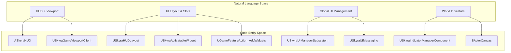
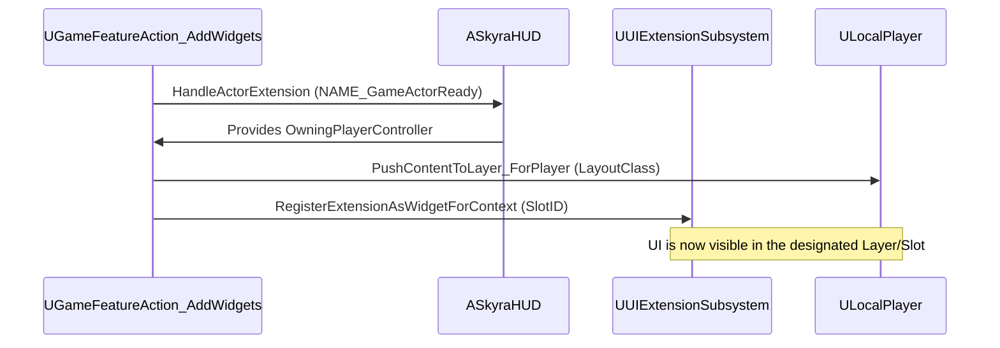

# UI框架

Relevant source files

以下文件被用作生成本wiki页面的上下文：

- [.gitattributes](.gitattributes)

SkyraFramework UI层构建于Epic的**CommonUI**插件之上，为复杂的HUD、菜单和世界空间指示器提供了健壮的跨平台基础。它采用解耦的数据驱动方法，通过Game Feature系统将UI元素注入视口，或通过专门的子系统进行管理。

### 架构概览

该框架将UI分为三个主要层：
1.  **持久化基础设施**：`ASkyraHUD`和`SkyraUIManagerSubsystem`管理UI层的生命周期和堆栈。
2.  **动态布局**：`SkyraHUDLayout`和`SkyraActivatableWidget`定义视觉结构，通常根据游戏状态推送到特定层（例如Game、Menu、Modal）。
3.  **世界空间反馈**：指示器系统处理附着在3D世界中 Actor 上的“平视”信息。

#### UI实体映射
以下图表说明了高级UI概念如何映射到`SkyraGame`模块中的特定类。

**来源：**`Source/SkyraGame/Private/UI/SkyraHUD.cpp`、`Source/SkyraGame/Private/UI/Subsystem/SkyraUIManagerSubsystem.cpp`、`Source/SkyraGame/Private/GameFeatures/GameFeatureAction_AddWidget.cpp`

---

### HUD 和 UI 基础架构
`ASkyraHUD` 作为玩家 UI 的主入口点。与执行大量绘制的传统 HUD 不同，`ASkyraHUD` 充当 `UCommonActivatableWidget` 实例的管理器。

Skyra 的一个关键特性是能够使用 **Game Feature Actions** 动态注入 UI 元素。`UGameFeatureAction_AddWidgets` 类允许开发者定义 HUD 布局和小组件扩展，当特定的 Game Feature 激活时，这些将自动添加到玩家屏幕上。

*   **HUD 布局**：定义游戏模式的主要“画布”。
*   **小组件扩展**：允许模块化部分（如小地图或血条）使用 `UUIExtensionSubsystem` 插入到 HUD 布局的预定义“插槽”中。

有关 HUD 生命周期和基础小组件类的详细信息，请参阅 [HUD、小组件和 UI 子系统](#8.1)。

**来源：** `Source/SkyraGame/Private/UI/SkyraHUDLayout.cpp`, `Source/SkyraGame/Private/GameFeatures/GameFeatureAction_AddWidget.cpp`

---

### 指示器系统
Skyra 包含一个用于渲染世界空间指示器（例如目标标记、敌人信号）的高性能系统。该系统通过使用 `SActorCanvas`（一个专门的 Slate 小组件，管理 3D 坐标到 2D 屏幕空间的投影），避免了标准 `UUserWidget` 在数百个点上的开销。

该系统由 `USkyraIndicatorManagerComponent` 管理，它跟踪 `UIndicatorDescriptor` 对象。这些描述符定义了要绘制的内容、跟随哪个 Actor 以及属于哪个 `UIndicatorLayer`。

有关渲染管线及指示器描述符的详细信息，请参阅 [指示器系统](#8.2)。

**来源：** `Source/SkyraGame/Private/UI/IndicatorSystem/SkyraIndicatorManagerComponent.cpp`, `Source/SkyraGame/Private/UI/IndicatorSystem/SActorCanvas.cpp`

---

### 前端和设置
该框架为游戏菜单和设置提供了标准化的流程。这包括：
*   **前端状态**：由 `SkyraFrontendStateComponent` 管理，处理初始加载屏幕、主菜单和大厅之间的转换。
*   **设置注册表**：一个用于游戏设置（视频、音频、游戏玩法等）的数据驱动系统，与 `CommonUI` 集成，提供跨鼠标/键盘和手柄的一致导航体验。

有关设置层次结构和前端流程的详细信息，请参见 [前端和设置 UI](#8.3)。

**来源：** `Source/SkyraGame/Private/UI/Frontend/SkyraFrontendStateComponent.cpp`, `Source/SkyraGame/Private/Settings/SkyraGameSettingRegistry.cpp`

---

### UI 集成流程
下图展示了一个游戏功能如何向玩家的 HUD 添加 UI。

**来源：** `Source/SkyraGame/Private/GameFeatures/GameFeatureAction_AddWidget.cpp`