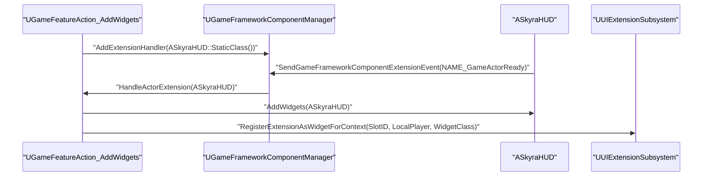
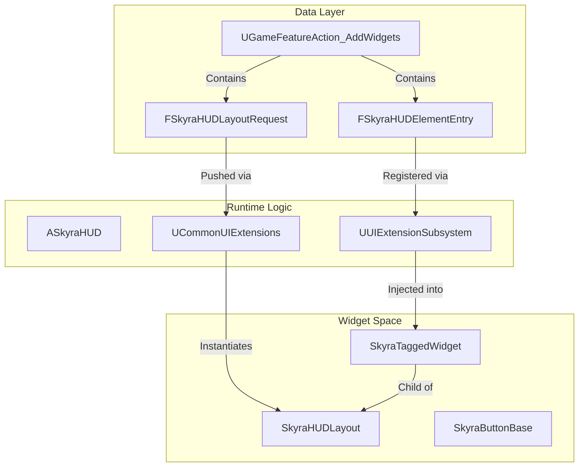
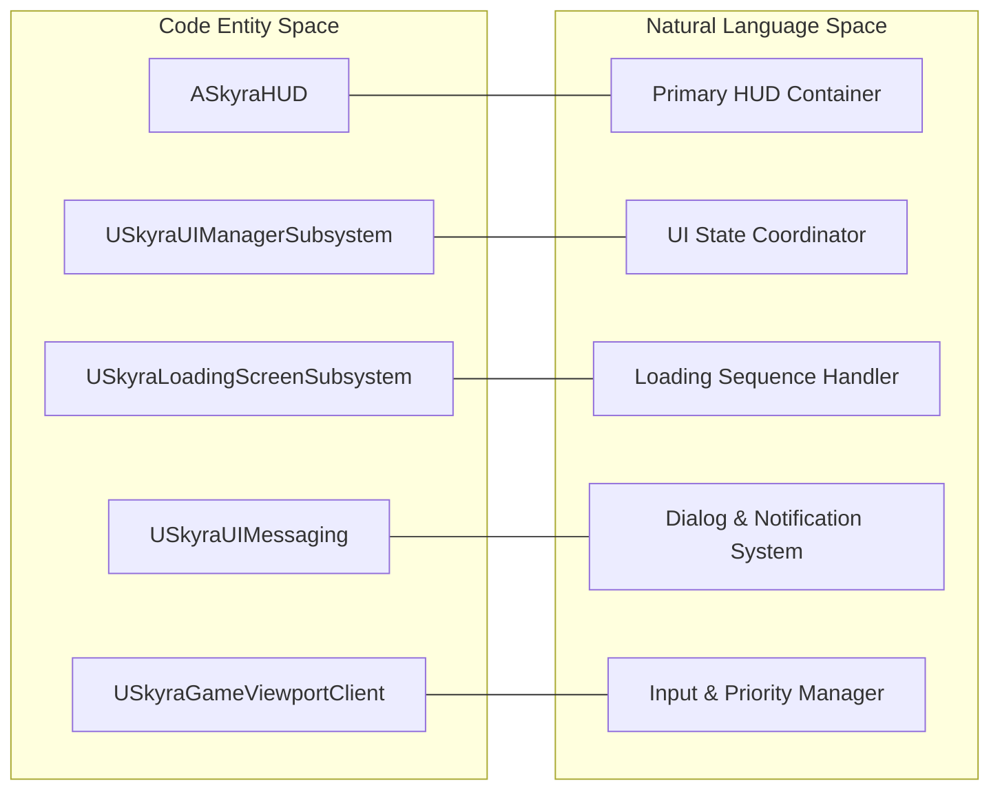

# HUD、小部件和UI子系统

Relevant source files

以下文件用作生成此维基页面的上下文：

- [.gitattributes](.gitattributes)

SkyraFramework UI架构基于Epic的**CommonUI**插件构建，并对其扩展以支持数据驱动的HUD布局、带标签的小部件插槽以及强大的消息系统。该系统使用`UUIExtensionSubsystem`和`GameFeatureActions`将UI定义与游戏逻辑解耦。

## 核心HUD架构

HUD系统围绕`ASkyraHUD`展开，它作为玩家界面的主要容器。与负责管理绘制逻辑的传统HUD不同，`ASkyraHUD`充当`SkyraHUDLayout`小部件的管理器。

### ASkyraHUD
`ASkyraHUD`是基础HUD类。它设计为通过`UGameFeatureAction_AddWidgets`进行扩展，`UGameFeatureAction_AddWidgets`根据当前游戏体验注入布局和小部件 [Source/SkyraGame/Private/GameFeatures/GameFeatureAction_AddWidget.cpp:101-108]()。

### SkyraHUDLayout
这是顶层的`UCommonActivatableWidget`，它定义了HUD的视觉结构（例如小地图、血条和背包槽的位置）。布局通过`UCommonUIExtensions`推送到特定的UI层（例如`UI.Layer.Game`） [Source/SkyraGame/Private/GameFeatures/GameFeatureAction_AddWidget.cpp:151-157]()。

### SkyraActivatableWidget
大多数Skyra UI元素的基础类。它继承自`UCommonActivatableWidget`，提供输入处理、返回按钮操作以及激活/停用生命周期支持。

### SkyraTaggedWidget
一种用于“Slot”系统的专用控件。它允许UI通过`GameplayTag`定义一个“命名槽”。然后，其他系统可以使用`UUIExtensionSubsystem`动态地将控件注入这些槽。[Source/SkyraGame/Private/GameFeatures/GameFeatureAction_AddWidget.cpp:160-163]()

**HUD 初始化流程**
下图说明了游戏功能如何向玩家的 HUD 添加 UI。

| 实体 | 角色 |
| :--- | :--- |
| `UGameFeatureAction_AddWidgets` | 定义要添加哪些控件的数据资产操作 [Source/SkyraGame/Private/GameFeatures/GameFeatureAction_AddWidget.cpp:36-40]() |
| `UGameFrameworkComponentManager` | 跟踪 `ASkyraHUD` Actor 并在它们就绪时通知操作 [Source/SkyraGame/Private/GameFeatures/GameFeatureAction_AddWidget.cpp:91-108]() |
| `UUIExtensionSubsystem` | 处理将控件注册到标记槽中的操作 [Source/SkyraGame/Private/GameFeatures/GameFeatureAction_AddWidget.cpp:159-163]() |
| `UCommonUIExtensions` | 管理不同层上可激活的小部件的堆栈 [Source/SkyraGame/Private/GameFeatures/GameFeatureAction_AddWidget.cpp:151-157]()。 |

**HUD 设置顺序**

*来源：[Source/SkyraGame/Private/GameFeatures/GameFeatureAction_AddWidget.cpp:91-108]()、[Source/SkyraGame/Private/GameFeatures/GameFeatureAction_AddWidget.cpp:125-136]()、[Source/SkyraGame/Private/GameFeatures/GameFeatureAction_AddWidget.cpp:159-163]()*

---

## UI 管理与消息

Skyra 利用多个子系统来管理 UI 的全局状态以及游戏逻辑与小组件之间的通信。

### SkyraUIManagerSubsystem
该子系统协调全局 UI 状态转换，例如从前端（主菜单）移动到游戏 HUD。它与 `SkyraGameViewportClient` 交互以管理输入路由和焦点。

### SkyraUIMessaging
一个用于显示异步通知、确认对话框和错误消息的专用系统。它利用 `SkyraConfirmationScreen` 向玩家呈现模态弹窗。

### SkyraLoadingScreenSubsystem
在体验转换或关卡流送期间管理加载屏幕的可见性和状态。它确保加载 UI 在引擎忙于加载资源时保持响应。

### SkyraGameViewportClient
`UCommonGameViewportClient` 的扩展，处理高级输入事件，并确保在模态小部件处于活动状态时，UI输入比游戏输入得到正确的优先级。

---

## 基础控件

Skyra 提供了一组“基础”控件，作为所有游戏 UI 的构建模块。这些控件已预先与 CommonUI 的样式和输入系统集成。

| 类 | 描述 |
| :--- | :--- |
| `SkyraButtonBase` | 标准按钮类。支持富文本、动态图标，以及 CommonUI 的 `CommonButtonStyle` 以实现一致的外观和感觉。 |
| `SkyraActionWidget` | 一个显示特定输入操作（例如“按 [E] 交互”）的控件。它会根据玩家当前的输入设备（游戏手柄 vs. 键盘鼠标）自动更新其图标。 |
| `SkyraConfirmationScreen` | 一个模态对话框控件，由 `SkyraUIMessaging` 用于显示“是/否”或“确定”提示。 |

---

## 数据驱动的 UI 注入

`UGameFeatureAction_AddWidgets` 类是向运行中的游戏注入 UI 的主要机制，无需修改基础 HUD 类。

### 布局与控件
此操作区分两种类型的 UI 添加：
1.  **布局**：通过 `FSkyraHUDLayoutRequest` 推送到层的大型容器（例如 HUD 本身） [Source/SkyraGame/Private/GameFeatures/GameFeatureAction_AddWidget.cpp:50-65]()。
2.  **控件**：通过 `FSkyraHUDElementEntry` 注入到现有槽中的单个元素（例如特定技能图标） [Source/SkyraGame/Private/GameFeatures/GameFeatureAction_AddWidget.cpp:69-85]()。

### 数据验证
该系统包含严格的编辑器端验证，确保在游戏运行之前所有布局类和层/槽标签均有效 [Source/SkyraGame/Private/GameFeatures/GameFeatureAction_AddWidget.cpp:44-88]()。

**UI 实体关系**

*来源：[Source/SkyraGame/Private/GameFeatures/GameFeatureAction_AddWidget.cpp:36-40](), [Source/SkyraGame/Private/GameFeatures/GameFeatureAction_AddWidget.cpp:151-163]()*

---

## 实现细节

### 清理与停用
当游戏功能停用时，`UGameFeatureAction_AddWidgets` 确保所有生成的布局被停用，并且所有 UI 扩展被注销，以防内存泄漏或孤立控件 [Source/SkyraGame/Private/GameFeatures/GameFeatureAction_AddWidget.cpp:111-123]()。

- `LayoutsAdded` 通过 `DeactivateWidget()` 停用 [Source/SkyraGame/Private/GameFeatures/GameFeatureAction_AddWidget.cpp:176-182]()。
- `ExtensionHandles` 通过 `Handle.Unregister()` 移除 [Source/SkyraGame/Private/GameFeatures/GameFeatureAction_AddWidget.cpp:184-187]()。

### 上下文感知扩展
`UUIExtensionSubsystem` 使用 `LocalPlayer` 作为上下文，确保在分屏场景中，UI 元素仅添加到拥有特定游戏功能或体验的玩家的视口 [Source/SkyraGame/Private/GameFeatures/GameFeatureAction_AddWidget.cpp:147-164]()。

**系统代码关联**

*来源：[Source/SkyraGame/Private/GameFeatures/GameFeatureAction_AddWidget.cpp:1-193]()*