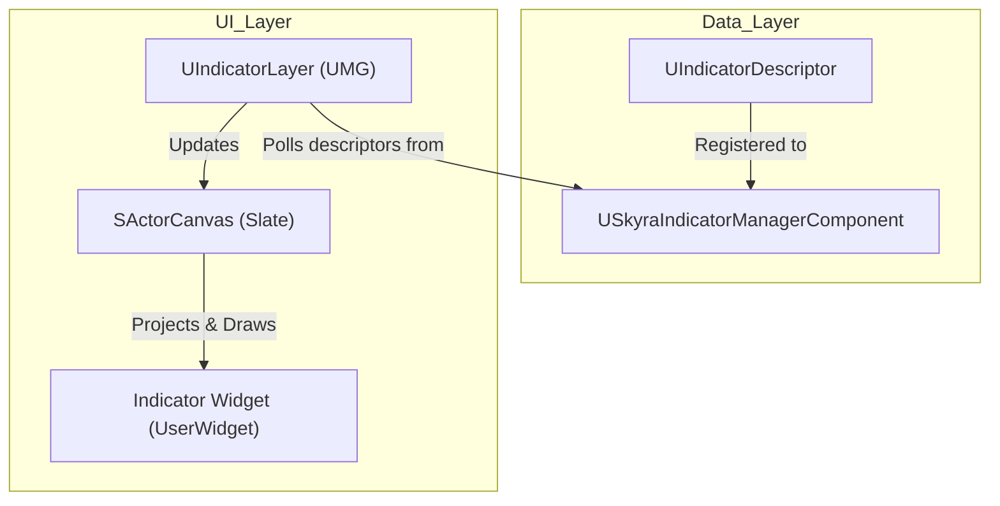

# 指示器系统

Relevant source files

以下文件用作生成本维基页面的上下文：

- [.gitattributes](.gitattributes)

SkyraFramework中的指示器系统提供了一个高性能流水线，用于将世界空间UI元素（如血条、目标标记或名牌）渲染到2D屏幕空间。它利用专门的管理器组件和自定义Slate控件（`SActorCanvas`）来处理这些视觉提示的投影和生命周期。

## 系统架构

该系统基于`USkyraIndicatorManagerComponent`构建，它充当所有活动指示器的集中注册表。指示器由`UIndicatorDescriptor`对象定义，其中包含跟踪角色或位置以及确定其显示方式所需的数据。

### 核心组件与流程

| 类 | 职责 |
| :--- | :--- |
| `UIndicatorDescriptor` | 数据容器，定义要跟踪的内容（角色/组件/插槽）以及显示方式（控件类）。 |
| `USkyraIndicatorManagerComponent` | 一个每玩家的组件，管理活跃的`UIndicatorDescriptor`实例列表。 |
| `UIndicatorLayer` | 一个UMG控件，作为`SActorCanvas`的容器，通常添加到HUD中。 |
| `SActorCanvas` | 底层的Slate控件，负责繁重的工作：将3D坐标投影到2D并管理控件槽。 |
| `UIndicatorLibrary` | 用于创建和管理指示器描述符的静态工具类。 |

### 指示器管道图

该图说明了数据描述符与渲染控件之间的关系。

**指示器渲染管道**

来源： [Source/SkyraGame/UI/IndicatorSystem/IndicatorDescriptor.h:12-20]()、[Source/SkyraGame/UI/IndicatorSystem/SkyraIndicatorManagerComponent.h:18-25]()、[Source/SkyraGame/UI/IndicatorSystem/SActorCanvas.h:15-30]()

## 指示器描述符

`UIndicatorDescriptor` 是所有世界空间标记的主要配置对象。它允许开发者指定：
*   **目标选择**：要跟随哪个 `AActor` 或 `USceneComponent`。
*   **内容**：为指示器实例化的 `UUserWidget` 类。
*   **屏幕行为**：当目标离开屏幕时，指示器是否应“钳制”到屏幕边缘。
*   **视觉效果**：深度排序优先级和投影偏移量。

`UIndicatorLibrary` 提供了辅助函数来简化这些描述符的创建，确保它们在传递到管理器之前被正确初始化。

来源：[Source/SkyraGame/UI/IndicatorSystem/IndicatorDescriptor.h:15-85]()、[Source/SkyraGame/UI/IndicatorSystem/IndicatorLibrary.h:11-30]()

## 管理器与层集成

`USkyraIndicatorManagerComponent` 通常附加到 `ASkyraPlayerController` 或相关的玩家状态组件上，以跟踪与该特定用户相关的指示器。

### 通过游戏功能添加指示器
指示器通常通过游戏功能系统动态添加。`UGameFeatureAction_AddWidgets` 类可用于将 `UIndicatorLayer` 注入到在 `ASkyraHUD` 中定义的特定 HUD 槽位中。

**代码实体映射：小部件注入**

源代码：[Source/SkyraGame/Private/GameFeatures/GameFeatureAction_AddWidget.cpp:138-165]()、[Source/SkyraGame/Private/GameFeatures/GameFeatureAction_AddWidget.cpp:91-109]()

### 关键函数
*   `USkyraIndicatorManagerComponent::AddIndicator(UIndicatorDescriptor* Descriptor)`：注册一个新的指示器以进行渲染。
*   `UIndicatorLayer::NativeTick`：持续将描述符列表从管理器同步到`SActorCanvas`。
*   `SActorCanvas::OnPaint`：核心 Slate 渲染函数，为每个活动指示器槽执行 3D 到 2D 的投影。

## SActorCanvas 实现

`SActorCanvas` 是一个高性能的 Slate 控件，旨在同时处理多个指示器。与标准的 UMG 画布不同，它针对以下方面进行了优化：
1.  **坐标投影**：使用本地玩家的视图投影矩阵将 `FVector` 世界位置转换为 `FVector2D` 屏幕位置。
2.  **钳位逻辑**：计算屏幕边缘位置，使得即使目标位于摄像机后方，指示器也必须保持可见。
3.  **深度排序**：确保更靠近摄像机的指示器渲染在远离摄像机的指示器之上。

源代码：[Source/SkyraGame/UI/IndicatorSystem/SActorCanvas.h:20-120]()、[Source/SkyraGame/UI/IndicatorSystem/IndicatorLayer.h:12-45]()