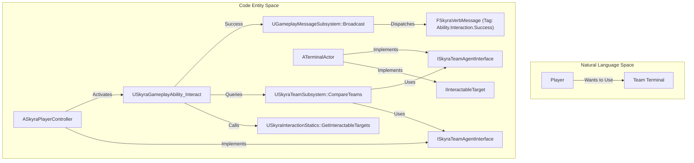
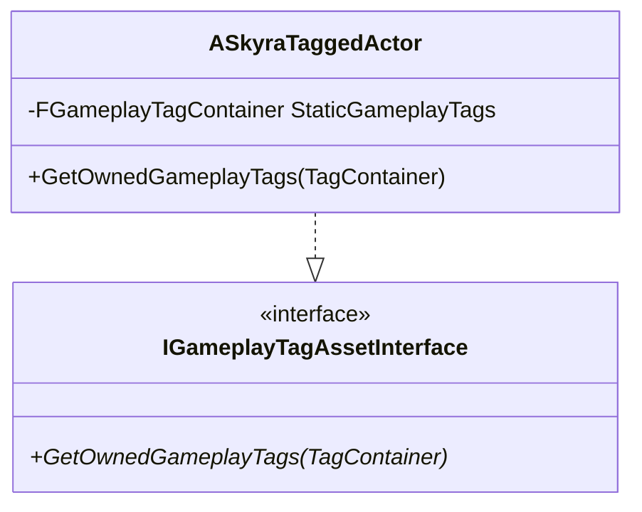

# 团队、消息与交互

Relevant source files

以下文件被用作生成本Wiki页面的上下文：

- [.gitattributes](.gitattributes)

本节概述了在SkyraFramework中促进多人协作、解耦通信和世界交互的系统。这些系统旨在协同工作，处理复杂的游戏规则，如基于团队的计分、事件驱动的UI更新以及玩家与物体的交互。

### 系统概述

该框架依赖三个主要支柱来处理角色关系和事件：
1.  **团队管理**：用于识别友方、敌方以及管理团队特定数据的集中逻辑。
2.  **游戏玩法消息传递**：用于游戏玩法事件（例如，“玩家A淘汰了玩家B”）的高性能解耦广播系统。
3.  **交互**：玩家通过GAS查询和与世界物体交互的标准化方式。

### 团队系统
团队系统提供管理角色关系的稳健基础设施。它围绕`USkyraTeamSubsystem`构建，该组件处理团队的注册，并提供用于比较团队ID以确定“友方”或“敌方”状态的实用工具。

角色通过实现`ISkyraTeamAgentInterface`参与此系统，该接口允许框架查询其`GenericTeamId`。系统通过`USkyraTeamCreationComponent`支持动态团队创建，并通过`USkyraTeamDisplayAsset`提供视觉数据（颜色、名称）。

*   **关键实体**：`USkyraTeamSubsystem` 充当团队查询的权威机构。
*   **关键接口**：`ISkyraTeamAgentInterface` 必须由 Pawn 和 Player State 实现，以便被系统识别。
*   **详情请参阅 [团队系统](#9.1)**。

### 游戏消息系统
游戏消息系统是一种轻量级、解耦的替代方案，可替代直接函数调用或标准 Unreal 委托。它允许系统（如 UI 或状态追踪）监听特定的“动词”（游戏标签），而无需对消息来源产生强依赖。

该系统使用 `FSkyraVerbMessage` 打包事件数据，例如发起者、目标和相关量级。它还包括一个专门的复制机制 `FSkyraVerbMessageReplication`，该机制使用 `FastArraySerializer` 在网络中高效同步消息。

*   **关键实体**：`UGameplayMessageSubsystem`（由 GameplayMessageRouter 插件提供）管理监听器和广播。
*   **数据结构**：`FSkyraVerbMessage` 定义了诸如伤害、击杀或目标夺取等事件的有效载荷。
*   **详情请参阅 [游戏消息系统](#9.2)**。

### 交互系统
交互系统在玩家的输入与世界中的可交互对象之间架起了一座桥梁。它构建在游戏技能系统（GAS）之上，使用专门的技能和任务来检测和触发交互。

交互由 `IInteractionInstigator`（通常是玩家）发起，目标是 `IInteractableTarget`。该框架使用 `UAbilityTask_WaitForInteractableTargets`，根据玩家的视角或接近度持续扫描有效的 `FInteractionOption`。

*   **关键实体**：`USkyraGameplayAbility_Interact` 是执行交互逻辑的基础 GAS 技能。
*   **关键接口**：`IInteractableTarget` 由可被使用的 Actor 实现（例如门、宝箱或载具）。
*   **详细信息，请参阅 [交互系统](#9.3)**。

### 系统关系

下图说明了在典型游戏事件中这些系统如何相互关联，例如玩家与团队锁定的终端进行交互。

**团队与交互流程**

来源：[Source/SkyraGame/Private/AbilitySystem/SkyraTaggedActor.cpp:13-16]()、[Source/SkyraGame/Private/AbilitySystem/SkyraTaggedActor.h:10-25]() (与标记 Actor 接口的概念对齐)。

### 标记 Actor
该框架还提供了 `ASkyraTaggedActor`，一个实用的基类，供关卡 Actor 在不需要完整技能系统组件的情况下，携带静态游戏标签以供交互或团队系统识别。

| 类 | 用途 | 关键方法 |
| :--- | :--- | :--- |
| `ASkyraTaggedActor` | 具有静态标签的世界Actor基类。 | `GetOwnedGameplayTags` |

**标签化Actor结构**

源代码：[Source/SkyraGame/Private/AbilitySystem/SkyraTaggedActor.cpp:8-16](), [Source/SkyraGame/Private/AbilitySystem/SkyraTaggedActor.h:18-31]()

---
- [团队系统](#9.1)
- [玩法消息系统](#9.2)
- [交互系统](#9.3)