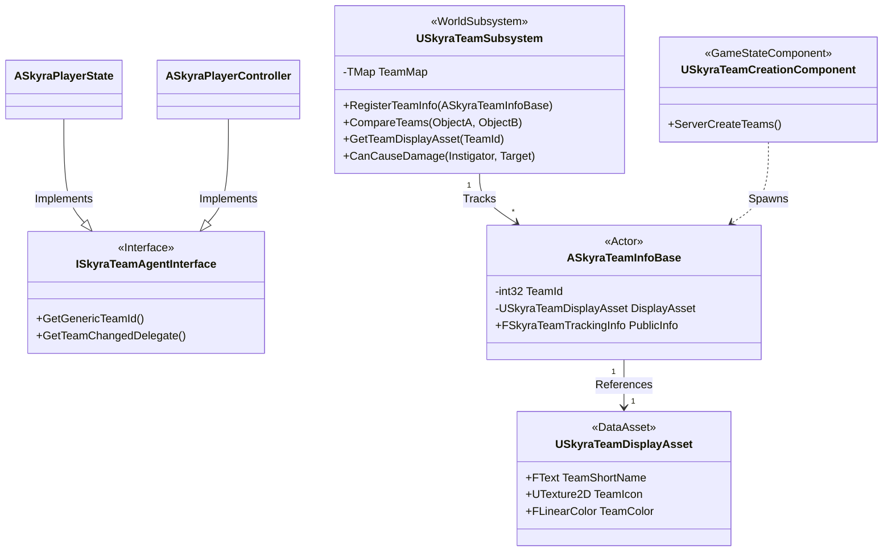
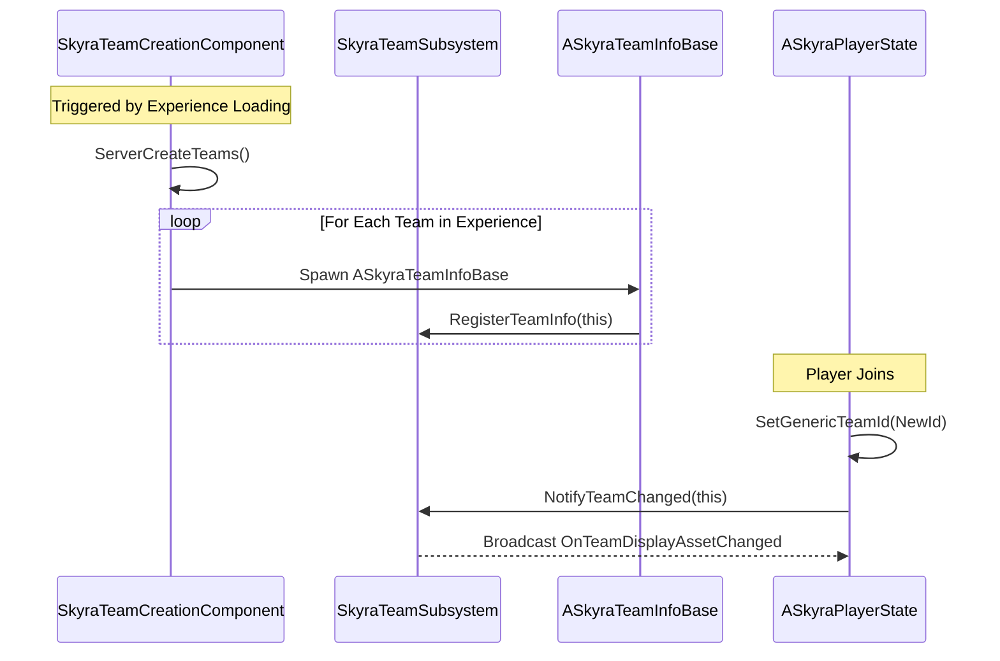

# 团队系统

Relevant source files

以下文件用作生成本Wiki页面的上下文：

- [.gitattributes](.gitattributes)

SkyraFramework中的团队系统提供了一个强大的、数据驱动的框架，用于管理角色从属关系、友军伤害规则以及基于团队的游戏逻辑。它围绕一个集中式子系统构建，该子系统跟踪团队成员身份，并为UI和游戏系统提供异步观察工具。

## 系统架构

团队系统基于解耦架构构建，角色无需知晓彼此的具体类即可确定从属关系，而是通过`ISkyraTeamAgentInterface`进行交互。

### 核心组件及其关系

下图说明了中央子系统、数据资源以及参与团队系统的角色之间的关系。

**团队系统实体映射图**

**来源：** `[Source/SkyraGame/Teams/SkyraTeamSubsystem.h:24-118]()`, `[Source/SkyraGame/Teams/SkyraTeamAgentInterface.h:12-42]()`, `[Source/SkyraGame/Teams/SkyraTeamInfoBase.h:18-51]()`, `[Source/SkyraGame/Teams/SkyraTeamCreationComponent.h:16-43]()`

---

## USkyraTeamSubsystem

`USkyraTeamSubsystem`是世界内团队管理的主要权威。它处理团队的注册，提供比较两个角色之间关系的方法，并管理团队ID到其各自数据结构的映射。

### 关键功能
*   **团队比较**：`CompareTeams` 函数判断两个对象是否属于同一团队、不同团队，或者其中一个（或两个）是中立者。`[Source/SkyraGame/Teams/SkyraTeamSubsystem.cpp:115-154]()`。
*   **团队注册**：团队信息 Actor 在生成时通过 `RegisterTeamInfo` 向子系统注册自身。`[Source/SkyraGame/Teams/SkyraTeamSubsystem.cpp:52-70]()`。
*   **友军伤害**：提供一个集中检查 `CanCauseDamage`，它使用团队归属来确定战斗交互是否应继续进行。`[Source/SkyraGame/Teams/SkyraTeamSubsystem.cpp:156-168]()`。

### 归属结果
系统使用 `ESkyraTeamComparison` 枚举来返回两个实体之间的关系：
*   `OnSameTeam`：两个实体共享相同的有效团队 ID。
*   `DifferentTeams`：两个实体拥有有效但不同的团队 ID。
*   `InvalidArgument`：一个或两个实体未实现团队接口或拥有无效 ID。

**来源：** `[Source/SkyraGame/Teams/SkyraTeamSubsystem.h:15-18]()`, `[Source/SkyraGame/Teams/SkyraTeamSubsystem.cpp:125-150]()`

---

## 团队数据与显示

### ASkyraTeamInfoBase、PublicInfo 和 PrivateInfo
团队在世界中由`ASkyraTeamInfoBase` Actor 表示。这些 Actor 充当团队范围内状态的复制源。
*   **公共信息**：`ASkyraTeamPublicInfo` 包含复制到所有客户端的数据（例如，团队得分、团队名称）。`[Source/SkyraGame/Teams/SkyraTeamPublicInfo.h:15-25]()`。
*   **私有信息**：`ASkyraTeamPrivateInfo` 包含仅复制到该特定团队成员的数据（例如，队友位置、共享资源）。`[Source/SkyraGame/Teams/SkyraTeamPrivateInfo.h:15-25]()`。

### USkyraTeamDisplayAsset
此数据资产定义了团队的视觉标识。UI组件使用它来着色铭牌、HUD元素和图标。
*   `TeamShortName`：团队的本地化字符串。
*   `TeamColor`：用于UI高亮的主要颜色。
*   `TeamIcon`：用于击杀提示或记分板的纹理。

**来源：**`[Source/SkyraGame/Teams/SkyraTeamDisplayAsset.h:18-35]()`, `[Source/SkyraGame/Teams/SkyraTeamInfoBase.h:35-50]()`

---

## 团队分配流程

团队的创建和分配通常由`USkyraTeamCreationComponent`处理，它附加到`ASkyraGameState`。

**团队初始化序列**

**来源：** `[Source/SkyraGame/Teams/SkyraTeamCreationComponent.cpp:45-85]()`、`[Source/SkyraGame/Teams/SkyraTeamSubsystem.cpp:55-65]()`

---

## 异步观察操作

为简化UI开发，该框架提供了 `UAsyncAction_ObserveTeam`，这是一个异步蓝图节点。它允许UI控件"监听"特定Actor（例如 PlayerState）上的团队变化，而无需每帧轮询。

*   **功能**：它绑定到由 `ISkyraTeamAgentInterface` 提供的 `OnTeamChangedDelegate`。`[Source/SkyraGame/Teams/AsyncAction_ObserveTeam.cpp:35-55]()`。
*   **自动清理**：当世界或观察到的Actor失效时，该操作会自动解绑并销毁自身。`[Source/SkyraGame/Teams/AsyncAction_ObserveTeam.cpp:70-85]()`。

**来源：** `[Source/SkyraGame/Teams/AsyncAction_ObserveTeam.h:15-59]()`

---

## SkyraTeamStatics

`USkyraTeamStatics` 提供了一个静态辅助函数库，可供C++和蓝图用于常见的团队相关查询。

| 函数 | 用途 |
| :--- | :--- |
| `GetTeamDisplayAsset` | 获取给定团队ID或Actor的 `USkyraTeamDisplayAsset`。 |
| `GetTeamId` | 从任何实现了该接口的对象中安全地提取 Team ID。 |
| `CompareTeams` | 子系统比较逻辑的静态封装器。 |

**来源：** `[Source/SkyraGame/Teams/SkyraTeamStatics.h:15-50]()`, `[Source/SkyraGame/Teams/SkyraTeamStatics.cpp:20-65]()`

---

## 标记的 Actor

虽然并非严格属于 Team ID 逻辑的一部分，`ASkyraTaggedActor` 通常与队伍结合用于环境对象（例如占领点或队伍专属门）。它实现了 `IGameplayTagAssetInterface`，使队伍系统或 GAS 能够查询其静态标签以进行过滤或交互逻辑。

**来源：** `[Source/SkyraGame/AbilitySystem/SkyraTaggedActor.h:15-30]()`, `[Source/SkyraGame/AbilitySystem/SkyraTaggedActor.cpp:13-16]()`