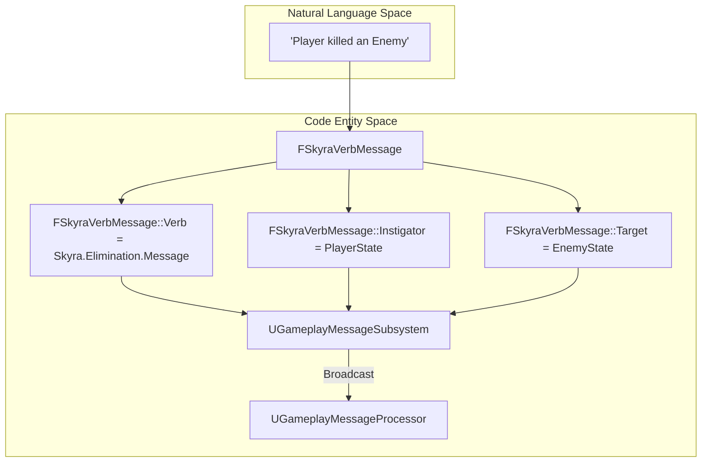
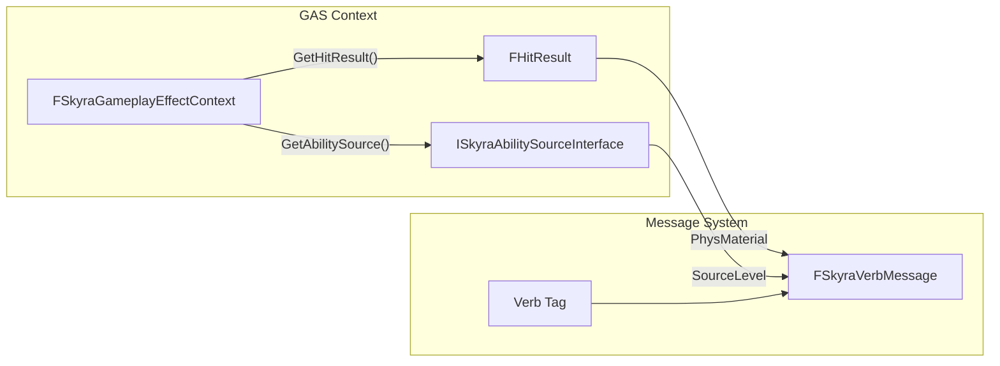

# 游戏玩法消息系统

Relevant source files

以下文件用于生成本Wiki页面的上下文：

- [.gitattributes](.gitattributes)

游戏玩法消息系统提供了一个解耦的、基于标签的通信层，用于在框架内广播事件。它允许系统通过利用`UGameplayMessageSubsystem`以及为“动词”（动作）和UI通知量身定制的专用消息结构进行交互，而无需直接硬引用。

### 消息结构与数据流

该系统以`FSkyraVerbMessage`为中心，这是一个用于传达“动作”已发生的标准化结构。这通常用于战斗事件、目标完成和成就跟踪。

#### FSkyraVerbMessage
在`Source/SkyraGame/Messages/SkyraVerbMessage.h`中定义，此结构封装了游戏事件的“谁、做了什么以及在哪里”的信息。

| 字段 | 类型 | 描述 |
| :--- | :--- | :--- |
| `Verb` | `FGameplayTag` | 具体动作（例如：`Ability.Type.Death`）。 |
| `Instigator` | `UObject*` | 执行该动作的实体。 |
| `Target` | `UObject*` | 接收该动作的实体。 |
| `InstigatorTags` | `FGameplayTagContainer` | 事件发生时与发起者关联的标签。 |
| `TargetTags` | `FGameplayTagContainer` | 事件发生时与目标关联的标签。 |
| `ContextHitResult` | `FHitResult` | 事件的可选物理数据。 |
| `Magnitude` | `double` | 与动词关联的数值（例如伤害量）。 |

**来源：** [Source/SkyraGame/Messages/SkyraVerbMessage.h:1-30]()

#### 自然语言到代码实体空间：消息路由
下图说明了概念性的“玩家击杀敌人”事件如何转化为代码实体并流经消息系统。

**来源：** [Source/SkyraGame/Messages/SkyraVerbMessage.h:14-35](), [Source/SkyraGame/Messages/GameplayMessageProcessor.h:17-25]()

---

### 网络复制与快速序列化

为在网络上高效同步游戏消息，框架使用了`FSkyraVerbMessageReplication`。它利用`FFastArraySerializer`来最小化带宽，同时确保客户端接收到关键的游戏事件。

#### FSkyraVerbMessageReplicationEntry
这是复制数组中的一个条目。它封装了一个`FSkyraVerbMessage`用于传输。
- **文件：** [Source/SkyraGame/Messages/SkyraVerbMessageReplication.h:14-30]()

#### FSkyraVerbMessageReplication
复制数组的管理器。它处理`PostReplicatedAdd`逻辑，以在从服务器接收消息时触发本地事件。

*   **关键函数：`PostReplicatedAdd`**：当客户端接收到新消息时，该函数提取消息并通过`UGameplayMessageSubsystem`在本地广播 [Source/SkyraGame/Messages/SkyraVerbMessageReplication.h:48-60]()。

**源文件：** [Source/SkyraGame/Messages/SkyraVerbMessageReplication.h:1-70]()

---

### 游戏消息处理器

`UGameplayMessageProcessor`是一个基类，专为需要在游戏生命周期中观察和响应特定消息标签的持久监听器而设计。

*   **`BeginPlay()`**：处理器通常使用它来通过`UGameplayMessageSubsystem::RegisterListener`开始监听特定标签 [Source/SkyraGame/Messages/GameplayMessageProcessor.h:25-30]()。
*   **`EndPlay()`**：确保清理侦听器以防止内存泄漏 [来源/SkyraGame/Messages/GameplayMessageProcessor.h:32-35]().

**来源：** [Source/SkyraGame/Messages/GameplayMessageProcessor.h:1-40]()

---

### 辅助工具和 UI 通知

#### SkyraVerbMessageHelpers
一个静态工具类，用于从消息负载中提取参与者。
*   **`GetPlayerStateFromObject`**：尝试从 `UObject` 解析 `APlayerState`，处理 `AActor`、`AController` 和 `APawn` 的情况 [来源/SkyraGame/Messages/SkyraVerbMessageHelpers.h:18-25]().
*   **`GetPlayerControllerFromObject`**：与上述类似，但解析的是 `APlayerController` [来源/SkyraGame/Messages/SkyraVerbMessageHelpers.h:27-30]().

#### SkyraNotificationMessage
一种用于 UI 相关通知的专用消息结构。
*   **`TargetPlayer`**：允许针对特定玩家发送通知。
*   **`PayloadTag`**：使用 `FGameplayTag` 定义要触发的 UI 通知类型。

**来源：** [Source/SkyraGame/Messages/SkyraVerbMessageHelpers.h:1-35]()、[Source/SkyraGame/Messages/SkyraNotificationMessage.h:1-25]()

---

### 上下文集成：效果上下文

消息系统通常与游戏玩法能力系统（GAS）协同工作。`FSkyraGameplayEffectContext`扩展了标准GAS上下文，以便在消息广播期间提供额外的元数据。

#### FSkyraGameplayEffectContext
此类存储能力的来源和物理材质信息，这些信息可以打包到`FSkyraVerbMessage`量级或上下文字段中。

| 函数 | 描述 |
| :--- | :--- |
| `GetAbilitySource()` | 返回与效果关联的`ISkyraAbilitySourceInterface` [Source/SkyraGame/Private/AbilitySystem/SkyraGameplayEffectContext.cpp:54-57]()。|
| `GetPhysicalMaterial()` | 从存储在上下文中的命中结果提取`UPhysicalMaterial` [Source/SkyraGame/Private/AbilitySystem/SkyraGameplayEffectContext.cpp:59-66]()。|
| `NetSerialize()` | 处理用于网络传输的自定义上下文序列化 [Source/SkyraGame/Private/AbilitySystem/SkyraGameplayEffectContext.cpp:29-37]()。|

#### 系统交互：从效果到消息
下图展示了游戏效果上下文如何为游戏消息提供数据。

**来源：** [Source/SkyraGame/Private/AbilitySystem/SkyraGameplayEffectContext.cpp:48-66]()、[Source/SkyraGame/Messages/SkyraVerbMessage.h:14-30]()