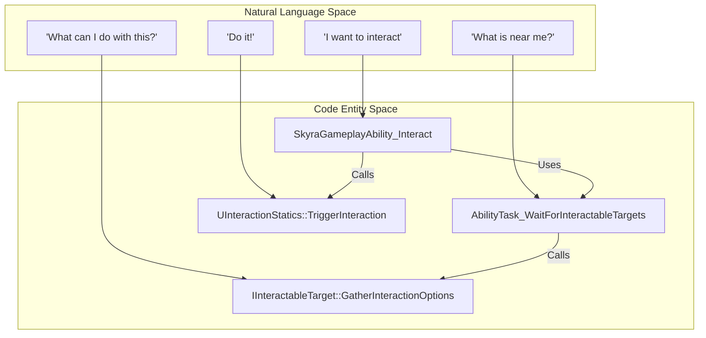
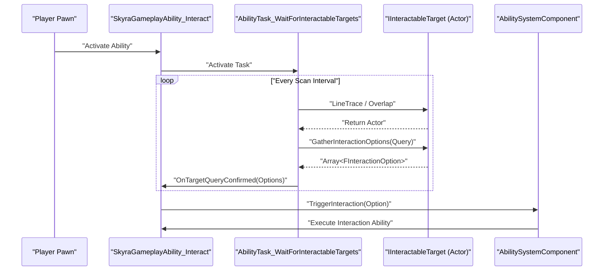

# 交互系统

Relevant source files

以下文件被用作生成本Wiki页面的上下文：

- [.gitattributes](.gitattributes)

SkyraFramework中的交互系统提供了一个模块化的、集成GAS的框架，用于处理世界空间交互。它将“查找”可交互对象的逻辑与交互本身的“执行”解耦，使用由游戏技能和专门的技能任务中介的请求-响应模式。

## 核心架构与数据流

该系统围绕三个主要概念构建：
1.  **发起者**：发起交互的实体（通常是玩家Pawn）。
2.  **目标**：被交互的对象（例如，箱子、门或载具）。
3.  **选项**：定义交互*如何*发生的数据结构（文本、持续时间以及要触发的游戏技能）。

### 交互数据结构

该系统使用`FInteractionQuery`来定义搜索的上下文，并使用`FInteractionOption`来定义结果。

*   **`FInteractionQuery`**：包含`Instigator`和一个可选的`OptionalInventoryItemContext`。它被传递给潜在目标，以判断它们是否可以交互。[Source/SkyraGame/Interaction/InteractionQuery.h:12-25]()
*   **`FInteractionOption`**：表示目标上可用的单个“动词”或操作。它包括：
    *   `InteractableTarget`：指向目标的接口指针。[Source/SkyraGame/Interaction/InteractionOption.h:20-21]()
    *   `Text`：用于UI的显示字符串（例如，“Open”）。[Source/SkyraGame/Interaction/InteractionOption.h:24-25]()
    *   `SubText`：额外的UI信息。[Source/SkyraGame/Interaction/InteractionOption.h:28-29]()
    *   `InteractionAbilityToGrant`：将被授予并激活以执行交互逻辑的GAS能力类。[Source/SkyraGame/Interaction/InteractionOption.h:32-33]()

### 系统实体映射
以下图表将逻辑交互流程映射到具体的代码实体。

**交互逻辑流程**

来源：[Source/SkyraGame/Interaction/Abilities/SkyraGameplayAbility_Interact.cpp:1-50]()、[Source/SkyraGame/Interaction/Tasks/AbilityTask_WaitForInteractableTargets.h:18-25]()、[Source/SkyraGame/Interaction/IInteractableTarget.h:34-35]()、[Source/SkyraGame/Interaction/InteractionStatics.h:22-23]()

## 接口

### IInteractableTarget
任何可被交互的Actor或Component都必须实现此接口。
*   **`GatherInteractionOptions`**：根据提供的`FInteractionQuery`填充`FInteractionOption`数组。 [Source/SkyraGame/Interaction/IInteractableTarget.h:34-35]()
*   **`CustomizeInteractionEventData`**：允许目标在交互能力触发之前修改`FGameplayEventData`，以便传递自定义负载（例如宝箱内容）。 [Source/SkyraGame/Interaction/IInteractableTarget.h:38-39]()

### IInteractionInstigator
由发起交互的实体（通常是Pawn）实现。它为系统提供了一个钩子，用于识别谁在执行操作。 [Source/SkyraGame/Interaction/IInteractionInstigator.h:16-24]()

## 交互能力和任务

### SkyraGameplayAbility_Interact
这是管理交互生命周期的“主”能力。它通常在后台处于激活状态，或由输入标签触发。
*   它利用`AbilityTask_WaitForInteractableTargets`来扫描环境。 [Source/SkyraGame/Interaction/Abilities/SkyraGameplayAbility_Interact.cpp:38-45]()
*   当目标确认后，它会调用`UInteractionStatics::TriggerInteraction`。 [Source/SkyraGame/Interaction/Abilities/SkyraGameplayAbility_Interact.cpp:60-70]()

### AbilityTask_WaitForInteractableTargets
一个专用的`UAbilityTask`，它执行定期追踪或重叠检测，以查找实现`IInteractableTarget`的Actor。
*   它支持不同的“交互扫描频率”以优化性能。 [Source/SkyraGame/Interaction/Tasks/AbilityTask_WaitForInteractableTargets.h:40-41]()
*   当找到目标时，它会执行`UpdateInteractableOptions`，该函数查询目标可用的`FInteractionOption`s。[Source/SkyraGame/Interaction/Tasks/AbilityTask_WaitForInteractableTargets.cpp:80-100]()

### AbilityTask_GrantNearbyInteraction
用于在玩家进入特定体积或接近范围时动态地向其授予交互能力。
*   它会监测角色周围的一个半径。[Source/SkyraGame/Interaction/Tasks/AbilityTask_GrantNearbyInteraction.h:25-30]()
*   它管理`FInteractionOption`技能的授予和移除，以确保玩家的`AbilitySystemComponent`保持整洁。[Source/SkyraGame/Interaction/Tasks/AbilityTask_GrantNearbyInteraction.cpp:45-65]()

## 静态工具与目标选取

### InteractionStatics
一个蓝图库，提供辅助函数以弥合世界与GAS交互流程之间的间隙。
*   **`GetTargetActorFromHandle`**：将交互句柄解析回Actor。[Source/SkyraGame/Interaction/InteractionStatics.h:19-20]()
*   **`TriggerInteraction`**：核心执行函数。它接受一个`FInteractionOption`，准备`FGameplayEventData`，并向发起者的ASC发送游戏玩法事件以触发特定的交互能力。[Source/SkyraGame/Interaction/InteractionStatics.cpp:35-55]()

### GameplayAbilityTargetActor_Interact
交互系统用于可视化或确认目标的`AGameplayAbilityTargetActor`实现。
*   它执行实际的射线检测或碰撞检查，以确定玩家正在看什么。[Source/SkyraGame/Interaction/Abilities/GameplayAbilityTargetActor_Interact.cpp:25-45]()
*   它与`FWorldReticleParameters`集成，在悬停于可交互对象上时提供视觉反馈（准星）。[Source/SkyraGame/Interaction/Abilities/GameplayAbilityTargetActor_Interact.h:30-35]()

## 实现序列

下图说明了从射线检测到执行的交互序列。

**交互执行序列**

来源：[Source/SkyraGame/Interaction/Abilities/SkyraGameplayAbility_Interact.cpp:35-75](), [Source/SkyraGame/Interaction/Tasks/AbilityTask_WaitForInteractableTargets.cpp:50-110](), [Source/SkyraGame/Interaction/InteractionStatics.cpp:35-60]()

## 关键类汇总

| 类/接口 | 作用 |
| :--- | :--- |
| `IInteractableTarget` | 可交互Actor的接口。[Source/SkyraGame/Interaction/IInteractableTarget.h:18]() |
| `UInteractionStatics` | 用于触发交互 GAS 事件的工具。[Source/SkyraGame/Interaction/InteractionStatics.h:14]() |
| `USkyraGameplayAbility_Interact` | 交互循环的基础能力。[Source/SkyraGame/Interaction/Abilities/SkyraGameplayAbility_Interact.h:19]() |
| `UAbilityTask_WaitForInteractableTargets` | 在世界中寻找目标的任务。[Source/SkyraGame/Interaction/Tasks/AbilityTask_WaitForInteractableTargets.h:25]() |
| `FInteractionOption` | 描述可用操作的数据结构。[Source/SkyraGame/Interaction/InteractionOption.h:14]() |

源文件：[Source/SkyraGame/Interaction/IInteractableTarget.h:1-40](), [Source/SkyraGame/Interaction/InteractionStatics.h:1-30](), [Source/SkyraGame/Interaction/Abilities/SkyraGameplayAbility_Interact.h:1-50](), [Source/SkyraGame/Interaction/Tasks/AbilityTask_WaitForInteractableTargets.h:1-120](), [Source/SkyraGame/Interaction/InteractionOption.h:1-40]()