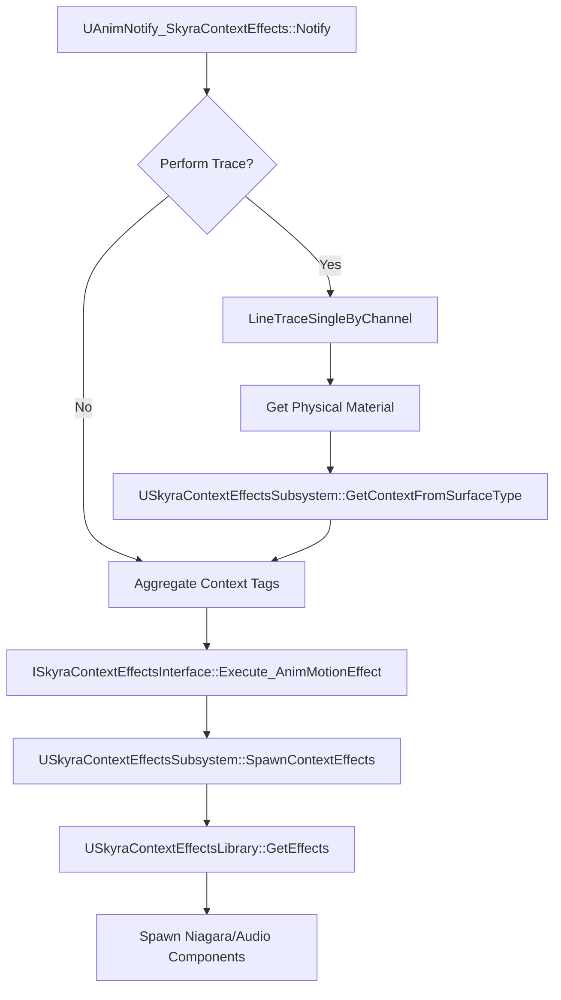
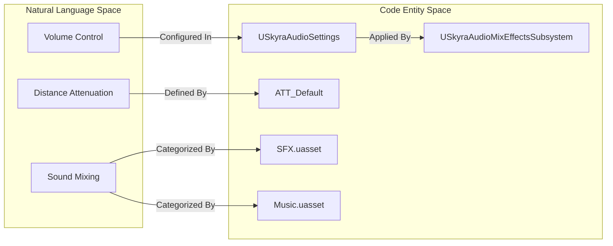
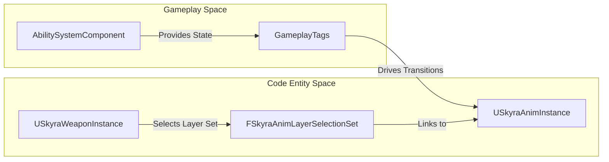

# 反馈、音频与动画

Relevant source files

以下文件被用作生成本维基页面的上下文：

- [Content/Assets/Audio/AttenuationPresets/ATT_Amb_Pad.uasset](Content/Assets/Audio/AttenuationPresets/ATT_Amb_Pad.uasset)
- [Content/Assets/Audio/AttenuationPresets/ATT_Default.uasset](Content/Assets/Audio/AttenuationPresets/ATT_Default.uasset)
- [Content/Assets/Audio/Classes/Music.uasset](Content/Assets/Audio/Classes/Music.uasset)
- [Content/Assets/Audio/Classes/Overall.uasset](Content/Assets/Audio/Classes/Overall.uasset)
- [Content/Assets/Audio/Classes/SFX.uasset](Content/Assets/Audio/Classes/SFX.uasset)

SkyraFramework中的反馈系统提供了游戏体验的感官层，将游戏机制（如移动或战斗）与视觉和听觉响应连接起来。该系统设计为数据驱动，允许设计师根据当前环境或角色状态，将抽象的游戏事件映射到特定的资产上。

## 情境效果系统

情境效果系统是一个数据驱动的框架，用于根据“情境”（游戏标签）和“表面”（物理材质）触发视觉效果（VFX）和声音效果（SFX）。动画会通知系统发生了“脚步”效果，系统随后检查角色当前的表面和状态标签，从`USkyraContextEffectsLibrary`中选择正确的资产，而不是为每个表面硬编码脚步声。

### 系统架构

该系统依赖于一个中央子系统来管理角色及其可用效果库之间的映射。

| 实体 | 角色 |
| :--- | :--- |
| `USkyraContextEffectsSubsystem` | 管理 Actor 的活动库，并处理 Niagara 和 Audio 组件的生成 [Source/SkyraGame/Private/Feedback/ContextEffects/SkyraContextEffectsSubsystem.cpp:20-33]()。 |
| `USkyraContextEffectsLibrary` | 一种数据资产，包含将 `EffectTag` + `ContextContainer` 映射到特定 `USoundBase` 和 `UNiagaraSystem` 资产 [Source/SkyraGame/Private/Feedback/ContextEffects/SkyraContextEffectsLibrary.cpp:11-31]()。 |
| `USkyraContextEffectComponent` | 一个 Actor 组件，实现 `ISkyraContextEffectsInterface` 以监听效果请求并将其转发到子系统 [Source/SkyraGame/Private/Feedback/ContextEffects/SkyraContextEffectComponent.cpp:61-65]()。 |
| `UAnimNotify_SkyraContextEffects` | 一种动画通知，用于直接从序列触发效果，支持线迹检测以进行表面检测 [Source/SkyraGame/Private/Feedback/ContextEffects/AnimNotify_SkyraContextEffects.cpp:45-48]()。 |

### 上下文效果流程

下图说明了动画事件如何转换为世界空间效果。

**上下文效果解析图**

**来源：** [Source/SkyraGame/Private/Feedback/ContextEffects/AnimNotify_SkyraContextEffects.cpp:45-120](), [Source/SkyraGame/Private/Feedback/ContextEffects/SkyraContextEffectsSubsystem.cpp:20-89](), [Source/SkyraGame/Private/Feedback/ContextEffects/SkyraContextEffectsLibrary.cpp:11-31]()

如需深入了解库的安装和表面映射，请参阅 **[上下文效果系统](#10.1)**。

---

## 数字弹出与音频

SkyraFramework 包含专门系统，用于为战斗动作提供即时反馈并管理全局音频混音。

### 数字弹出
“数字弹出”系统负责世界中伤害和治疗数值的可视化。它通过 `SkyraDamagePopStyle` 支持不同样式，并可使用 `MeshText`（数字的 3D 网格体）或 `NiagaraText`（基于粒子的数字），以确保对大量同时命中进行高性能渲染。`SkyraNumberPopComponent` 负责从游戏技能系统（GAS）接收这些请求，并管理视觉指示器的生命周期。

### 音频混音与设置
音频基础设施围绕 `SkyraAudioMixEffectsSubsystem` 构建。该系统允许游戏根据游戏状态动态调整音频混音（例如，在对话期间降低背景音或在战斗中强调脚步声）。它与 `SkyraAudioSettings` 集成，为音量与质量提供面向用户的控制。该框架利用标准化的衰减资产（`ATT_Default` [Content/Assets/Audio/AttenuationPresets/ATT_Default.uasset:1-3]()）以及 `Overall`、`SFX` 和 `Music` 等声音类 [Content/Assets/Audio/Classes/Music.uasset:1-3]() 来保持一致的混音层次结构。

**音频基础设施映射**

**来源：** [Content/Assets/Audio/AttenuationPresets/ATT_Default.uasset:1-3](), [Content/Assets/Audio/Classes/Music.uasset:1-3](), [Content/Assets/Audio/Classes/SFX.uasset:1-3](), [Content/Assets/Audio/Classes/Overall.uasset:1-3]()

有关战斗反馈和音频管理的详细信息，请参阅 **[数字弹出与音频](#10.2)**。

---

## 动画

SkyraFramework中的动画系统被设计为高度模块化，并能感知游戏玩法能力系统（GAS）。

### GAS感知动画
`USkyraAnimInstance`作为角色动画的基础。它被设计为自动从`AbilitySystemComponent`中获取状态信息，使得动画蓝图能够根据游戏玩法标签（例如`Status.IsCrouching`或`Ability.IsFiring`）来过渡状态。

### 装饰动画层
为了在单一基础骨骼上支持各种武器类型和角色部件，Skyra使用了`FSkyraAnimLayerSelectionSet`。这使得框架能够根据装饰标签动态链接和解链动画层（使用虚幻引擎的链接动画层功能）。例如，装备步枪会将角色的移动和空闲层替换为步枪特定的版本，而无需更改底层AnimBP逻辑。

**动画系统映射**

**来源：** [Source/SkyraGame/Private/Feedback/ContextEffects/SkyraContextEffectComponent.cpp:61-64]()、[Source/SkyraGame/Private/Feedback/ContextEffects/AnimNotify_SkyraContextEffects.cpp:113-118]()

关于AnimInstance实现和动态层选择的详细信息，请参阅 **[动画](#10.3)**。

---

## 子页面
*   **[上下文效果系统](#10.1)**：表面到效果的映射以及`USkyraContextEffectsSubsystem`。
*   **[数字弹出和音频](#10.2)**：伤害/治疗指示器以及音频混合子系统。
*   **[动画](#10.3)**：支持GAS的`USkyraAnimInstance`和装饰动画层选择。