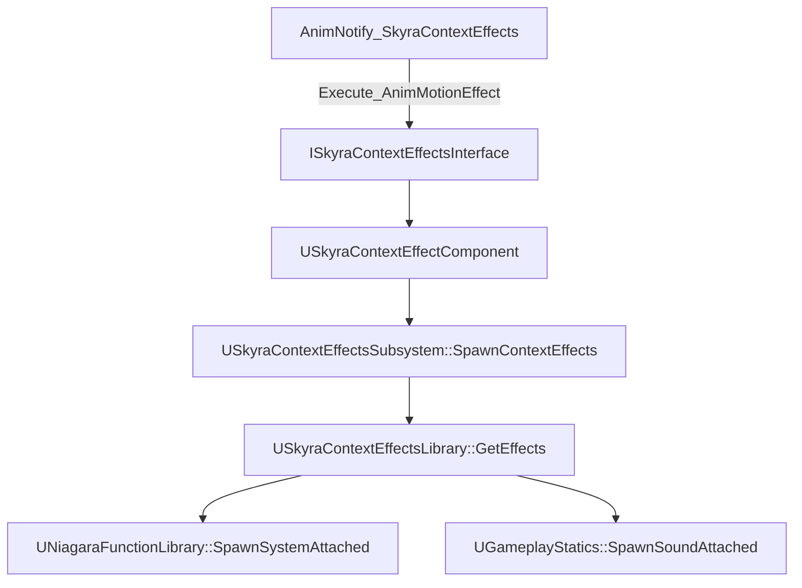
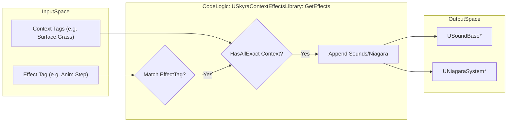

# 情境效果系统

<details>
<summary>Relevant source files</summary>

以下文件被用作生成本维基页面的上下文：

- [Content/Assets/Audio/AttenuationPresets/ATT_FX_BulletImpact.uasset](Content/Assets/Audio/AttenuationPresets/ATT_FX_BulletImpact.uasset)
- [Content/Assets/Audio/AttenuationPresets/ATT_FX_GrenadeBounce.uasset](Content/Assets/Audio/AttenuationPresets/ATT_FX_GrenadeBounce.uasset)
- [Content/Assets/Audio/AttenuationPresets/ATT_Foley.uasset](Content/Assets/Audio/AttenuationPresets/ATT_Foley.uasset)

</details>


情境效果系统是一个数据驱动的框架，旨在基于游戏玩法“情境”（例如表面类型、天气条件或角色状态）触发视觉（Niagara）和听觉（声音）反馈。它将效果请求（例如“播放脚步声”）与所使用的特定资源解耦，从而实现对环境的动态响应。

## 系统架构

该系统依赖于一个中央子系统，该子系统管理Actor与其可用效果库之间的映射。效果通过专用接口触发，允许组件和Actor响应动画通知或游戏事件。

### 数据流：动画到反馈
下图说明了动画通知如何通过系统传播以生成效果。

**情境效果触发流程**

来源：[Source/SkyraGame/Private/Feedback/ContextEffects/AnimNotify_SkyraContextEffects.cpp:113-118](), [Source/SkyraGame/Private/Feedback/ContextEffects/SkyraContextEffectComponent.cpp:131-133](), [Source/SkyraGame/Private/Feedback/ContextEffects/SkyraContextEffectsSubsystem.cpp:72-83]()

## 关键组件

### USkyraContextEffectsLibrary
此数据资产定义了`FGameplayTag`（效果类型）和`FGameplayTagContainer`（所需上下文）与实际资产（声音和Niagara系统）之间的映射。

*   **加载状态**：库使用内部状态机（`EContextEffectsLibraryLoadState`）来管理从`Unloaded`到`Loaded`的转换 [Source/SkyraGame/Private/Feedback/ContextEffects/SkyraContextEffectsLibrary.cpp:49-53]()。
*   **匹配逻辑**：当调用`GetEffects`时，库会对`EffectTag`进行精确标签匹配，并确保提供的`Context`容器包含条目所需的所有标签 [Source/SkyraGame/Private/Feedback/ContextEffects/SkyraContextEffectsLibrary.cpp:21-24]()。

### USkyraContextEffectsSubsystem
一个世界子系统，充当活动上下文效果的中心注册表。

*   **库管理**：它维护一个`ActiveActorEffectsMap`，将`AActor`指针与`USkyraContextEffectsSet`对象关联起来 [Source/SkyraGame/Private/Feedback/ContextEffects/SkyraContextEffectsSubsystem.cpp:35-36]()。
*   **表面映射**：它提供了实用函数，利用项目设置将`EPhysicalSurface`类型转换为`FGameplayTag`上下文 [Source/SkyraGame/Private/Feedback/ContextEffects/SkyraContextEffectsSubsystem.cpp:91-106]()。
*   **生成**：`SpawnContextEffects`函数从注册到该Actor的所有库中聚合声音和发射器，并将它们生成附加到指定的组件/插槽上 [Source/SkyraGame/Private/Feedback/ContextEffects/SkyraContextEffectsSubsystem.cpp:45-87]()。

### USkyraContextEffectComponent
一个实现`ISkyraContextEffectsInterface`的组件，为Actor处理上下文效果提供了标准方式。

*   **自动注册**：在 `BeginPlay` 时，它会自动将其 `DefaultContextEffectsLibraries` 注册到子系统 [Source/SkyraGame/Private/Feedback/ContextEffects/SkyraContextEffectComponent.cpp:28-44]() 中。
*   **上下文聚合**：它将本地 `CurrentContexts` 与在效果请求期间传递的瞬态上下文（例如，来自追踪的表面类型）组合起来 [Source/SkyraGame/Private/Feedback/ContextEffects/SkyraContextEffectComponent.cpp:70-75]()。

来源：[Source/SkyraGame/Private/Feedback/ContextEffects/SkyraContextEffectsLibrary.cpp:11-31]()、[Source/SkyraGame/Private/Feedback/ContextEffects/SkyraContextEffectsSubsystem.cpp:20-33]()、[Source/SkyraGame/Private/Feedback/ContextEffects/SkyraContextEffectComponent.cpp:61-65]()

## 动画集成

`UAnimNotify_SkyraContextEffects` 类允许设计师直接从动画时间轴触发效果。

### 追踪与上下文逻辑
该通知可以执行线条追踪来检测物理材质，然后将其转换为上下文标签。

| 功能 | 实现细节 |
| :--- | :--- |
| **线条追踪** | 使用 `TraceProperties` 来确定起点/终点和通道。返回 `bReturnPhysicalMaterial = true` [Source/SkyraGame/Private/Feedback/ContextEffects/AnimNotify_SkyraContextEffects.cpp:65-79]()。 |
| **接口执行** | 搜索拥有该Actor及其组件，寻找任何实现了`ISkyraContextEffectsInterface`的对象，并调用`Execute_AnimMotionEffect` [Source/SkyraGame/Private/Feedback/ContextEffects/AnimNotify_SkyraContextEffects.cpp:88-119]()。 |
| **编辑器预览** | 包含在动画编辑器预览世界中加载库并生成效果的逻辑 [Source/SkyraGame/Private/Feedback/ContextEffects/AnimNotify_SkyraContextEffects.cpp:123-189]()。 |

来源：[Source/SkyraGame/Private/Feedback/ContextEffects/AnimNotify_SkyraContextEffects.cpp:45-120]()

## 代码实体映射

下图将概念上的“自然语言”需求与代码库中具体的C++类和函数联系起来。

**系统实体关系**
```mermaid
classDiagram
    class "USkyraContextEffectsSubsystem" {
        +ActiveActorEffectsMap
        +SpawnContextEffects()
        +LoadAndAddContextEffectsLibraries()
    }
    class "USkyraContextEffectsLibrary" {
        +ContextEffects : TArray<FSkyraContextEffects>
        +LoadEffects()
        +GetEffects()
    }
    class "USkyraContextEffectComponent" {
        +CurrentContexts : FGameplayTagContainer
        +AnimMotionEffect_Implementation()
    }
    class "ISkyraContextEffectsInterface" {
        <<interface>>
        +AnimMotionEffect()
    }

    USkyraContextEffectComponent ..|> ISkyraContextEffectsInterface
    USkyraContextEffectComponent --> USkyraContextEffectsSubsystem : "Requests Spawn"
    USkyraContextEffectsSubsystem --> USkyraContextEffectsLibrary : "Queries Assets"
```
来源：[Source/SkyraGame/Private/Feedback/ContextEffects/SkyraContextEffectsSubsystem.cpp:35-36]()、[Source/SkyraGame/Private/Feedback/ContextEffects/SkyraContextEffectsLibrary.cpp:11-13]()、[Source/SkyraGame/Private/Feedback/ContextEffects/SkyraContextEffectComponent.cpp:61-65]()

**资产解析逻辑**

来源：[Source/SkyraGame/Private/Feedback/ContextEffects/SkyraContextEffectsLibrary.cpp:11-31]()

## 实现细节

### 库加载
`USkyraContextEffectsLibrary` 在调用 `LoadEffectsInternal` 时执行软引用资产的同步加载。它会遍历 `ContextEffects` 数组并尝试加载 `USoundBase` 和 `UNiagaraSystem` 对象 [Source/SkyraGame/Private/Feedback/ContextEffects/SkyraContextEffectsLibrary.cpp:55-98]()。加载完成后，它会调用 `SkyraContextEffectLibraryLoadingComplete` 将加载状态转换为 `Loaded` [Source/SkyraGame/Private/Feedback/ContextEffects/SkyraContextEffectsLibrary.cpp:110-118]()。

### 子系统注册
Actor 通过子系统的 `LoadAndAddContextEffectsLibraries` 函数注册其特定的库。这会创建一个 `USkyraContextEffectsSet` 并用已加载的库引用填充它，确保当特定 Actor 触发效果时，子系统知道要查询哪些库 [Source/SkyraGame/Private/Feedback/ContextEffects/SkyraContextEffectsSubsystem.cpp:108-137]()。

### 物理材质到上下文的映射
该框架支持将物理材质映射到游戏标签，以实现环境感知效果。例如，子弹命中效果会使用特定的衰减预设（如 `ATT_FX_BulletImpact.uasset`）来根据检测到的表面上下文处理空间化。

| 资产类型 | 文件引用 |
| :--- | :--- |
| **子弹命中衰减** | [Content/Assets/Audio/AttenuationPresets/ATT_FX_BulletImpact.uasset]() |
| **手雷弹跳衰减** | [Content/Assets/Audio/AttenuationPresets/ATT_FX_GrenadeBounce.uasset]() |
| **拟音衰减** | [Content/Assets/Audio/AttenuationPresets/ATT_Foley.uasset]() |

来源： [Source/SkyraGame/Private/Feedback/ContextEffects/SkyraContextEffectsLibrary.cpp:33-118](), [Source/SkyraGame/Private/Feedback/ContextEffects/SkyraContextEffectsSubsystem.cpp:108-150]()