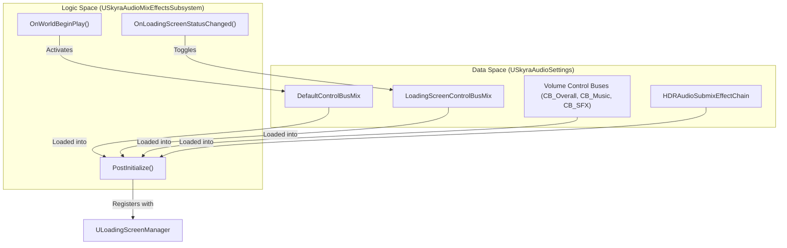
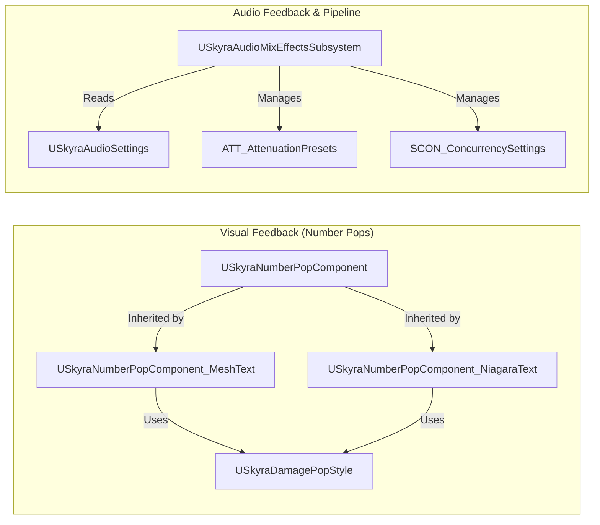

# 数字弹出与音频

Relevant source files

以下文件用作生成此维基页面的上下文：

- [Content/Assets/Audio/AttenuationPresets/ATT_Amb_Pad.uasset](Content/Assets/Audio/AttenuationPresets/ATT_Amb_Pad.uasset)
- [Content/Assets/Audio/AttenuationPresets/ATT_Default.uasset](Content/Assets/Audio/AttenuationPresets/ATT_Default.uasset)
- [Content/Assets/Audio/AttenuationPresets/ATT_FX_BulletImpact.uasset](Content/Assets/Audio/AttenuationPresets/ATT_FX_BulletImpact.uasset)
- [Content/Assets/Audio/AttenuationPresets/ATT_FX_Dash.uasset](Content/Assets/Audio/AttenuationPresets/ATT_FX_Dash.uasset)
- [Content/Assets/Audio/AttenuationPresets/ATT_FX_GrenadeBounce.uasset](Content/Assets/Audio/AttenuationPresets/ATT_FX_GrenadeBounce.uasset)
- [Content/Assets/Audio/AttenuationPresets/ATT_FX_Pad.uasset](Content/Assets/Audio/AttenuationPresets/ATT_FX_Pad.uasset)
- [Content/Assets/Audio/AttenuationPresets/ATT_Foley.uasset](Content/Assets/Audio/AttenuationPresets/ATT_Foley.uasset)
- [Content/Assets/Audio/AttenuationPresets/ATT_Footstep_NPC.uasset](Content/Assets/Audio/AttenuationPresets/ATT_Footstep_NPC.uasset)
- [Content/Assets/Audio/AttenuationPresets/ATT_Footstep_PC.uasset](Content/Assets/Audio/AttenuationPresets/ATT_Footstep_PC.uasset)
- [Content/Assets/Audio/AttenuationPresets/ATT_Grenade.uasset](Content/Assets/Audio/AttenuationPresets/ATT_Grenade.uasset)
- [Content/Assets/Audio/AttenuationPresets/ATT_Melee.uasset](Content/Assets/Audio/AttenuationPresets/ATT_Melee.uasset)
- [Content/Assets/Audio/AttenuationPresets/ATT_Pistol.uasset](Content/Assets/Audio/AttenuationPresets/ATT_Pistol.uasset)
- [Content/Assets/Audio/AttenuationPresets/ATT_Projectile.uasset](Content/Assets/Audio/AttenuationPresets/ATT_Projectile.uasset)
- [Content/Assets/Audio/AttenuationPresets/ATT_Rifle.uasset](Content/Assets/Audio/AttenuationPresets/ATT_Rifle.uasset)
- [Content/Assets/Audio/AttenuationPresets/ATT_Shotgun.uasset](Content/Assets/Audio/AttenuationPresets/ATT_Shotgun.uasset)
- [Content/Assets/Audio/AttenuationPresets/ATT_WhizBy.uasset](Content/Assets/Audio/AttenuationPresets/ATT_WhizBy.uasset)
- [Content/Assets/Audio/Blueprints/B_WindSystem.uasset](Content/Assets/Audio/Blueprints/B_WindSystem.uasset)
- [Content/Assets/Audio/Classes/Application_Focused.uasset](Content/Assets/Audio/Classes/Application_Focused.uasset)
- [Content/Assets/Audio/Classes/Music.uasset](Content/Assets/Audio/Classes/Music.uasset)
- [Content/Assets/Audio/Classes/Overall.uasset](Content/Assets/Audio/Classes/Overall.uasset)
- [Content/Assets/Audio/Classes/RenderedCinematics.uasset](Content/Assets/Audio/Classes/RenderedCinematics.uasset)
- [Content/Assets/Audio/Classes/SFX.uasset](Content/Assets/Audio/Classes/SFX.uasset)
- [Content/Assets/Audio/Classes/UI.uasset](Content/Assets/Audio/Classes/UI.uasset)
- [Content/Assets/Audio/Classes/VoiceChat.uasset](Content/Assets/Audio/Classes/VoiceChat.uasset)
- [Content/Assets/Audio/Concurrency/SCON_Footsteps.uasset](Content/Assets/Audio/Concurrency/SCON_Footsteps.uasset)
- [Content/Assets/Audio/Concurrency/SCON_Guns_LimitToOwner.uasset](Content/Assets/Audio/Concurrency/SCON_Guns_LimitToOwner.uasset)
- [Content/Assets/Audio/Concurrency/SCON_Guns_StopFarthest.uasset](Content/Assets/Audio/Concurrency/SCON_Guns_StopFarthest.uasset)
- [Content/Assets/Audio/Concurrency/SCON_Impacts.uasset](Content/Assets/Audio/Concurrency/SCON_Impacts.uasset)
- [Content/Assets/Audio/Concurrency/SCON_PlayerDamage.uasset](Content/Assets/Audio/Concurrency/SCON_PlayerDamage.uasset)
- [Content/Assets/Audio/Concurrency/SCON_WhizBys.uasset](Content/Assets/Audio/Concurrency/SCON_WhizBys.uasset)
- [Content/Assets/Audio/Concurrency/SCon_Default.uasset](Content/Assets/Audio/Concurrency/SCon_Default.uasset)
- [Content/Assets/Audio/DYN_LowMultibandDynamics.uasset](Content/Assets/Audio/DYN_LowMultibandDynamics.uasset)
- [Content/Assets/Audio/Effects/SubmixEffects/CREV_1978_LargeRoom.uasset](Content/Assets/Audio/Effects/SubmixEffects/CREV_1978_LargeRoom.uasset)
- [Content/Assets/Audio/Effects/SubmixEffects/CREV_BaseMain.uasset](Content/Assets/Audio/Effects/SubmixEffects/CREV_BaseMain.uasset)
- [Content/Assets/Audio/Effects/SubmixEffects/CREV_BaseMain_Tunnel.uasset](Content/Assets/Audio/Effects/SubmixEffects/CREV_BaseMain_Tunnel.uasset)
- [Content/Assets/Audio/Effects/SubmixEffects/CREV_BaseWing.uasset](Content/Assets/Audio/Effects/SubmixEffects/CREV_BaseWing.uasset)
- [Content/Assets/Audio/Effects/SubmixEffects/CREV_CenterCylinder.uasset](Content/Assets/Audio/Effects/SubmixEffects/CREV_CenterCylinder.uasset)
- [Content/Assets/Audio/Effects/SubmixEffects/CREV_ControlPoint.uasset](Content/Assets/Audio/Effects/SubmixEffects/CREV_ControlPoint.uasset)
- [Content/Assets/Audio/Effects/SubmixEffects/CREV_Exterior.uasset](Content/Assets/Audio/Effects/SubmixEffects/CREV_Exterior.uasset)
- [Content/Assets/Audio/Effects/SubmixEffects/DYN_LowDynamics.uasset](Content/Assets/Audio/Effects/SubmixEffects/DYN_LowDynamics.uasset)
- [Content/Assets/Audio/Effects/SubmixEffects/DYN_MainDynamics.uasset](Content/Assets/Audio/Effects/SubmixEffects/DYN_MainDynamics.uasset)
- [Content/Assets/Audio/Effects/SubmixEffects/FLT_EarlyReflections.uasset](Content/Assets/Audio/Effects/SubmixEffects/FLT_EarlyReflections.uasset)
- [Content/Assets/Audio/Effects/SubmixEffects/FLT_EarlyReflectionsHPF.uasset](Content/Assets/Audio/Effects/SubmixEffects/FLT_EarlyReflectionsHPF.uasset)
- [Content/Assets/Audio/Effects/SubmixEffects/TAP_EarlyReflections.uasset](Content/Assets/Audio/Effects/SubmixEffects/TAP_EarlyReflections.uasset)
- [Content/Assets/Audio/Impulses/1978_LargeRoom.uasset](Content/Assets/Audio/Impulses/1978_LargeRoom.uasset)
- [Content/Assets/Audio/Impulses/1978_LargeRoom_IR.uasset](Content/Assets/Audio/Impulses/1978_LargeRoom_IR.uasset)
- [Content/Assets/Audio/Impulses/IR_混响_室外_01.uasset](Content/Assets/Audio/Impulses/IR_Reverb_Exterior_01.uasset)
- [Content/Assets/Audio/Impulses/IR_混响_室外_01_IR.uasset](Content/Assets/Audio/Impulses/IR_Reverb_Exterior_01_IR.uasset)
- [Content/Assets/Audio/Impulses/IR_混响_大厅_01_明亮.uasset](Content/Assets/Audio/Impulses/IR_Reverb_Hall_01_bright.uasset)
- [Content/Assets/Audio/Impulses/IR_混响_大厅_01_明亮_IR.uasset](Content/Assets/Audio/Impulses/IR_Reverb_Hall_01_bright_IR.uasset)
- [Content/Assets/Audio/Impulses/IR_混响_大厅_01_黑暗.uasset](Content/Assets/Audio/Impulses/IR_Reverb_Hall_01_dark.uasset)
- [Content/Assets/Audio/Impulses/IR_混响_大厅_01_黑暗_IR.uasset](Content/Assets/Audio/Impulses/IR_Reverb_Hall_01_dark_IR.uasset)
- [Content/Assets/Audio/Impulses/IR_混响_大厅_02.uasset](Content/Assets/Audio/Impulses/IR_Reverb_Hall_02.uasset)
- [Content/Assets/Audio/Impulses/IR_混响_大厅_02_IR.uasset](Content/Assets/Audio/Impulses/IR_Reverb_Hall_02_IR.uasset)
- [Content/Assets/Audio/Impulses/IR_混响_大厅_03.uasset](Content/Assets/Audio/Impulses/IR_Reverb_Hall_03.uasset)
- [Content/Assets/Audio/Impulses/IR_混响_大厅_03_IR.uasset](Content/Assets/Audio/Impulses/IR_Reverb_Hall_03_IR.uasset)
- [Content/Assets/Audio/Impulses/IR_混响_房间_01.uasset](Content/Assets/Audio/Impulses/IR_Reverb_Room_01.uasset)
- [Content/Assets/Audio/Impulses/IR_混响_房间_01_IR.uasset](Content/Assets/Audio/Impulses/IR_Reverb_Room_01_IR.uasset)
- [Content/Assets/Audio/Impulses/IR_Reverb_Room_02.uasset](Content/Assets/Audio/Impulses/IR_Reverb_Room_02.uasset)
- [Content/Assets/Audio/Impulses/IR_Reverb_Room_02_IR.uasset](Content/Assets/Audio/Impulses/IR_Reverb_Room_02_IR.uasset)
- [Content/Assets/Audio/Impulses/IR_Reverb_Room_03.uasset](Content/Assets/Audio/Impulses/IR_Reverb_Room_03.uasset)
- [Content/Assets/Audio/Impulses/IR_Reverb_Room_03_IR.uasset](Content/Assets/Audio/Impulses/IR_Reverb_Room_03_IR.uasset)
- [Content/Assets/Audio/Impulses/IR_Reverb_Room_04.uasset](Content/Assets/Audio/Impulses/IR_Reverb_Room_04.uasset)
- [Content/Assets/Audio/Impulses/IR_Reverb_Room_04_IR.uasset](Content/Assets/Audio/Impulses/IR_Reverb_Room_04_IR.uasset)
- [Content/Assets/Audio/Impulses/IR_Reverb_Room_05.uasset](Content/Assets/Audio/Impulses/IR_Reverb_Room_05.uasset)
- [Content/Assets/Audio/Impulses/IR_Reverb_Room_05_IR.uasset](Content/Assets/Audio/Impulses/IR_Reverb_Room_05_IR.uasset)
- [Content/Assets/Audio/Impulses/IR_Reverb_Room_06.uasset](Content/Assets/Audio/Impulses/IR_Reverb_Room_06.uasset)
- [Content/Assets/Audio/Impulses/IR_Reverb_Room_06_IR.uasset](Content/Assets/Audio/Impulses/IR_Reverb_Room_06_IR.uasset)
- [Content/Assets/Audio/Impulses/IR_Reverb_Room_07.uasset](Content/Assets/Audio/Impulses/IR_Reverb_Room_07.uasset)
- [Content/Assets/Audio/Impulses/IR_Reverb_Room_07_IR.uasset](Content/Assets/Audio/Impulses/IR_Reverb_Room_07_IR.uasset)
- [Content/Assets/Audio/MetaSounds/MS_Graph_RandomPitch_Stereo.uasset](Content/Assets/Audio/MetaSounds/MS_Graph_RandomPitch_Stereo.uasset)
- [Content/Assets/Audio/MetaSounds/MS_Graph_TriggerDelayPitchShift_Mono.uasset](Content/Assets/Audio/MetaSounds/MS_Graph_TriggerDelayPitchShift_Mono.uasset)
- [Content/Assets/Audio/MetaSounds/lib_DovetailClip.uasset](Content/Assets/Audio/MetaSounds/lib_DovetailClip.uasset)
- [Content/Assets/Audio/MetaSounds/lib_DovetailClipFromArray.uasset](Content/Assets/Audio/MetaSounds/lib_DovetailClipFromArray.uasset)
- [Content/Assets/Audio/MetaSounds/lib_RandInterpTo.uasset](Content/Assets/Audio/MetaSounds/lib_RandInterpTo.uasset)
- [Content/Assets/Audio/MetaSounds/lib_RandPanStereo.uasset](Content/Assets/Audio/MetaSounds/lib_RandPanStereo.uasset)
- [Content/Assets/Audio/MetaSounds/lib_StereoBalance.uasset](Content/Assets/Audio/MetaSounds/lib_StereoBalance.uasset)
- [Content/Assets/Audio/MetaSounds/lib_TriggerAfter.uasset](Content/Assets/Audio/MetaSounds/lib_TriggerAfter.uasset)
- [Content/Assets/Audio/MetaSounds/lib_TriggerEvery.uasset](Content/Assets/Audio/MetaSounds/lib_TriggerEvery.uasset)
- [Content/Assets/Audio/MetaSounds/lib_TriggerModulo.uasset](Content/Assets/Audio/MetaSounds/lib_TriggerModulo.uasset)
- [Content/Assets/Audio/MetaSounds/lib_TriggerStopAfter.uasset](Content/Assets/Audio/MetaSounds/lib_TriggerStopAfter.uasset)
- [Content/Assets/Audio/MetaSounds/lib_WhizBy.uasset](Content/Assets/Audio/MetaSounds/lib_WhizBy.uasset)
- [Content/Assets/Audio/MetaSounds/mx_PlayAmbientChord.uasset](Content/Assets/Audio/MetaSounds/mx_PlayAmbientChord.uasset)
- [Content/Assets/Audio/MetaSounds/mx_PlayAmbientElement.uasset](Content/Assets/Audio/MetaSounds/mx_PlayAmbientElement.uasset)
- [Content/Assets/Audio/MetaSounds/mx_Stingers.uasset](Content/Assets/Audio/MetaSounds/mx_Stingers.uasset)
- [Content/Assets/Audio/MetaSounds/mx_System.uasset](Content/Assets/Audio/MetaSounds/mx_System.uasset)
- [Content/Assets/Audio/MetaSounds/sfx_Amb_Teleport_lp_meta.uasset](Content/Assets/Audio/MetaSounds/sfx_Amb_Teleport_lp_meta.uasset)
- [Content/Assets/Audio/MetaSounds/sfx_Amb_WeaponPad_lp_meta.uasset](Content/Assets/Audio/MetaSounds/sfx_Amb_WeaponPad_lp_meta.uasset)
- [Content/Assets/Audio/MetaSounds/sfx_Amb_Wind_lp_meta.uasset](Content/Assets/Audio/MetaSounds/sfx_Amb_Wind_lp_meta.uasset)
- [Content/Assets/Audio/MetaSounds/sfx_BaseLayer_Interactable_Pad_nl_meta.uasset](Content/Assets/Audio/MetaSounds/sfx_BaseLayer_Interactable_Pad_nl_meta.uasset)
- [Content/Assets/Audio/MetaSounds/sfx_CapturePoint_Progress_meta.uasset](Content/Assets/Audio/MetaSounds/sfx_CapturePoint_Progress_meta.uasset)
- [Content/Assets/Audio/MetaSounds/sfx_Character_DamageGivenKill_nl_meta.uasset](Content/Assets/Audio/MetaSounds/sfx_Character_DamageGivenKill_nl_meta.uasset)
- [Content/Assets/Audio/MetaSounds/sfx_Character_DamageGivenWeakSpot_nl_meta.uasset](Content/Assets/Audio/MetaSounds/sfx_Character_DamageGivenWeakSpot_nl_meta.uasset)
- [Content/Assets/Audio/MetaSounds/sfx_Character_DamageGiven_nl_meta.uasset](Content/Assets/Audio/MetaSounds/sfx_Character_DamageGiven_nl_meta.uasset)
- [Content/Assets/Audio/MetaSounds/sfx_Character_DamageTakenWeakSpot_nl_meta.uasset](Content/Assets/Audio/MetaSounds/sfx_Character_DamageTakenWeakSpot_nl_meta.uasset)
- [Content/Assets/Audio/MetaSounds/sfx_Character_DamageTaken_nl_meta.uasset](Content/Assets/Audio/MetaSounds/sfx_Character_DamageTaken_nl_meta.uasset)
- [Content/Assets/Audio/MetaSounds/sfx_Character_FS_Base_nl_meta.uasset](Content/Assets/Audio/MetaSounds/sfx_Character_FS_Base_nl_meta.uasset)
- [Content/Assets/Audio/MetaSounds/sfx_Character_FS_Concrete_nl_meta.uasset](Content/Assets/Audio/MetaSounds/sfx_Character_FS_Concrete_nl_meta.uasset)

本节介绍了负责视觉伤害/治疗指示器（“数值弹出”）和全局音频管理子系统的反馈系统。这些系统将游戏事件（例如受到伤害或改变游戏状态）转化为面向玩家的感官反馈。

## 数值弹出系统

数值弹出系统为数值游戏性变化（主要是伤害和治疗）提供世界空间视觉反馈。它的设计具有可扩展性，同时支持基于网格体和基于Niagara的实现。

### 核心组件与数据

该系统以 `USkyraNumberPopComponent` 为中心，它是处理在世界上显示数字请求的基类。

*   **`FSkyraNumberPopRequest`**：一个包含生成弹出所需数据的结构，包括数值、世界位置、是否为暴击，以及与来源关联的游戏标签。
*   **`USkyraDamagePopStyle`**：一个数据资产，用于定义不同类型数值弹出的视觉外观（网格体、材质或Niagara系统）[Source/SkyraGame/Private/Feedback/NumberPops/SkyraDamagePopStyle.h:7-11]()。

### 实现变体

SkyraFramework 提供了两种主要的数字渲染实现：

#### 1. 基于网格的文本 (`USkyraNumberPopComponent_MeshText`)
此实现使用`UStaticMeshComponent` 实例池来渲染数字。它在材质中使用世界位置偏移（WPO）来动画化数字，并通过重用组件来提供高性能渲染。

*   **组件池化**：为了避免运行时分配开销，它维护一个`PooledComponentMap` [源代码/SkyraGame/Private/Feedback/NumberPops/SkyraNumberPopComponent_MeshText.cpp:91-118]().
*   **材质参数**：数字通过标量和向量参数（例如`SignDigitParameterName`、`PositionParameterNames`）传递给材质 [源代码/SkyraGame/Private/Feedback/NumberPops/SkyraNumberPopComponent_MeshText.cpp:24-31]().
*   **仅本地**：为了防止监听服务器上的视觉混乱，数字弹出仅针对本地控制器处理 [源代码/SkyraGame/Private/Feedback/NumberPops/SkyraNumberPopComponent_MeshText.cpp:49-55]().

#### 2. 基于Niagara的文本 (`USkyraNumberPopComponent_NiagaraText`)
此变体使用 Niagara VFX 系统渲染数字，允许更复杂的基于粒子的动画。

*   **数据接口**：它使用`UNiagaraDataInterfaceArrayFunctionLibrary`将伤害信息作为`FVector4`数组传入Niagara系统（其中XYZ是位置，W是伤害值） [源代码/SkyraGame/Private/Feedback/NumberPops/SkyraNumberPopComponent_NiagaraText.cpp:51-53]().
*   **暴击**：通过将伤害值作为负数传递给 Niagara 发射器来区分暴击 [源代码/SkyraGame/Private/Feedback/NumberPops/SkyraNumberPopComponent_NiagaraText.cpp:25-28]().

### 数字弹出数据流

| 步骤 | 实体 | 操作 |
| :--- | :--- | :--- |
| 1 | 游戏玩法代码 | 使用 `FSkyraNumberPopRequest` 调用 `AddNumberPop`。 |
| 2 | `USkyraNumberPopComponent` | 验证请求并检查本地控制器状态。 |
| 3 | `MeshText` 变体 | 从 `PooledComponentMap` 检索/创建 `StaticMeshComponent`。 |
| 4 | `MeshText` 变体 | 将 `NumberToDisplay` 解析为单个数字 [Source/SkyraGame/Private/Feedback/NumberPops/SkyraNumberPopComponent_MeshText.cpp:72-77]()。 |
| 5 | `MeshText` 变体 | 使用数字和位置数据更新动态材质实例 (MID)。 |
| 6 | `NiagaraText` 变体 | 将伤害数据附加到 Niagara 数组并激活系统。 |

**来源：**
* `Source/SkyraGame/Private/Feedback/NumberPops/SkyraNumberPopComponent.h`
* `Source/SkyraGame/Private/Feedback/NumberPops/SkyraNumberPopComponent_MeshText.cpp` [Source/SkyraGame/Private/Feedback/NumberPops/SkyraNumberPopComponent_MeshText.cpp:45-165]()
* `Source/SkyraGame/Private/Feedback/NumberPops/SkyraNumberPopComponent_NiagaraText.cpp` [Source/SkyraGame/Private/Feedback/NumberPops/SkyraNumberPopComponent_NiagaraText.cpp:20-55]()

---

## 音频子系统与管线

音频子系统管理全局音频状态，包括音量总线、子混音效果以及用于空间化和调制的资产管线。

### 子系统架构

`USkyraAudioMixEffectsSubsystem` 管理 `USoundControlBusMix` 的激活以及 `USoundEffectSubmixPreset` 链的应用 [Source/SkyraGame/Private/Audio/SkyraAudioMixEffectsSubsystem.h:21-35]()。

*   **`USkyraAudioSettings`**：一个开发者设置类，持有指向控制总线（总体、音乐、音效、对话）和子混音效果链的软指针 [Source/SkyraGame/Private/Audio/SkyraAudioMixEffectsSubsystem.cpp:54-150]()。
*   **加载画面混音**：当 `ULoadingScreenManager` 发出可见性变化信号时自动应用，以减弱游戏音频 [Source/SkyraGame/Private/Audio/SkyraAudioMixEffectsSubsystem.cpp:214-218]()。

### 音频资产管线

SkyraFramework 对音频资产采用结构化管线，根据其在音景中的角色进行分类。

#### 1. 衰减预设（`ATT_*`）
标准化的基于距离的音量和空间化设置。
*   `ATT_Default`：通用声音的基础衰减 [Content/Assets/Audio/AttenuationPresets/ATT_Default.uasset:1-3]()。
*   `ATT_Footstep_PC` / `ATT_Footstep_NPC`：针对玩家与非玩家移动的专用衰减 [Content/Assets/Audio/AttenuationPresets/ATT_Footstep_PC.uasset:1-3]()。
*   `ATT_Pistol` / `ATT_Rifle` / `ATT_Shotgun`：特定武器的衰减曲线 [Content/Assets/Audio/AttenuationPresets/ATT_Pistol.uasset:1-3]()。

#### 2. 声音类和子混音
该框架将音频组织成层次结构，用于路由和效果。
*   **声音类**：`Overall`、`SFX`、`Music`、`UI`、`VoiceChat` [Content/Assets/Audio/Classes/Overall.uasset:1-3]()。
*   **子混音图**：路由包括`MainSubmix`、`SFXSubmix`、`MusicSubmix`、`ReverbSubmix`、`UISubmix`、`VoiceSubmix`和`EarlyReflectionsSubmix`。
*   **脉冲响应**：`IR_Reverb_Exterior_01`和`1978_LargeRoom`用于卷积混响效果 [Content/Assets/Audio/Impulses/IR_Reverb_Exterior_01.uasset:1-3]()。

#### 3. 并发 (`SCON_*`)
限制同时播放的声音数量，以防止"相位失真"和性能问题。
*   `SCON_Guns_LimitToOwner`：限制每个玩家的武器声音 [Content/Assets/Audio/Concurrency/SCON_Guns_LimitToOwner.uasset:1-3]()。
*   `SCON_Footsteps`：管理重叠的移动声音 [Content/Assets/Audio/Concurrency/SCON_Footsteps.uasset:1-3]()。

### 调制与控制
音频电平和参数通过控制总线（`CB_*`）和控制总线混合（`CBM_*`）进行调制。这允许实时调整音频类别（例如，在过场动画中降低音效）。

### 风力系统
`B_WindSystem`蓝图提供了一个动态环境风实现，可能利用MetaSound图表(`sfx_*`、`mx_*`)进行程序化音频生成。

---

## 技术集成图

### 音频子系统数据关系

标题：音频子系统数据关系

### 反馈系统实体映射

标题：反馈系统实体映射

**来源：**
* `Source/SkyraGame/Private/Audio/SkyraAudioMixEffectsSubsystem.cpp` [Source/SkyraGame/Private/Audio/SkyraAudioMixEffectsSubsystem.cpp:52-219]()
* `Source/SkyraGame/Private/Audio/SkyraAudioSettings.h`
* `Content/Assets/Audio/AttenuationPresets/ATT_Default.uasset`
* `Content/Assets/Audio/Classes/Overall.uasset`
* `Content/Assets/Audio/Concurrency/SCON_Footsteps.uasset`
* `Content/Assets/Audio/Impulses/IR_Reverb_Exterior_01.uasset`