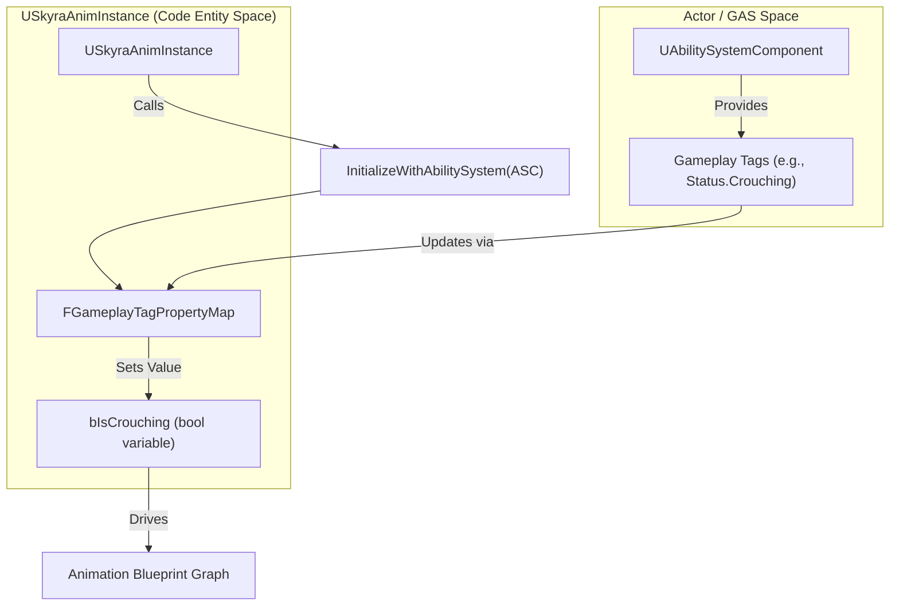
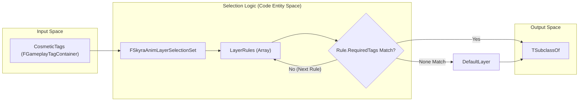

# 动画

Relevant source files

以下文件被用作生成此维基页面的上下文：

- [.gitattributes](.gitattributes)

SkyraFramework的动画系统提供了一种数据驱动的方法来处理角色和武器动画，并与Gameplay Ability System（GAS）和装饰品框架紧密集成。它侧重于两个主要支柱：一个能够感知GAS的基础动画实例，该实例将游戏玩法标签同步到动画变量；以及一个基于装饰品和装备标签的动态动画层选择系统。

## USkyraAnimInstance

`USkyraAnimInstance` 是 SkyraFramework 中动画蓝图的基础类。它的主要职责是通过自动将游戏玩法标签映射到成员变量，来弥合 `UAbilitySystemComponent`（ASC）与动画图表之间的差距。

### GAS 集成与标签映射

该类利用 `FGameplayTagPropertyMap` 来同步状态。这允许开发者在 AnimBP 中定义布尔或浮点属性，这些属性会在特定的 Gameplay 标签被添加到所属角色或从所属角色移除时自动更新 [Source/SkyraGame/Private/Animation/SkyraAnimInstance.h:35-38]()。

初始化流程确保动画实例始终与角色的 ASC 连接：
1.  **初始化**：在 `NativeInitializeAnimation` 期间，实例尝试通过 `UAbilitySystemGlobals` 在所属角色上定位 ASC [Source/SkyraGame/Private/Animation/SkyraAnimInstance.cpp:38-49]()。
2.  **绑定**：如果找到，它会调用 `InitializeWithAbilitySystem`，将 `GameplayTagPropertyMap` 绑定到 ASC [Source/SkyraGame/Private/Animation/SkyraAnimInstance.cpp:20-25]()。
3.  **验证**：在编辑器中，`IsDataValid` 确保属性映射配置正确，防止因标签不匹配或属性缺失而导致运行时错误 [Source/SkyraGame/Private/Animation/SkyraAnimInstance.cpp:28-35]()。

### 数据流：从 GAS 到动画

下图说明了游戏状态如何从能力系统流入动画图表。

**动画状态同步**

**来源：** [Source/SkyraGame/Private/Animation/SkyraAnimInstance.cpp:20-25]()、[Source/SkyraGame/Private/Animation/SkyraAnimInstance.h:35-38]()

---

## 外观动画选择

SkyraFramework 采用“层选择”模式来处理复杂的动画需求，例如装备武器时更改移动集或根据角色部位切换风格。这由 `FSkyraAnimLayerSelectionSet` 处理。

### FSkyraAnimLayerSelectionSet

此结构允许系统根据一组 `FGameplayTagContainer` 外观标签来选择 `UAnimInstance`（通常是动画层接口）[Source/SkyraGame/Private/Cosmetics/SkyraCosmeticAnimationTypes.h:38-41]()。

*   **层规则**：一个 `FSkyraAnimLayerSelectionEntry` 对象列表。每个条目包含对 Anim BP 类的引用和一组必需的标签 [Source/SkyraGame/Private/Cosmetics/SkyraCosmeticAnimationTypes.h:25-33]()。
*   **选择逻辑**：`SelectBestLayer` 函数遍历规则。返回第一个其 `RequiredTags` 全部存在于提供的 `CosmeticTags` 容器中的规则 [Source/SkyraGame/Private/Cosmetics/SkyraCosmeticAnimationTypes.cpp:10-21]()。
*   **默认回退**：如果没有规则匹配，则返回 `DefaultLayer` 以确保角色不会呈 T 姿势 [Source/SkyraGame/Private/Cosmetics/SkyraCosmeticAnimationTypes.cpp:20-20]()。

### FSkyraAnimBodyStyleSelectionSet

与层选择类似，此结构根据标签选择`USkeletalMesh`。用于可能会根据当前装备或装饰状态在视觉上发生变化（并且可能需要不同的动画偏移）的角色部位 [Source/SkyraGame/Private/Cosmetics/SkyraCosmeticAnimationTypes.cpp:23-34]()。

### 选择逻辑工作流程

下图展示了装饰系统如何从一组规则中解析出特定的动画层。

**装饰标签解析**

**来源：** [Source/SkyraGame/Private/Cosmetics/SkyraCosmeticAnimationTypes.cpp:10-21](), [Source/SkyraGame/Private/Cosmetics/SkyraCosmeticAnimationTypes.h:38-52]()

---

## 技术参考

### 关键类和结构

| 类/结构 | 用途 | 关键函数 |
| :--- | :--- | :--- |
| `USkyraAnimInstance` | 集成了GAS的基础AnimInstance。 | `InitializeWithAbilitySystem` [Source/SkyraGame/Private/Animation/SkyraAnimInstance.cpp:20](), `NativeInitializeAnimation` [Source/SkyraGame/Private/Animation/SkyraAnimInstance.cpp:38]() |
| `FSkyraAnimLayerSelectionSet` | 基于标签选择动画层的数据结构。 | `SelectBestLayer` [Source/SkyraGame/Private/Cosmetics/SkyraCosmeticAnimationTypes.cpp:10]() |
| `FSkyraAnimBodyStyleSelectionSet` | 基于标签选择骨架网格体的数据结构。 | `SelectBestBodyStyle` [Source/SkyraGame/Private/Cosmetics/SkyraCosmeticAnimationTypes.cpp:23]() |
| `FSkyraAnimLayerSelectionEntry` | 将标签映射到动画蓝图类的单个规则。 | N/A [Source/SkyraGame/Private/Cosmetics/SkyraCosmeticAnimationTypes.h:25]() |

**来源：** [Source/SkyraGame/Private/Animation/SkyraAnimInstance.h:18-21](), [Source/SkyraGame/Private/Cosmetics/SkyraCosmeticAnimationTypes.h:38-41](), [Source/SkyraGame/Private/Cosmetics/SkyraCosmeticAnimationTypes.h:55-58]()

### 实现细节

*   **地面信息**：`NativeUpdateAnimation`包含从`USkyraCharacterMovementComponent`（如果可用）拉取`FSkyraCharacterGroundInfo`的逻辑，为着陆和下落逻辑提供`GroundDistance`[Source/SkyraGame/Private/Animation/SkyraAnimInstance.cpp:51-64]()。
*   **属性映射**：`GameplayTagPropertyMap`是`UAbilitySystemComponent`的一个特性，在此利用它来避免在`BlueprintUpdateAnimation`滴答中进行手动的`HasTag`检查[Source/SkyraGame/Private/Animation/SkyraAnimInstance.h:35-38]()。

**来源：** [Source/SkyraGame/Private/Animation/SkyraAnimInstance.cpp:51-64](), [Source/SkyraGame/Private/Animation/SkyraAnimInstance.h:35-38]()