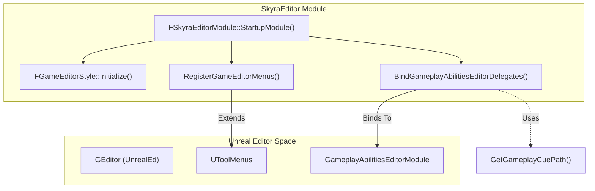
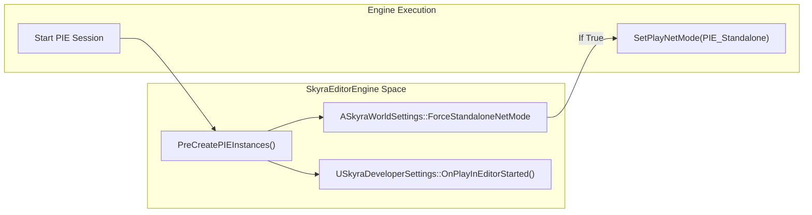

# SkyraEditor 模块

Relevant source files

以下文件用作生成此维基页面的上下文：

- [.gitattributes](.gitattributes)

`SkyraEditor` 模块提供仅限编辑器的功能，以支持 SkyraFramework 生态系统。它专注于通过自定义工具栏扩展来提升开发者生产力，简化游戏技能系统（GAS）工作流程，通过资产验证管道强制执行项目标准，并提供专门的资产管理工具。

## 模块启动与扩展
编辑器模块的入口点是 `FSkyraEditorModule`。启动时，它初始化自定义 Slate 样式并集成到 Unreal Editor 的菜单系统中。一个关键特性是扩展关卡编辑器工具栏以包含项目特定的实用工具。

### 工具栏扩展
该模块扩展 `LevelEditor.LevelEditorToolBar.PlayToolBar` [Source/SkyraEditor/Private/SkyraEditor.cpp:151-152]() 以添加：
*   **检查内容**：资产验证框架的手动触发器 [Source/SkyraEditor/Private/SkyraEditor.cpp:171-183]()。
*   **常用地图**：一个由 `USkyraDeveloperSettings` 填充的下拉菜单，允许开发者在常用地图之间快速跳转 [Source/SkyraEditor/Private/SkyraEditor.cpp:185-198]()。

### GAS 编辑器集成
为了改善 GAS 开发者体验，该模块将委托绑定到 `GameplayAbilitiesEditorModule`。这包括以下逻辑：
*   **GameplayCue 路径**：根据标签自动确定新 GameplayCue 通知的文件夹结构 [Source/SkyraEditor/Private/SkyraEditor.cpp:56-86]()。
*   **类过滤**：将 GameplayCue 编辑器限制为特定的通知类（Burst、Latent、Looping）[Source/SkyraEditor/Private/SkyraEditor.cpp:33-39]()。

### 编辑器引擎生命周期
`USkyraEditorEngine` 扩展了标准编辑器引擎，以处理 PIE（Play In Editor，编辑器内运行）的特定逻辑。例如，它可以根据 `ASkyraWorldSettings` 强制 `Standalone` 网络模式 [Source/SkyraEditor/Private/SkyraEditorEngine.cpp:56-73]()，并在 PIE 会话开始时触发开发者设置覆盖 [Source/SkyraEditor/Private/SkyraEditorEngine.cpp:76-77]()。

有关详细信息，请参阅[编辑器模块启动和扩展](#11.1)。

---

## 资产验证框架
SkyraEditor 实现了一个健壮的验证管线，以确保资产在提交或烘焙之前符合技术要求。该系统可通过“检查内容”工具栏按钮或通过用于 CI/CD 集成的 commandlet 访问。

该框架利用 `UEditorValidator` 作为基类来实现特定的检查：
*   **蓝图**：确保有效的父类和变量配置。
*   **材质函数**：检查性能退化或命名约定。
*   **源代码控制**：验证资产是否正确签出和同步。

有关详细信息，请参阅[资产验证框架](#11.2)。

---

## 编辑器实用工具和上下文效果工具
该模块提供了用于管理复杂资产（如上下文效果系统）的专用工具。这包括自定义`FAssetTypeActions`和工厂，以简化`USkyraContextEffectsLibrary`资产的创建。

此外，还提供了各种实用工具函数以：
*   检查Chaos网格碰撞。
*   管理重定向器和集合引用。

有关详细信息，请参阅[编辑器实用工具和上下文效果资产工具](#11.3)。

---

## 系统架构

### 编辑器启动流程
下图说明了`SkyraEditor`模块如何初始化并挂接到Unreal Editor环境中。

**SkyraEditor初始化桥接**

**来源：** [Source/SkyraEditor/Private/SkyraEditor.cpp:204-220]()、[Source/SkyraEditor/Private/SkyraEditor.cpp:149-152]()

### PIE生命周期管理
`USkyraEditorEngine` 管理从编辑器模式到运行模式的转换，确保应用开发者特定的配置。

**PIE 执行流程**

**源代码：** [Source/SkyraEditor/Private/SkyraEditorEngine.cpp:56-83]()

| 类/函数 | 职责 |
| :--- | :--- |
| `FSkyraEditorModule` | 主模块类；处理样式和菜单的注册。 [Source/SkyraEditor/Private/SkyraEditor.cpp:204-210]() |
| `USkyraEditorEngine` | 自定义编辑器引擎类；管理 PIE 状态和工作区默认设置。 [Source/SkyraEditor/Private/SkyraEditorEngine.cpp:20-23]() |
| `FGameEditorStyle` | 定义 Skyra 特定编辑器 UI 的视觉外观（图标/颜色）。 [Source/SkyraEditor/Private/SkyraEditor.cpp:144-147]() |
| `GetGameplayCuePath` | 用于确定 `GameplayCue` 资产在 `/Game` 文件夹中应存放位置的逻辑。[Source/SkyraEditor/Private/SkyraEditor.cpp:56-60]() |
| `CheckGameContent_Clicked` | 对当前选中文件或已签出的文件调用 `UEditorValidator` 套件。[Source/SkyraEditor/Private/SkyraEditor.cpp:171-183]() |

**来源：** [Source/SkyraEditor/Private/SkyraEditor.cpp:33-220](), [Source/SkyraEditor/Private/SkyraEditorEngine.cpp:20-83]()