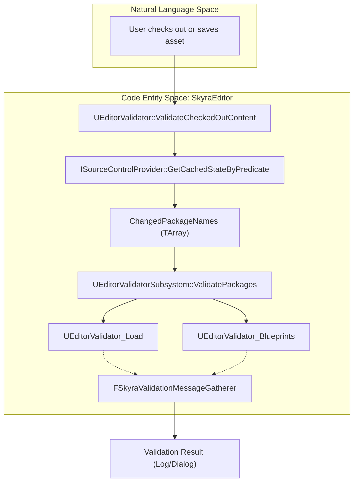
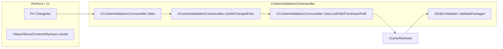

# 资产验证框架

Relevant source files

以下文件被用作生成此维基页面的上下文：

- [.gitattributes](.gitattributes)

SkyraFramework中的资产验证框架提供了一个强大、可扩展的系统，用于确保整个项目中的内容完整性。它与虚幻引擎的数据验证插件集成，可在资产保存、手动“检查内容”操作以及通过自定义命令行的自动化CI/CD流程中执行检查。

## 核心验证架构

该框架构建于`UEditorValidator`之上，`UEditorValidator`是一个抽象基类，扩展了`UEditorValidatorBase`。它提供了用于批量验证和项目范围设置检查的静态实用函数。

### UEditorValidator
此类充当验证逻辑的中心枢纽。它处理已更改资产（包括受C++头文件更改影响的资产）的发现，并管理特定验证器子类的执行。

*   **关键功能**：
    *   `ValidateCheckedOutContent`：识别所有当前在源代码控制中检出的文件，并对它们运行验证 [Source/SkyraEditor/Private/Validation/EditorValidator.cpp:42-159]().
    *   `ValidatePackages`：加载资产并将其传递给验证子系统的核心循环 [Source/SkyraEditor/Private/Validation/EditorValidator.cpp:161-300]().
    *   `GetChangedAssetsForCode`：当头文件被修改时，使用资产注册表查找依赖于特定C++类的资产 [Source/SkyraEditor/Private/Validation/EditorValidator.cpp:387-466]().

### 消息收集
该框架使用`FSkyraValidationMessageGatherer`在验证期间拦截日志消息。这使得系统能够捕获引擎在资产加载或处理过程中发出的警告或错误，这些警告或错误可能不会被验证器显式返回。

| 类 | 职责 |
| :--- | :--- |
| `FSkyraValidationMessageGatherer` | 一个`FOutputDevice`，在作用域块期间捕获`ELogVerbosity::Warning`和`Error` [Source/SkyraEditor/Public/Validation/EditorValidator.h:11-78]()。 |
| `FScopedContentValidationMessageGatherer` | 一个专用版本，在Commandlet内用于跟踪是否至少发生了一个错误 [Source/SkyraEditor/Private/Commandlets/ContentValidationCommandlet.cpp:20-44]()。 |

**来源：** [Source/SkyraEditor/Public/Validation/EditorValidator.h:11-108]()，[Source/SkyraEditor/Private/Validation/EditorValidator.cpp:37-40]()

## 专用验证器

SkyraFramework实现了多个专用验证器来处理不同的资产类型和基础设施需求。

### EditorValidator_Load
此验证器确保资产可以加载而不发出警告或错误。 
*   **实现方式**：为避免内存中已有资产的问题，它将资产文件复制到 `/Temp/` 包中，加载它，并通过 `FSkyraValidationMessageGatherer` [Source/SkyraEditor/Private/Validation/EditorValidator_Load.cpp:84-140]() 监控输出日志。
*   **特殊处理**：对于蓝图，它在加载副本之前编译原始蓝图以处理循环引用 [Source/SkyraEditor/Private/Validation/EditorValidator_Load.cpp:108-125]()。

### EditorValidator_Blueprints
专注于蓝图完整性。当启用“完整验证”时，它会递归查找所有非纯数据、硬引用当前资产的蓝图，并对其进行验证，以确保更改不会破坏其编译 [Source/SkyraEditor/Private/Validation/EditorValidator_Blueprints.cpp:35-107]()。

### EditorValidator_MaterialFunctions
与蓝图验证器类似，当验证 `UMaterialFunction` 时，此类会查找所有引用它的 `UMaterial` 资产，并验证它们是否仍能正确编译 [Source/SkyraEditor/Private/Validation/EditorValidator_MaterialFunctions.cpp:32-95]()。

### EditorValidator_SourceControl
确保提交到源代码管理（Perforce）的资产不引用仅本地的资产。它查询 `ISourceControlProvider` 以检查所有包依赖项的状态 [Source/SkyraEditor/Private/Validation/EditorValidator_SourceControl.cpp:33-57]()。

**来源：** [Source/SkyraEditor/Private/Validation/EditorValidator_Load.cpp:23-140](), [Source/SkyraEditor/Private/Validation/EditorValidator_Blueprints.cpp:17-107](), [Source/SkyraEditor/Private/Validation/EditorValidator_SourceControl.cpp:15-57](), [Source/SkyraEditor/Private/Validation/EditorValidator_MaterialFunctions.cpp:32-95]()

## 验证数据流

以下图表说明了系统如何从高级请求（例如检出文件）过渡到特定的代码实体和验证结果。

### 逻辑流程：版本控制到验证
标题：验证执行管道

**来源：** [Source/SkyraEditor/Private/Validation/EditorValidator.cpp:42-103](), [Source/SkyraEditor/Private/Validation/EditorValidator.cpp:161-186]()

## 内容验证 Commandlet

`UContentValidationCommandlet` 为 CI/CD 集成提供无界面入口点，专为 Perforce (P4) 环境设计。

### 执行参数
该 Commandlet 支持多个标志来确定要验证哪些资产：
*   `-P4Changelist=[CL]`：验证特定变更列表中的文件 [Source/SkyraEditor/Private/Commandlets/ContentValidationCommandlet.cpp:81-84]()。
*   `-P4Opened`：验证工作区中当前打开的所有文件 [Source/SkyraEditor/Private/Commandlets/ContentValidationCommandlet.cpp:92-112]()。
*   `-InPath=[Path]`：验证特定目录内的所有资产 [Source/SkyraEditor/Private/Commandlets/ContentValidationCommandlet.cpp:129-132]()。
*   `-OfType=[ClassName]`：验证特定类的所有资产 [Source/SkyraEditor/Private/Commandlets/ContentValidationCommandlet.cpp:135-141]()。

### 路径映射
该命令小程序包含了将 Perforce 仓库路径映射到 Unreal Engine 长包名的逻辑（例如，将 `SkyraGame/Content/Items/` 映射到 `/Game/Items/`）[Source/SkyraEditor/Private/Commandlets/ContentValidationCommandlet.cpp:184-206]()。

### CI/CD 流水线集成
标题：命令小程序集成与映射

**来源：** [Source/SkyraEditor/Private/Commandlets/ContentValidationCommandlet.cpp:51-90](), [Source/SkyraEditor/Private/Commandlets/ContentValidationCommandlet.cpp:174-206]()

## 关键函数汇总表

| 功能 | 文件 | 描述 |
| :--- | :--- | :--- |
| `ValidatePackages` | `EditorValidator.cpp` | 静态入口点，遍历包并触发验证子系统 [Source/SkyraEditor/Private/Validation/EditorValidator.cpp:161]()。 |
| `GetLoadWarningsAndErrorsForPackage` | `EditorValidator_Load.cpp` | 核心逻辑，用于将资产\"侧载\"到临时包中，以检查加载时的问题 [Source/SkyraEditor/Private/Validation/EditorValidator_Load.cpp:64]() |
| `GetAllChangedFiles` | `ContentValidationCommandlet.cpp` | 执行 P4 命令以检索在 CI 上下文中要验证的文件列表 [Source/SkyraEditor/Private/Commandlets/ContentValidationCommandlet.cpp:174]() |
| `ValidateProjectSettings` | `EditorValidator.cpp` | 检查全局项目配置（例如打包设置）以查找常见错误 [Source/SkyraEditor/Private/Validation/EditorValidator.cpp:302]() |

**源文件：** [Source/SkyraEditor/Private/Validation/EditorValidator.cpp:161-300](), [Source/SkyraEditor/Private/Validation/EditorValidator_Load.cpp:64-185](), [Source/SkyraEditor/Private/Commandlets/ContentValidationCommandlet.cpp:174-240]()