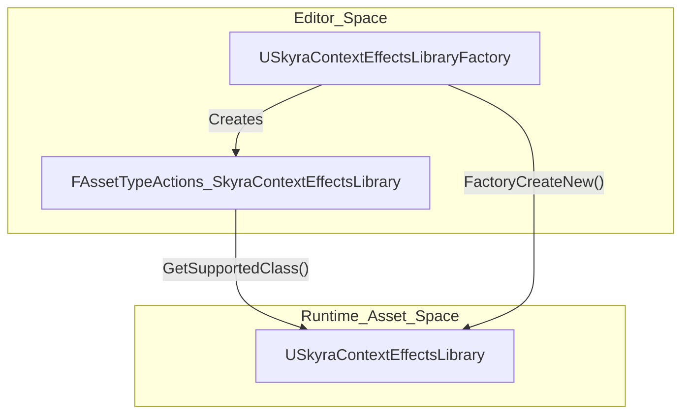
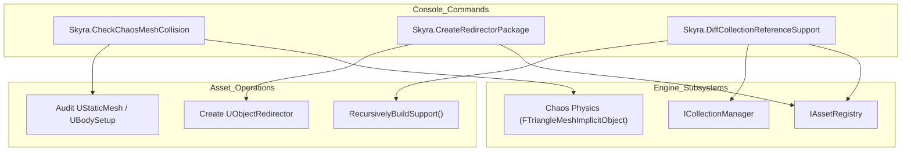

# 编辑器工具与情境效果资产工具

Relevant source files

以下文件用作生成本维基页面的上下文信息：

- [.gitattributes](.gitattributes)

本页面记录了`SkyraEditor`模块提供的编辑器专用工具和资产管线扩展。这些工具有助于资产维护、碰撞调试，以及创建自定义游戏资产，例如情境效果库。

## 情境效果资产管线

情境效果系统需要特殊的资产类型来将游戏标签和物理表面映射到特定的视觉或音频效果。`SkyraEditor`模块提供了必要的基础设施，以便在Unreal编辑器中创建和管理这些资产。

### USkyraContextEffectsLibraryFactory
此类允许直接从内容浏览器的“新建资产”菜单创建新的`USkyraContextEffectsLibrary`资产。它已配置为出现在菜单中，并自动处理库对象的实例化[Source/SkyraEditor/Public/SkyraContextEffectsLibraryFactory.h:14-26]()。

*   **初始化**：构造函数将支持的类设置为`USkyraContextEffectsLibrary`并启用`bCreateNew`[Source/SkyraEditor/Private/SkyraContextEffectsLibraryFactory.cpp:13-21]()。
*   **创建**：`FactoryCreateNew`执行库的实际`NewObject`分配[Source/SkyraEditor/Private/SkyraContextEffectsLibraryFactory.cpp:23-28]()。

### FAssetTypeActions_SkyraContextEffectsLibrary
此类定义了情境效果库资产在编辑器中的显示和行为方式。它继承自`FAssetTypeActions_Base`以提供标准的资产功能[Source/SkyraEditor/Public/AssetTypeActions_SkyraContextEffectsLibrary.h:10-18]()。

*   **分类**：资产位于编辑器菜单中的**Gameplay**类别下 [Source/SkyraEditor/Public/AssetTypeActions_SkyraContextEffectsLibrary.h:17-17]().
*   **视觉效果**：资产被赋予特定颜色（RGB: 65, 200, 98），以便在内容浏览器中轻松识别 [Source/SkyraEditor/Public/AssetTypeActions_SkyraContextEffectsLibrary.h:15-15]().

### 上下文效果资产创建流程
下图说明了编辑器工厂与生成的运行时资产之间的关系。

**图表：上下文效果资产实体映射**

**来源：** [Source/SkyraEditor/Private/SkyraContextEffectsLibraryFactory.cpp:13-28]()、[Source/SkyraEditor/Private/AssetTypeActions_SkyraContextEffectsLibrary.cpp:11-14]()

---

## 编辑器实用工具

`SkyraEditor`模块包含多个控制台驱动的实用工具，用于帮助开发者进行资产审计和维护。它们被注册为`FAutoConsoleCommandWithWorldArgsAndOutputDevice`命令。

### Chaos网格碰撞检查器
`Skyra.CheckChaosMeshCollision`命令审计所有当前加载的`UStaticMesh`资产，检查其Chaos物理数据中的退化三角形。退化三角形（面积为零的三角形）可能导致物理引擎不稳定或崩溃 [Source/SkyraEditor/Private/Utilities/CheckChaosMeshCollision.cpp:74-84]().

*   **逻辑**：它遍历`TObjectRange<UStaticMesh>`，访问`UBodySetup`，并获取`FTriangleMeshImplicitObject` [Source/SkyraEditor/Private/Utilities/CheckChaosMeshCollision.cpp:56-71]().
*   **验证**：`CheckMeshDataForProblem`函数通过边叉积计算每个三角形的法线。如果归一化结果小于`SMALL_NUMBER`，则该三角形被标记为退化 [Source/SkyraEditor/Private/Utilities/CheckChaosMeshCollision.cpp:17-52]().

### 重定向包创建器
`Skyra.CreateRedirectorPackage` 命令允许开发者以编程方式创建 `UObjectRedirector` 资源。这对于修复损坏的引用或在不断开现有依赖的情况下移动资源非常有用 [Source/SkyraEditor/Private/Utilities/CreateRedirectorPackage.cpp:15-19]()。

*   **参数**：需要一个 `RedirectorName`（重定向器将创建的路径）和一个 `TargetPackage`（它应指向的资源）[Source/SkyraEditor/Private/Utilities/CreateRedirectorPackage.cpp:31-32]()。
*   **实现**：它创建一个新的 `UPackage`，在其中实例化一个 `UObjectRedirector`，并将 `DestinationObject` 设置为目标资源 [Source/SkyraEditor/Private/Utilities/CreateRedirectorPackage.cpp:56-61]()。

### 集合引用支持差异
`Skyra.DiffCollectionReferenceSupport` 命令对两个编辑器集合之间的资源依赖关系进行了深入分析。它确定“旧”集合中的哪些资源支持（引用）“新”集合中引入的资源 [Source/SkyraEditor/Private/Utilities/DiffCollectionReferenceSupport.cpp:14-22]()。

*   **递归分析**：该工具使用 `RecursivelyBuildSupport` 通过 `IAssetRegistry` 遍历引用图。它识别直接和间接引用者 [Source/SkyraEditor/Private/Utilities/DiffCollectionReferenceSupport.cpp:73-104]()。
*   **去重**：一个可选的第三个参数允许用户对被多个源支持的资源进行去重，帮助识别“最强”的支持者 [Source/SkyraEditor/Private/Utilities/DiffCollectionReferenceSupport.cpp:41-41]()。
*   **输出**：记录支持者资源的排序列表，以及在新集合中没有旧集合引用者的“松散”资源列表 [Source/SkyraEditor/Private/Utilities/DiffCollectionReferenceSupport.cpp:124-167]()。

---

## 工具数据流

下图展示了编辑器工具如何与 Unreal Engine 的核心系统（资源注册表、Chaos 物理）交互以执行审计和修改。

**图表：编辑器工具系统交互**

**来源:** [Source/SkyraEditor/Private/Utilities/CheckChaosMeshCollision.cpp:56-72](), [Source/SkyraEditor/Private/Utilities/CreateRedirectorPackage.cpp:22-23](), [Source/SkyraEditor/Private/Utilities/DiffCollectionReferenceSupport.cpp:26-27](), [Source/SkyraEditor/Private/Utilities/DiffCollectionReferenceSupport.cpp:73-74]()

### 命令摘要

| 命令 | 目的 | 关键文件 |
| :--- | :--- | :--- |
| `Skyra.CheckChaosMeshCollision` | 查找已加载的静态网格体碰撞中的退化三角形。 | [Source/SkyraEditor/Private/Utilities/CheckChaosMeshCollision.cpp]() |
| `Skyra.CreateRedirectorPackage` | 创建指向目标包的重定向器资产。 | [Source/SkyraEditor/Private/Utilities/CreateRedirectorPackage.cpp]() |
| `Skyra.DiffCollectionReferenceSupport` | 分析两个集合之间的依赖关系。 | [Source/SkyraEditor/Private/Utilities/DiffCollectionReferenceSupport.cpp]() |

**来源：** [Source/SkyraEditor/Private/Utilities/CheckChaosMeshCollision.cpp:74-75](), [Source/SkyraEditor/Private/Utilities/CreateRedirectorPackage.cpp:15-16](), [Source/SkyraEditor/Private/Utilities/DiffCollectionReferenceSupport.cpp:14-15]()