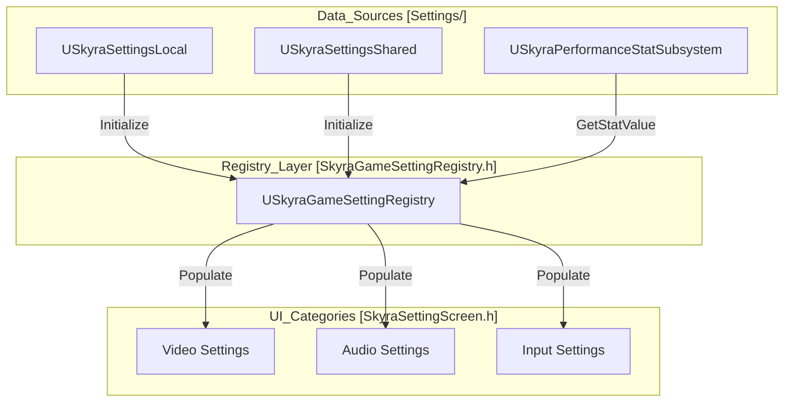
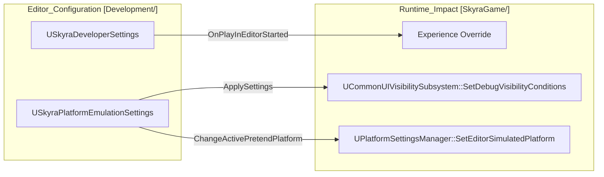

# 性能、设置和基础设施

Relevant source files

以下文件被用作生成此 Wiki 页面的上下文：

- [.gitattributes](.gitattributes)

本节概述了支持 SkyraFramework 运行稳定性和用户配置的横切系统。这些系统处理从底层性能跟踪和物理交互到高层用户偏好和实时服务热修复的一切。

基础设施设计为模块化，允许特定平台的覆盖（例如，移动端与 PC 设置），并提供强大的开发工具用于测试各种网络和硬件环境。

## 性能和设置系统

SkyraFramework 中的设置架构分为本地、共享和数据驱动的注册表组件。这种分离确保了硬件特定的可扩展性设置（本地）与用户偏好（如音频音量或游戏玩法切换）独立管理。

### 系统概览
- **`USkyraSettingsLocal`**：管理机器特定数据，包括视频可扩展性、自定义输入映射和设备配置文件。它负责应用“可扩展性快照”，以确保在不同硬件层级上保持一致的性能。
- **`USkyraSettingsShared`**：存储每个用户的偏好设置，这些设置旨在跟随玩家跨不同设备，例如字幕、灵敏度和色盲模式。
- **`USkyraPerformanceStatSubsystem`**：一个运行时子系统，用于直接在 UI 中跟踪和显示性能指标（FPS、延迟、内存）。
- **`USkyraGameSettingRegistry`**：将设置暴露给 UI 的中央权威。它将设置分为音频、视频、游戏玩法、鼠标/键盘和手柄，为设置界面提供统一的 API 来查询和修改值。

有关这些设置如何注册和应用的详细信息，请参阅**[性能与设置系统](#12.1)**。

### 设置基础设施图
以下图表说明了不同的设置类如何与`USkyraGameSettingRegistry`交互，以弥合本地数据与用户界面之间的差距。

---

## 热修复、回放和开发工具

Skyra框架包含一套专为线上运营和开发者生产力设计的工具。这包括用于远程配置更新的热修复系统，以及用于比赛回顾的回放子系统。

### 关键组件
- **热修复系统**：由`USkyraHotfixManager`管理，该系统允许游戏接收对`USkyraRuntimeOptions`和`USkyraTextHotfixConfig`的更新，而无需完整的二进制补丁。这对于在线上环境中调整平衡变量或禁用损坏的功能至关重要。
- **回放子系统**：`USkyraReplaySubsystem`便于录制和回放游戏会话。它利用`UAsyncAction_QueryReplays`为UI异步获取可用的回放。
- **开发者设置**：`USkyraDeveloperSettings`为编辑器专用的覆盖提供了集中位置，例如在PIE（在编辑器中运行）会话期间强制使用特定的`USkyraExperienceDefinition`。
- **平台仿真**：`USkyraPlatformEmulationSettings`允许开发者“假装”处于不同平台（例如，在PC上模拟移动设备），以测试UI可见性和平台特定特征。

有关运行时配置和调试工具的详细信息，请参阅**[热修复、回放和开发工具](#12.2)**。

### 开发基础设施流程
此图展示了开发者设置和平台模拟在测试期间如何影响运行时环境，将编辑器专用配置映射为运行时行为。

### 物理与材质
该框架使用`USkyraPhysicalMaterialWithTags`扩展了Unreal的物理系统。这使得物理材质能够携带游戏性标签，`USkyraContextEffectsSubsystem`利用这些标签来触发表面感知的音频和视觉效果（例如，"草地"与"金属"有不同的脚步声）。

| 类 | 职责 |
| :--- | :--- |
| `USkyraHotfixManager` | 获取并将远程补丁应用到数据资产。 |
| `USkyraRuntimeOptions` | 数据驱动的游戏功能开关（例如，启用/禁用特定地图）。 |
| `USkyraReplaySubsystem` | 用于启动/停止回放的高级API。 |
| `USkyraPlatformEmulationSettings` | 配置 `PretendPlatform` 和 `PretendBaseDeviceProfile`。 |

**来源:** `.gitattributes:1-4` (基础设施/LFS 配置)