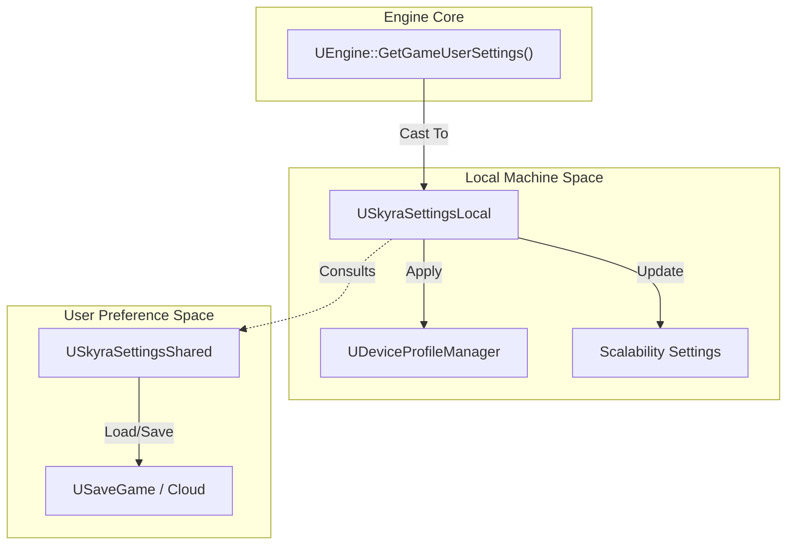
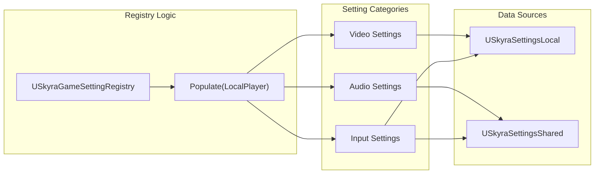

# 性能与设置系统

Relevant source files

以下文件被用作生成此维基页面的上下文：

- [.gitattributes](.gitattributes)

SkyraFramework提供了一个强大的多层基础设施，用于管理硬件可扩展性、用户偏好和实时性能监控。该系统将瞬态的本地硬件配置与持久的用户特定账户设置分离开，同时提供一个统一的注册表，以便将这些选项暴露给UI。

## 性能统计子系统

`USkyraPerformanceStatSubsystem`负责跟踪和广播实时性能指标（例如FPS、帧时间、延迟）。它充当一个中心枢纽，在这里对各种引擎级统计数据进行采样，然后通过基于委托的系统传递给UI。

### 关键组件
- **统计跟踪**：它监控特定的`ESkyraDisplayablePerformanceStat`枚举值。
- **数据流**：该子系统在`Tick`期间对值进行采样，并为任何活动监听器（通常是UI控件）触发`OnStatChanged`委托。

### 性能设置
全局性能配置在`USkyraPerformanceSettings`中定义。此数据资产允许开发者对性能统计数据进行分类，并定义在不同的构建配置中哪些统计数据可用于显示。

来源： [Source/SkyraGame/Private/Performance/SkyraPerformanceSettings.cpp:1-10](), [Source/SkyraGame/Private/Performance/SkyraPerformanceStatSubsystem.cpp:1-15]()

## 设置架构

Skyra 将设置分为两个主要类别，以处理“游戏在此机器上的运行方式”与“该特定用户喜欢的游戏方式”之间的差异。

### SkyraSettingsLocal
`USkyraSettingsLocal` 继承自 `UGameUserSettings`。它处理不应在不同设备间同步的特定于机器的数据（例如 PC 与主机）。
- **可扩展性快照**：管理分辨率缩放、阴影质量和视距。
- **设备配置文件**：与 Unreal 的 `UDeviceProfileManager` 集成，以应用特定于平台的优化。
- **输入映射**：存储本地按键覆盖和灵敏度设置。

### SkyraSettingsShared
`USkyraSettingsShared` 处理期望在不同设备间跟随用户账户的持久用户偏好。
- **音频/视频偏好**：字幕、色盲模式和音量级别。
- **游戏性切换**：“自动奔跑”或“按住下蹲”偏好。
- **数据序列化**：使用 `USaveGame` 将数据持久化到本地磁盘或云存储。

### 数据流：设置初始化
下图说明了设置系统如何初始化并与Unreal Engine硬件层交互。

**设置初始化和硬件交互**

来源：[Source/SkyraGame/Private/Settings/SkyraSettingsLocal.cpp:1-50]()、[Source/SkyraGame/Private/Settings/SkyraSettingsShared.cpp:1-30]()

## 游戏设置注册表

`USkyraGameSettingRegistry`充当`SkyraSettingsLocal/Shared`中的原始数据与UI之间的桥梁。它将设置组织为逻辑类别（视频、音频、游戏玩法等），并提供`UGameSetting`对象，UI可为其自动生成控件。

### 按类别注册表
注册表通过查询每个类别的专用提供程序来自我填充：
- **音频**：音量滑块和输出设备选择。
- **视频**：显示模式、垂直同步和帧率限制。
- **游戏手柄/鼠标和键盘**：灵敏度、反转和按键重新映射。
- **性能统计**：显示FPS或网络调试信息的开关。

**注册表实体映射**

来源：[Source/SkyraGame/Private/Settings/SkyraGameSettingRegistry.cpp:1-100]()

## 开发与仿真工具

为了在没有物理访问多个设备的情况下测试不同硬件层级的性能，Skyra 包含了仅限开发者使用的设置。

### SkyraDeveloperSettings
`USkyraDeveloperSettings` 类提供了仅在编辑器中使用的覆盖选项，用于测试特定游戏玩法场景。
- **体验覆盖**：强制加载特定的 `USkyraExperienceDefinition`，而不考虑地图的默认设置 [Source/SkyraGame/Private/Development/SkyraDeveloperSettings.cpp:50-58]()。
- **通知系统**：当覆盖激活时触发 Slate 通知，以防止意外的“脏”测试 [Source/SkyraGame/Private/Development/SkyraDeveloperSettings.cpp:52-57]()。

### SkyraPlatformEmulationSettings
`USkyraPlatformEmulationSettings` 允许开发者在 PC 编辑器中直接模拟不同的平台（例如移动端或主机）。
- **伪装平台**：使用 `UPlatformSettingsManager::SetEditorSimulatedPlatform` 欺骗引擎使用特定平台的逻辑 [Source/SkyraGame/Private/Development/SkyraPlatformEmulationSettings.cpp:110-111]()。
- **特质覆盖**：管理 `AdditionalPlatformTraitsToEnable` 和 `AdditionalPlatformTraitsToSuppress`，它们与 `UCommonUIVisibilitySubsystem` 接口，根据仿真平台来隐藏/显示 UI 元素 [Source/SkyraGame/Private/Development/SkyraPlatformEmulationSettings.cpp:95-96]()。
- **设备配置文件选择**：自动选择一个“合理”的基础设备配置文件（例如，选择与平台匹配的最短名称）来应用可扩展性设置 [Source/SkyraGame/Private/Development/SkyraPlatformEmulationSettings.cpp:161-193]()

来源：[Source/SkyraGame/Private/Development/SkyraDeveloperSettings.cpp:12-60]()，[Source/SkyraGame/Private/Development/SkyraPlatformEmulationSettings.cpp:35-113]()，[Source/SkyraGame/Private/Development/SkyraPlatformEmulationSettings.cpp:161-193]()