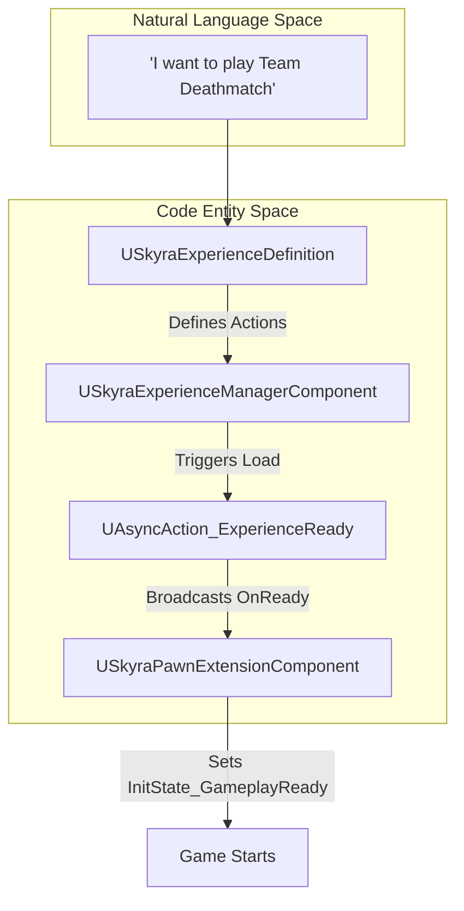
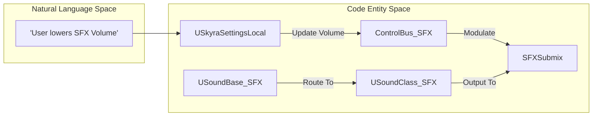

# 术语表

Relevant source files

以下文件被用作生成此维基页面的上下文：

- [.gitattributes](.gitattributes)
- [.gitignore](.gitignore)
- [Content/Assets/Audio/AttenuationPresets/ATT_Amb_Pad.uasset](Content/Assets/Audio/AttenuationPresets/ATT_Amb_Pad.uasset)
- [Content/Assets/Audio/AttenuationPresets/ATT_Default.uasset](Content/Assets/Audio/AttenuationPresets/ATT_Default.uasset)
- [Content/Assets/Audio/AttenuationPresets/ATT_Foley.uasset](Content/Assets/Audio/AttenuationPresets/ATT_Foley.uasset)
- [Content/Assets/Audio/AttenuationPresets/ATT_Footstep_NPC.uasset](Content/Assets/Audio/AttenuationPresets/ATT_Footstep_NPC.uasset)
- [Content/Assets/Audio/Classes/Overall.uasset](Content/Assets/Audio/Classes/Overall.uasset)
- [Content/Assets/Audio/Classes/SFX.uasset](Content/Assets/Audio/Classes/SFX.uasset)
- [Content/Assets/Audio/Concurrency/SCON_Footsteps.uasset](Content/Assets/Audio/Concurrency/SCON_Footsteps.uasset)
- [Content/Assets/Audio/MetaSounds/lib_WhizBy.uasset](Content/Assets/Audio/MetaSounds/lib_WhizBy.uasset)
- [Content/Assets/Audio/MetaSounds/mx_System.uasset](Content/Assets/Audio/MetaSounds/mx_System.uasset)

本词汇表定义了SkyraFramework代码库中使用的技术术语、缩写和领域特定概念。它在高级游戏概念与底层C++实现之间架起桥梁，包括基础设施和音频术语。

## 核心框架概念

### 体验
一种数据驱动的游戏模式定义。与标准的虚幻引擎`AGameMode`不同，体验由`USkyraExperienceDefinition`数据资产定义，该资产指定了Pawn数据、加载时要执行的操作（如添加游戏功能）以及游戏流程逻辑。
*   **实现**：`USkyraExperienceDefinition` [Source/SkyraGame/Private/GameModes/SkyraExperienceDefinition.h]()
*   **管理**：由附加到`ASkyraGameState`的`USkyraExperienceManagerComponent`处理。
*   **加载**：异步加载由`UAsyncAction_ExperienceReady`实现，见[Source/SkyraGame/Private/GameModes/AsyncAction_ExperienceReady.cpp:17-29]()。

### Pawn数据
一种配置对象（`USkyraPawnData`），它定义了Pawn的“身份”，包括其基类、要授予的`USkyraAbilitySet`，以及用于将玩家输入映射到游戏标签的`USkyraInputConfig`。
*   **实现**：`USkyraPawnData` [Source/SkyraGame/Private/Character/SkyraPawnData.h]()
*   **用法**：通过`USkyraPawnExtensionComponent::SetPawnData`函数分配给Pawn，见[Source/SkyraGame/Private/Character/SkyraPawnExtensionComponent.cpp:76-98]()。

### 初始化状态（Init State）
一种状态机模式，用于同步Actor上模块化组件的就绪状态。组件向`UGameFrameworkComponentManager`注册，并通过`InitState_Spawned`和`InitState_GameplayReady`等标签推进。
*   **关键组件**：`USkyraPawnExtensionComponent` [Source/SkyraGame/Private/Character/SkyraPawnExtensionComponent.cpp:213-222]()。

## 游戏能力系统（GAS）扩展

### 能力激活策略
决定一个`USkyraGameplayAbility`如何启动。
*   **OnInputTriggered**：在首次按下输入按钮时激活。
*   **WhileInputActive**：按下时激活，释放输入时取消。
*   **OnSpawn**：在生成/初始化Actor时自动激活。
*   **实现**：`ESkyraAbilityActivationPolicy` [Source/SkyraGame/Private/AbilitySystem/Abilities/SkyraGameplayAbility.h]()。

### 能力标签关系映射
一种数据资产（`USkyraAbilityTagRelationshipMapping`），定义了游戏标签如何在全局范围内相互交互（例如，“Tag A 阻止 Tag B”或“Tag C 取消 Tag D”）。
*   **实现**: `USkyraAbilityTagRelationshipMapping` [Source/SkyraGame/Private/AbilitySystem/SkyraAbilityTagRelationshipMapping.h]().
*   **用法**: 在 Pawn 初始化期间应用于 `USkyraAbilitySystemComponent` [Source/SkyraGame/Private/Character/SkyraPawnExtensionComponent.cpp:144-147]().

### 游戏阶段
一种专门的游戏玩法能力 (`USkyraGamePhaseAbility`)，代表游戏的高层级状态（例如，“热身”、“游戏中”、“游戏结束”）。阶段可以使用游戏玩法标签进行嵌套。
*   **子系统**: `USkyraGamePhaseSubsystem` 管理阶段的开始和结束 [Source/SkyraGame/Private/AbilitySystem/Phases/SkyraGamePhaseSubsystem.cpp:50-70]().

### 全局能力系统
一个世界子系统，允许同时向世界中所有注册的能力系统组件 (ASC) 应用游戏效果或授予能力。
*   **实现**: `USkyraGlobalAbilitySystem` [Source/SkyraGame/Private/AbilitySystem/SkyraGlobalAbilitySystem.h]().
*   **注册**: ASC 在 `InitAbilityActorInfo` 期间自行注册 [Source/SkyraGame/Private/AbilitySystem/SkyraAbilitySystemComponent.cpp:79-83]().

## 装备与库存

### 装备定义 vs. 实例
*   **装备定义 (`USkyraEquipmentDefinition`)**: 一个静态数据资产，描述物品是什么、它生成哪些 Actor，以及它授予哪些能力 [Source/SkyraGame/Private/Equipment/SkyraEquipmentDefinition.h]().
*   **装备实例 (`USkyraEquipmentInstance`)**：一个生成的UObject，代表当前由Pawn拥有的特定装备。它管理世界中物理Actor（网格体）的生命周期 [Source/SkyraGame/Private/Equipment/SkyraEquipmentInstance.h]()。

### 上下文效果
一个基于“上下文”（例如表面类型）和“效果”（例如脚步声）触发反馈（Niagara粒子或声音）的系统。
*   **库**：`USkyraContextEffectsLibrary` 存储映射 [Source/SkyraGame/Private/Feedback/ContextEffects/SkyraContextEffectsLibrary.h]()。
*   **触发**：通常通过 `AnimNotify_SkyraContextEffects` 执行。

## 音频和反馈术语

### MetaSound
一个用于程序化声音生成和复杂逻辑的高性能音频图系统。
*   **示例**：`mx_System` [Content/Assets/Audio/MetaSounds/mx_System.uasset:1-4]()，`lib_WhizBy` [Content/Assets/Audio/MetaSounds/lib_WhizBy.uasset:1-4]()。

### 衰减
定义声音音量和空间化如何根据听者与声源之间的距离而变化。
*   **预设**：`ATT_Default` [Content/Assets/Audio/AttenuationPresets/ATT_Default.uasset:1-4]()，`ATT_Foley` [Content/Assets/Audio/AttenuationPresets/ATT_Foley.uasset:1-4]()。

### 并发
控制特定声音可以同时播放的实例数量，以防止音频混乱和性能问题的设置。
*   **示例**：`SCON_Footsteps` [Content/Assets/Audio/Concurrency/SCON_Footsteps.uasset:1-4]().

### 子混音和控制总线
*   **子混音**：一种音频端点，将多个声音混合在一起以进行组处理（例如，对所有音效应用混响）。
*   **控制总线（CB）**：一种调制源，用于驱动跨多个声音或子混音的参数（例如，设置中的音量滑块）。

### 拟音
代表角色附带动作的声音效果，例如衣服沙沙声或装备碰撞声。
*   **衰减**：`ATT_Foley` [Content/Assets/Audio/AttenuationPresets/ATT_Foley.uasset:1-4]().

## 系统架构图

### 体验加载数据流
此图展示了系统如何从请求的体验过渡到完全初始化的游戏状态。

**源文件**：[Source/SkyraGame/Private/GameModes/AsyncAction_ExperienceReady.cpp:61-82](), [Source/SkyraGame/Private/Character/SkyraPawnExtensionComponent.cpp:213-222]()

### 音频路由与控制
将概念上的"调整音效音量"映射到内部引擎和框架实体。

**源文件**：[Content/Assets/Audio/Classes/SFX.uasset:1-4](), [Source/SkyraGame/Private/Settings/SkyraSettingsLocal.h]()

## 技术缩写与基础设施

| 缩写 | 全称 | 描述 |
| :--- | :--- | :--- |
| **ASC** | 能力系统组件 | Unreal Gameplay能力系统的核心组件 [Source/SkyraGame/Private/AbilitySystem/SkyraAbilitySystemComponent.h]()。 |
| **CDO** | 类默认对象 | 类的默认实例，用于模板数据。 |
| **DDC** | 派生数据缓存 | Unreal 用于存储针对特定平台优化格式的资产版本的缓存。 |
| **LFS** | 大文件存储 | 用于处理大型二进制文件的 Git 扩展，例如 `.uasset` [ .gitattributes:3-3]()。 |
| **UBT / UHT** | Unreal 构建工具 / 头文件工具 | 负责编译 C++ 代码并生成反射数据的工具。 |
| **GE / GA** | Gameplay Effect / Ability | 用于逻辑和属性修改的核心 GAS 基元。 |
| **PIE** | Play In Editor | 在虚幻编辑器环境中运行游戏。 |

## 插件依赖
SkyraFramework 依赖于多个模块化插件来提供其核心功能。
*   **ModularGameplay**：提供用于初始状态的 `GameFrameworkComponentManager`。
*   **GameplayAbilities**：GAS 实现的基础。
*   **GameFeatures**：由 Experiences 用于切换模块化内容。
*   **CommonUI**：跨平台 UI 系统的基础。

**来源**：[SkyraFramework.uplugin:29-138]()