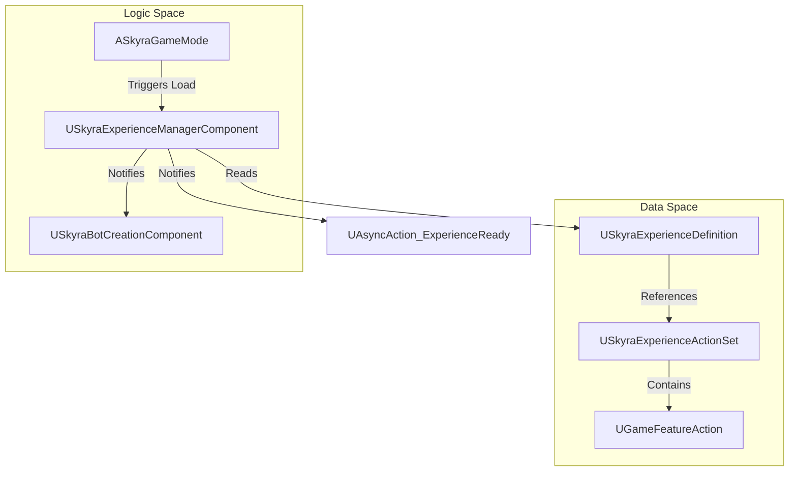
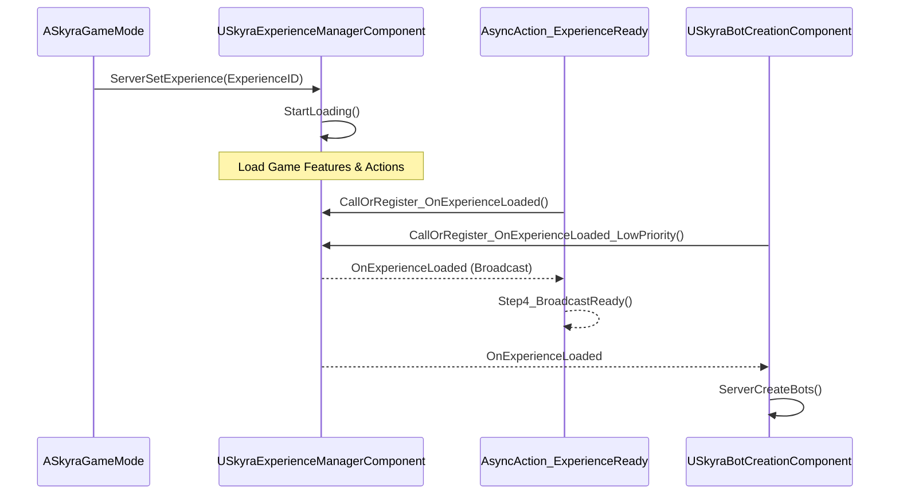

# 体验与游戏模式系统

Relevant source files

以下文件被用作生成本维基页面的上下文：

- [.gitattributes](.gitattributes)

SkyraFramework中的**体验与游戏模式系统**是一个数据驱动的架构，它将游戏逻辑从传统的`AGameMode`类中解耦出来。Skyra不是为不同的比赛类型创建大量C++或蓝图的游戏模式子类，而是使用**体验**（`USkyraExperienceDefinition`）来定义特定游戏会话所需的规则、功能和资产。

该系统利用**模块化游戏玩法**和**游戏功能**插件来动态加载和卸载内容，从而实现高度灵活和异步的初始化流水线。

## 核心架构

该系统从静态的游戏模式结构过渡到动态的、基于组件的加载流程。`ASkyraGameMode`充当一个外壳，触发特定体验的加载，然后该体验用必要的组件和规则填充世界。

### 系统概览图

**来源：** [Source/SkyraGame/Private/GameModes/SkyraExperienceActionSet.cpp:24-38]()、[Source/SkyraGame/Private/GameModes/AsyncAction_ExperienceReady.cpp:61-82]()

## 关键组件

### 体验定义
`USkyraExperienceDefinition`是定义游戏模式的主要数据资产。它包含`UGameFeatureAction`对象的列表和对`USkyraExperienceActionSet`资产的引用。这些定义了从HUD控件到授予玩家的特定游戏能力的所有内容。
* 有关详细信息，请参阅[体验定义和加载](#2.1)。

### 游戏模式与状态
`ASkyraGameMode` 是入口点。它处理加载体验的初始请求并管理玩家生成。它与 `ASkyraGameState` 协同工作，后者托管 `USkyraExperienceManagerComponent`。
* 有关详细信息，请参阅[游戏模式、游戏状态和世界设置](#2.2)。

### 体验管理器组件
`USkyraExperienceManagerComponent`（附加到 `ASkyraGameState`）管理加载体验的实际状态机。它处理资产的异步加载和游戏特性的激活。
* 有关详细信息，请参阅[体验定义和加载](#2.1)。

## 初始化管线

Skyra 使用异步管线来确保所有资产（游戏特性、能力集等）在游戏开始前完全加载。这通常通过 `UAsyncAction_ExperienceReady` 进行管理，它允许 UI 或其他系统等待环境完全准备就绪。

### 加载流程图

**来源：** [Source/SkyraGame/Private/GameModes/AsyncAction_ExperienceReady.cpp:61-94]()，[Source/SkyraGame/Private/GameModes/SkyraBotCreationComponent.cpp:21-32]()

## 子系统

### 机器人创建
`USkyraBotCreationComponent` 与体验系统集成，在体验准备就绪后生成 AI 玩家。它支持开发者覆盖机器人数量，并利用 `ASkyraGameMode` 进行标准化的角色初始化。
* **关键函数：** `ServerCreateBots` [Source/SkyraGame/Private/GameModes/SkyraBotCreationComponent.cpp:44-78]()
* **初始化：** 在生成之前监听 `OnExperienceLoaded` [Source/SkyraGame/Private/GameModes/SkyraBotCreationComponent.cpp:21-30]()。

### 游戏功能动作
动作是体验的模块化构建块。`USkyraExperienceActionSet` 充当这些动作的容器，允许常见功能集（如“基础战斗规则”）在多个体验之间共享。
* **数据验证：** 系统包含编辑器端验证，以确保集合中的所有动作都是有效的 [Source/SkyraGame/Private/GameModes/SkyraExperienceActionSet.cpp:19-42]()。
* 有关详细信息，请参阅 [游戏功能与动作](#2.3)。

## 子页面
* **[体验定义与加载](#2.1)**：深入了解加载状态机和资产打包。
* **[游戏模式、游戏状态和世界设置](#2.2)**：详细介绍角色生成和特定世界配置。
* **[游戏功能与动作](#2.3)**：关于特定动作的文档，例如添加能力、控件和输入映射。