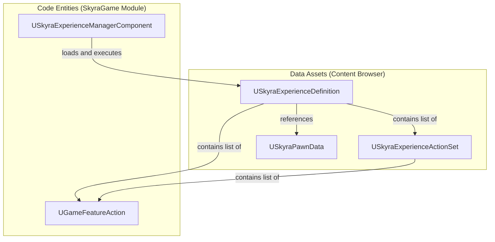
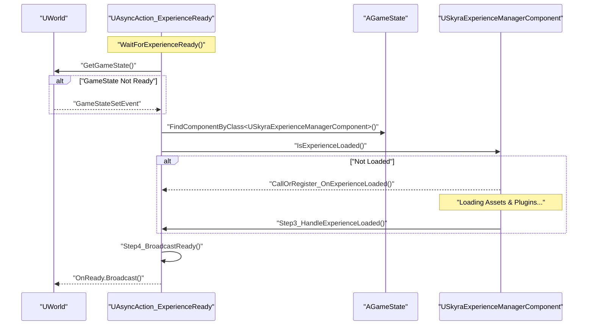

# 体验定义与加载

Relevant source files

以下文件用作生成此维基页面的上下文：

- [.gitattributes](.gitattributes)

SkyraFramework 中的体验系统是一种数据驱动架构，用于定义游戏会话的规则、内容和能力。与传统的虚幻引擎开发中将逻辑硬编码到 `AGameMode` 不同，Skyra 使用 `USkyraExperienceDefinition` 来协调游戏功能的激活、Pawn 的生成以及游戏能力系统 (GAS) 的配置。

## 核心数据结构

该系统依赖三种主要数据资产来定义“游戏”的组成。

### USkyraExperienceDefinition
这是描述完整游戏体验的顶级资产。它充当需要加载和初始化的所有内容的清单。
*   **游戏功能**：必须为此体验激活的游戏功能插件列表 [Source/SkyraGame/Public/GameModes/SkyraExperienceDefinition.h:38-39]()。
*   **动作集**：对包含模块化规则的 `USkyraExperienceActionSet` 资产的引用 [Source/SkyraGame/Public/GameModes/SkyraExperienceDefinition.h:45-46]()。
*   **动作**：用于体验特定逻辑的内联 `UGameFeatureAction` 列表 [Source/SkyraGame/Public/GameModes/SkyraExperienceDefinition.h:42-43]()。
*   **默认 Pawn 数据**：定义体验的默认 Pawn 类及关联的 GAS 数据 [Source/SkyraGame/Public/GameModes/SkyraExperienceDefinition.h:35-36]()。

### USkyraExperienceActionSet
动作集允许可重用的 `UGameFeatureAction` 实体组。这对于在多个体验间共享通用功能（例如“标准射击 UI”或“库存系统”）非常有用 [Source/SkyraGame/Public/GameModes/SkyraExperienceActionSet.h:17-18]()。
*   **验证**：该类包含编辑器时验证，以确保动作列表中不存在空条目 [Source/SkyraGame/Private/GameModes/SkyraExperienceActionSet.cpp:19-41]()。
*   **资产包**：它支持资产包更新，以确保动作中引用的所有资产都正确烘焙和加载 [Source/SkyraGame/Private/GameModes/SkyraExperienceActionSet.cpp:45-56]()。

### 数据实体关系
下图说明了这些数据资产如何与代码实体关联。

**体验数据映射**

来源：[Source/SkyraGame/Public/GameModes/SkyraExperienceDefinition.h:17-50]()，[Source/SkyraGame/Public/GameModes/SkyraExperienceActionSet.h:17-27]()

---

## 体验管理器组件

`USkyraExperienceManagerComponent` 是系统的引擎室。它附着在 `AGameState` 上，并管理当前体验的生命周期，包括资产的异步加载和游戏功能的激活。

### 加载流程
该组件处理从“无体验”状态到“完全加载”状态的转换。
1.  **体验识别**：游戏模式决定加载哪个体验。
2.  **资源加载**：管理器使用 `USkyraAssetManager` 加载 `USkyraExperienceDefinition` 以及所有引用的 `UGameFeatureAction` 资源。
3.  **功能激活**：它与 `UGameFeaturesSubsystem` 接口以加载并激活所需的插件。
4.  **动作执行**：它遍历所有动作（包括内联动作和来自动作集的动作）以应用游戏性更改。

### 状态跟踪
该组件提供委托，供其他系统响应加载过程：
*   `IsExperienceLoaded()`：仅当所有资源、插件和动作准备就绪后返回 true [Source/SkyraGame/Private/GameModes/SkyraExperienceManagerComponent.cpp:67-71]()。
*   `CallOrRegister_OnExperienceLoaded()`：一个辅助工具，如果体验已就绪则立即执行回调，否则将其绑定到完成委托 [Source/SkyraGame/Private/GameModes/SkyraExperienceManagerComponent.cpp:80-81]()。

---

## 异步加载管线

由于加载插件和资源耗时较长，Skyra 采用异步操作以避免帧卡顿并确保初始化顺序。

### AsyncAction_ExperienceReady
`UAsyncAction_ExperienceReady` 类是一个暴露给蓝图的潜伏动作，允许 UI 或世界 Actor 等待体验完全初始化后再执行逻辑 [Source/SkyraGame/Public/GameModes/AsyncAction_ExperienceReady.h:18-22]()。

**体验加载序列**

来源：[Source/SkyraGame/Private/GameModes/AsyncAction_ExperienceReady.cpp:31-49]()，[Source/SkyraGame/Private/GameModes/AsyncAction_ExperienceReady.cpp:61-82]()

### 实现细节
*   **步骤1 (HandleGameStateSet)**：等待World在动作开始时注册GameState（如果尚未存在）[Source/SkyraGame/Private/GameModes/AsyncAction_ExperienceReady.cpp:51-59]()。
*   **步骤2 (ListenToExperienceLoading)**：定位`USkyraExperienceManagerComponent`并检查其状态。如果已加载，仍通过`SetTimerForNextTick`延迟一帧以确保一致的执行模式 [Source/SkyraGame/Private/GameModes/AsyncAction_ExperienceReady.cpp:61-82]()。
*   **步骤4 (BroadcastReady)**：触发`OnReady`委托，表明HUD或玩家生成等系统可以安全进行 [Source/SkyraGame/Private/GameModes/AsyncAction_ExperienceReady.cpp:89-94]()。

---

## 游戏功能激活

体验加载的一个关键部分是游戏功能插件的激活。这使得代码库保持模块化；例如，"Shooter"体验可以激活一个"WeaponSystem"插件，该插件在"Racing"体验中完全不存在。

`USkyraExperienceManagerComponent`处理定义中的`GameFeaturesToEnable`列表。这包括：
1.  请求`GameFeaturesSubsystem`加载插件。
2.  等待插件达到`Active`状态。
3.  执行`UGameFeatureAction`对象，将插件的内容（能力、输入、UI）绑定到实时世界。

**来源：**
*   `Source/SkyraGame/Public/GameModes/SkyraExperienceDefinition.h`
*   `Source/SkyraGame/Public/GameModes/SkyraExperienceActionSet.h`
*   `Source/SkyraGame/Private/GameModes/SkyraExperienceActionSet.cpp`
*   `Source/SkyraGame/Public/GameModes/AsyncAction_ExperienceReady.h`
*   `Source/SkyraGame/Private/GameModes/AsyncAction_ExperienceReady.cpp`
*   `Source/SkyraGame/Private/GameModes/SkyraExperienceManagerComponent.cpp`