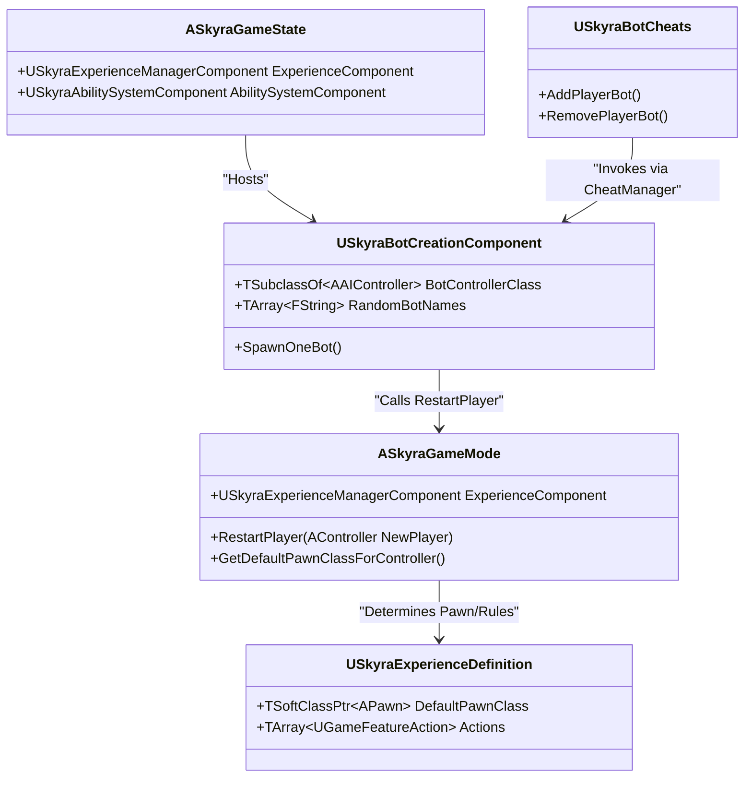

# 游戏模式、游戏状态与世界设置

<details>
<summary>Relevant source files</summary>

以下文件用作生成此维基页面的上下文：

- [.gitattributes](.gitattributes)

</details>


本页面详细介绍了SkyraFramework中的核心玩法框架类。它涵盖了模块化游戏模式架构、网络游戏的状态管理、专业化世界设置以及自动机器人生成系统。

## ASkyraGameMode

`ASkyraGameMode` 是 SkyraFramework 中模块化玩法的基础。与传统的虚幻引擎游戏模式将 Pawn 类与逻辑硬编码不同，`ASkyraGameMode` 是“体验驱动”的，将其大部分配置交给 `USkyraExperienceDefinition` [Source/SkyraGame/Private/GameModes/SkyraGameMode.cpp:20-30]()。

### 关键职责
*   **模块化初始化**：继承自 `AModularGameMode` 以支持 `IGameFrameworkComponentManager` [Source/SkyraGame/Public/GameModes/SkyraGameMode.h:23-25]()。
*   **体验集成**：与 `USkyraExperienceManagerComponent` 协同工作，以确定世界何时准备好迎接玩家生成 [Source/SkyraGame/Private/GameModes/SkyraGameMode.cpp:100-115]()。
*   **Pawn 生成**：覆写 `GetDefaultPawnClassForController_Implementation`，根据当前体验的 `USkyraPawnData` 提供一个 Pawn 类 [Source/SkyraGame/Private/GameModes/SkyraGameMode.cpp:78-90]()。
*   **玩家初始化**：处理 `GenericPlayerInitialization` 与 `RestartPlayer` 流程，确保人类玩家和 AI 机器人都能获得适当的初始化 [Source/SkyraGame/Private/GameModes/SkyraGameMode.cpp:120-140]()。

### 生成流程
游戏模式与体验系统协调，确保玩家仅在所有必需的游戏功能和动作加载完成后生成。

**体验驱动的生成逻辑**
1.  `PostLogin` 发生。
2.  `ASkyraGameMode` 通过 `USkyraExperienceManagerComponent` 检查体验是否已加载 [Source/SkyraGame/Private/GameModes/SkyraGameMode.cpp:105-110]()。
3.  如果未就绪，玩家将处于“等待”状态。
4.  加载后，调用 `RestartPlayer`，并且 `GetDefaultPawnClassForController` 从体验的Pawn数据中检索类 [Source/SkyraGame/Private/GameModes/SkyraGameMode.cpp:85-88]()。

**来源:** [Source/SkyraGame/Public/GameModes/SkyraGameMode.h:1-50](), [Source/SkyraGame/Private/GameModes/SkyraGameMode.cpp:1-150]()

---

## ASkyraGameState

`ASkyraGameState` 是跨网络同步游戏状态的核心权威。它继承自 `AModularGameState`，允许通过游戏功能动态添加组件。

### 关键组件
*   **USkyraExperienceManagerComponent**：管理当前 `USkyraExperienceDefinition` 的生命周期 [Source/SkyraGame/Public/GameModes/SkyraGameState.h:35-40]()。
*   **USkyraAbilitySystemComponent**：为游戏状态本身提供全局的能力系统组件（ASC），用于游戏范围内的标签和阶段 [Source/SkyraGame/Public/GameModes/SkyraGameState.h:42-45]()。

**来源：** [Source/SkyraGame/Public/GameModes/SkyraGameState.h:1-60]()

---

## ASkyraWorldSettings

`ASkyraWorldSettings` 扩展了标准的 `AWorldSettings`，以在关卡层面提供Skyra特定的配置。

### 强制独立网络模式
`ASkyraWorldSettings` 的主要特性是 `bForceStandaloneNetMode` 属性。启用后，这会强制引擎将世界视为独立实例，即使引擎在网络配置下运行，也会绕过某些网络逻辑 [Source/SkyraGame/Public/GameModes/SkyraWorldSettings.h:23-27]()。这对于仅UI的地图或前端菜单特别有用。

**来源：** [Source/SkyraGame/Public/GameModes/SkyraWorldSettings.h:1-30]()

---

## SkyraBotCreationComponent

`USkyraBotCreationComponent` 是一个附加到游戏状态（通过 `ASkyraGameMode`）的组件，用于自动化AI机器人的创建和管理。它被设计为数据驱动的，从配置或开发者设置中获取机器人数量和名称。

### 机器人创建逻辑
该组件会等待游戏体验完全加载后，才开始创建机器人 [Source/SkyraGame/Private/GameModes/SkyraBotCreationComponent.cpp:26-30]()。

| 功能 | 作用 |
| :--- | :--- |
| `OnExperienceLoaded` | 当 Experience 准备就绪时触发；调用 `ServerCreateBots` [Source/SkyraGame/Private/GameModes/SkyraBotCreationComponent.cpp:32-40]()。 |
| `ServerCreateBots` | 根据默认值、URL 选项（`?NumBots=X`）或 `USkyraDeveloperSettings` 计算 `EffectiveBotCount` [Source/SkyraGame/Private/GameModes/SkyraBotCreationComponent.cpp:44-78]()。 |
| `SpawnOneBot` | 生成一个 `AAIController`（使用 `BotControllerClass`），分配一个随机名称，并在 Game Mode 上调用 `RestartPlayer` [Source/SkyraGame/Private/GameModes/SkyraBotCreationComponent.cpp:98-129]()。 |
| `RemoveOneBot` | 从 `SpawnedBotList` 中随机选择一个 bot，在其 `USkyraHealthComponent` 上触发 `DamageSelfDestruct`，并销毁控制器 [Source/SkyraGame/Private/GameModes/SkyraBotCreationComponent.cpp:131-163]()。 |

### 作弊集成
Bots 可以在运行时使用 `USkyraBotCheats` 扩展进行管理，该扩展提供了控制台命令，通过与此组件交互来添加或移除 bots [Source/SkyraGame/Private/Development/SkyraBotCheats.cpp:27-45]()。

### Bot 生成数据流
下图说明了 `USkyraBotCreationComponent` 如何将 Experience 加载过程与实际的 AI 实体生成连接起来。

**AI 机器人初始化流程**
```mermaid
graph TD
    subgraph "Experience System"
        "ExpComp[USkyraExperienceManagerComponent]" -- "OnExperienceLoaded" --> "BotComp[USkyraBotCreationComponent]"
    end

    subgraph "Logic: USkyraBotCreationComponent"
        "BotComp" -- "1. Get Effective Count" --> "Calc[ServerCreateBots_Implementation]"
        "Calc" -- "2. Loop Spawn" --> "Spawn[SpawnOneBot]"
    end

    subgraph "Entity Creation"
        "Spawn" -- "SpawnActor" --> "AIC[AAIController]"
        "Spawn" -- "Initialize" --> "GM[ASkyraGameMode::GenericPlayerInitialization]"
        "GM" -- "Restart" --> "GM_Restart[ASkyraGameMode::RestartPlayer]"
    end

    subgraph "Configuration Sources"
        "DevSet[USkyraDeveloperSettings]" -.-> "Calc"
        "URL[OptionsString: NumBots]" -.-> "Calc"
    end
```
**来源：** [Source/SkyraGame/Private/GameModes/SkyraBotCreationComponent.cpp:44-129](), [Source/SkyraGame/Private/Development/SkyraBotCheats.cpp:47-58]()

---

## 系统交互图

该图描述了核心游戏模式类之间的关系以及它们所使用的数据资产。

**游戏模式与状态实体映射**

**来源：** [Source/SkyraGame/Private/GameModes/SkyraGameMode.cpp:78-90](), [Source/SkyraGame/Private/GameModes/SkyraBotCreationComponent.cpp:108-117](), [Source/SkyraGame/Private/Development/SkyraBotCheats.cpp:47-58]()