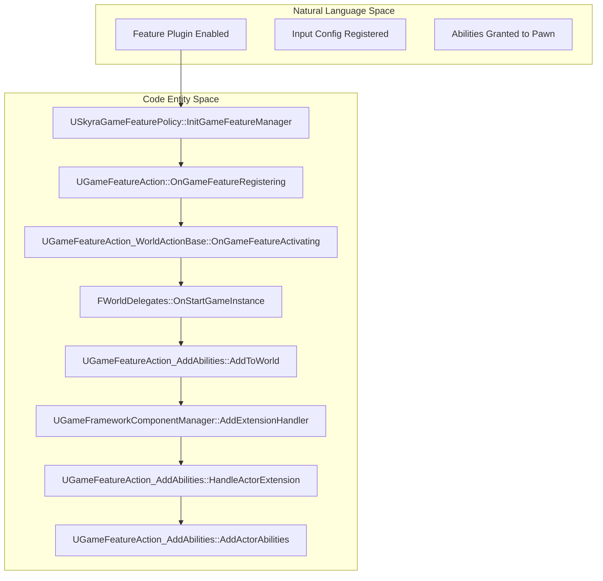
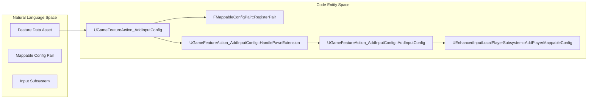

# 游戏特性与动作

Relevant source files

以下文件被用作生成此维基页面的上下文：

- [.gitattributes](.gitattributes)

SkyraFramework 中的游戏特性与动作系统提供了一种数据驱动机制，能在游戏特性插件激活时动态扩展游戏功能。这主要通过 `UGameFeatureAction` 的子类实现，这些子类负责将能力、输入配置、UI组件和世界设置注入到运行中的游戏状态。

## Skyra游戏特性策略

`USkyraGameFeaturePolicy` 是管理游戏特性处理方式的中央权威。它协调对特性插件生命周期（如注册和加载）作出反应的观察者。

### 主要职责
*   **观察者管理**：将 `USkyraGameFeature_HotfixManager` 和 `USkyraGameFeature_AddGameplayCuePaths` 注册到 `UGameFeaturesSubsystem` [Source/SkyraGame/Private/GameFeatures/SkyraGameFeaturePolicy.cpp:19-31]()。
*   **加载模式**：根据当前执行上下文（专用服务器与客户端）决定是加载客户端还是服务器数据 [Source/SkyraGame/Private/GameFeatures/SkyraGameFeaturePolicy.cpp:55-60]()。
*   **游戏提示集成**：`USkyraGameFeature_AddGameplayCuePaths` 在插件注册期间扫描 `UGameFeatureAction_AddGameplayCuePath` 动作，以使用新的资产通知路径更新 `USkyraGameplayCueManager` [Source/SkyraGame/Private/GameFeatures/SkyraGameFeaturePolicy.cpp:91-128]()。

**来源：**
* `USkyraGameFeaturePolicy` [Source/SkyraGame/Private/GameFeatures/SkyraGameFeaturePolicy.cpp:9-17]()
* `USkyraGameFeature_AddGameplayCuePaths` [Source/SkyraGame/Private/GameFeatures/SkyraGameFeaturePolicy.cpp:91-159]()

## 世界操作基类

`UGameFeatureAction_WorldActionBase` 作为抽象基类，用于需要应用于特定 `UWorld` 的操作。它确保操作被正确应用于现有世界以及功能激活后创建的任何世界。

### 数据流：世界应用
1.  **OnGameFeatureActivating**：绑定到 `FWorldDelegates::OnStartGameInstance` 并遍历所有现有的 `GEngine` 世界上下文 [Source/SkyraGame/Private/GameFeatures/GameFeatureAction_WorldActionBase.cpp:10-23]()。
2.  **HandleGameInstanceStart**：当新的游戏实例开始时触发 `AddToWorld` 的回调 [Source/SkyraGame/Private/GameFeatures/GameFeatureAction_WorldActionBase.cpp:35-44]()。
3.  **AddToWorld**：由子类实现的虚函数，用于执行特定逻辑（例如，添加小部件或能力）。

**来源：**
* `UGameFeatureAction_WorldActionBase` [Source/SkyraGame/Private/GameFeatures/GameFeatureAction_WorldActionBase.cpp:10-44]()

## 能力与属性注入

`UGameFeatureAction_AddAbilities` 允许游戏功能向Actor授予游戏能力、属性集和能力集。

### 实现细节
*   **角色追踪**：使用 `FPerContextData` 来跟踪每个功能激活的 `ActiveExtensions` 和 `ComponentRequests` [Source/SkyraGame/Private/GameFeatures/GameFeatureAction_AddAbilities.cpp:22-32]().
*   **扩展处理器**：利用 `UGameFrameworkComponentManager` 监听特定类的角色进入世界 [Source/SkyraGame/Private/GameFeatures/GameFeatureAction_AddAbilities.cpp:114-130]().
*   **权限检查**：技能和属性仅在服务器端授予 (`HasAuthority`) [Source/SkyraGame/Private/GameFeatures/GameFeatureAction_AddAbilities.cpp:164-167]().

| 特性 | 描述 |
| :--- | :--- |
| **GrantedAbilities** | `FSkyraAbilityGrant` 列表（技能类型 + 等级）。|
| **GrantedAttributes** | `FSkyraAttributeSetGrant` 列表（属性集 + 初始化数据）。|
| **GrantedAbilitySets** | 指向 `USkyraAbilitySet` 资源的软指针。|

**来源：**
* `UGameFeatureAction_AddAbilities` [Source/SkyraGame/Private/GameFeatures/GameFeatureAction_AddAbilities.cpp:20-131]()
* `AddActorAbilities` [Source/SkyraGame/Private/GameFeatures/GameFeatureAction_AddAbilities.cpp:161-193]()

## 输入配置操作

Skyra 使用多个操作来与增强输入系统集成。

### AddInputBinding 对比 AddInputConfig 对比 AddInputContextMapping

1.  **AddInputBinding**：将 `USkyraInputConfig` 绑定到 `USkyraHeroComponent`。当 Pawn 就绪时，它会调用 `HeroComponent->AddAdditionalInputConfig`。 [Source/SkyraGame/Private/GameFeatures/GameFeatureAction_AddInputBinding.cpp:122-141]()
2.  **AddInputConfig**：在注册时将 `FMappableConfigPair` 注册到本地设置中，即使功能未激活，它们也会显示在菜单中。 [Source/SkyraGame/Private/GameFeatures/GameFeatureAction_AddInputConfig.cpp:26-37]() 它从 `UEnhancedInputLocalPlayerSubsystem` 中添加/移除配置。 [Source/SkyraGame/Private/GameFeatures/GameFeatureAction_AddInputConfig.cpp:146-173]()
3.  **AddInputContextMapping**：管理 `UInputMappingContext`（IMC）的注册。它确保 IMC 已注册到 `UEnhancedInputUserSettings`，以便玩家可以重新映射它们。 [Source/SkyraGame/Private/GameFeatures/GameFeatureAction_AddInputContextMapping.cpp:88-115]()

**源文件：**
* `UGameFeatureAction_AddInputBinding` [Source/SkyraGame/Private/GameFeatures/GameFeatureAction_AddInputBinding.cpp:24-120]()
* `UGameFeatureAction_AddInputConfig` [Source/SkyraGame/Private/GameFeatures/GameFeatureAction_AddInputConfig.cpp:26-144]()
* `UGameFeatureAction_AddInputContextMapping` [Source/SkyraGame/Private/GameFeatures/GameFeatureAction_AddInputContextMapping.cpp:25-115]()

## UI 与控件管理

`UGameFeatureAction_AddWidgets` 负责注入 HUD 布局和 UI 扩展。

### 逻辑流程
*   **定位**：专用于 `ASkyraHUD` Actor，使用 `UGameFrameworkComponentManager` [Source/SkyraGame/Private/GameFeatures/GameFeatureAction_AddWidget.cpp:99-108]()。
*   **布局**：通过 `UCommonUIExtensions::PushContentToLayer_ForPlayer` 将 `UCommonActivatableWidget` 类推送到特定的 UI 层 [Source/SkyraGame/Private/GameFeatures/GameFeatureAction_AddWidget.cpp:151-157]()。
*   **扩展**：通过 `UUIExtensionSubsystem` 将控件注册到特定插槽（例如“武器状态”插槽）[Source/SkyraGame/Private/GameFeatures/GameFeatureAction_AddWidget.cpp:159-163]()。

**来源：**
* `UGameFeatureAction_AddWidgets` [Source/SkyraGame/Private/GameFeatures/GameFeatureAction_AddWidget.cpp:20-109]()
* `AddWidgets` [Source/SkyraGame/Private/GameFeatures/GameFeatureAction_AddWidget.cpp:138-165]()

## 系统架构图

### 动作激活管线
该图表说明了游戏功能操作如何从注册过渡到世界应用。

**来源：**
* `USkyraGameFeaturePolicy` [Source/SkyraGame/Private/GameFeatures/SkyraGameFeaturePolicy.cpp:19-31]()
* `UGameFeatureAction_WorldActionBase` [Source/SkyraGame/Private/GameFeatures/GameFeatureAction_WorldActionBase.cpp:10-23]()
* `UGameFeatureAction_AddAbilities` [Source/SkyraGame/Private/GameFeatures/GameFeatureAction_AddAbilities.cpp:106-131]()

### 输入配置数据流
该图展示了输入配置如何从游戏功能资产移动到增强输入子系统。

**来源：**
* `UGameFeatureAction_AddInputConfig` [Source/SkyraGame/Private/GameFeatures/GameFeatureAction_AddInputConfig.cpp:26-37]()
* `AddInputConfig` [Source/SkyraGame/Private/GameFeatures/GameFeatureAction_AddInputConfig.cpp:146-173]()

## 其他操作

### 分屏配置
`UGameFeatureAction_SplitscreenConfig` 提供了一个投票系统来禁用分屏。
*   **GlobalDisableVotes**：一个静态映射，用于跟踪不同游戏上下文中的投票 [Source/SkyraGame/Private/GameFeatures/GameFeatureAction_SplitscreenConfig.cpp:16]()。
*   **逻辑**：当 `bDisableSplitscreen` 为 true 时，它在 `UGameViewportClient` 上调用 `VC->SetForceDisableSplitscreen(true)` [Source/SkyraGame/Private/GameFeatures/GameFeatureAction_SplitscreenConfig.cpp:54-75]()。

### Gameplay Cue 路径
`UGameFeatureAction_AddGameplayCuePath` 是一个用于目录路径的简单数据容器 [Source/SkyraGame/Private/GameFeatures/GameFeatureAction_AddGameplayCuePath.cpp:12-16]()。将这些路径添加到 `USkyraGameplayCueManager` 的实际逻辑由策略中的 `USkyraGameFeature_AddGameplayCuePaths` 观察者处理 [Source/SkyraGame/Private/GameFeatures/SkyraGameFeaturePolicy.cpp:91-128]()。

**来源：**
* `UGameFeatureAction_SplitscreenConfig` [Source/SkyraGame/Private/GameFeatures/GameFeatureAction_SplitscreenConfig.cpp:18-75]()
* `UGameFeatureAction_AddGameplayCuePath` [Source/SkyraGame/Private/GameFeatures/GameFeatureAction_AddGameplayCuePath.cpp:12-34]()