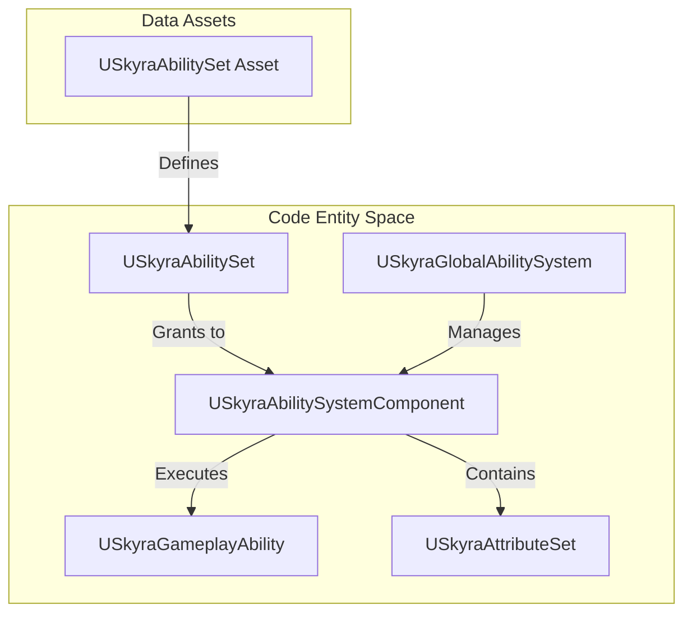
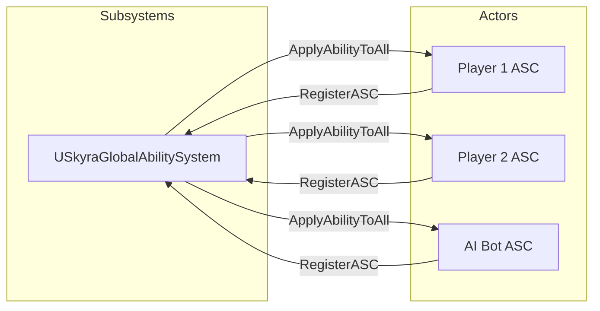

# 游戏技能系统（GAS）

Relevant source files

以下文件曾作为生成此 Wiki 页面的上下文使用：

- [.gitattributes](.gitattributes)

SkyraFramework 扩展了虚幻引擎的游戏技能系统（GAS），为技能、属性和游戏效果提供了数据驱动的架构。该框架引入了专用的输入路由组件、适用于战斗和生命值的稳健属性集，以及用于管理跨角色游戏逻辑的全局技能系统。

### 系统概览

GAS 实现的核心围绕着 `USkyraAbilitySystemComponent`，它充当技能执行和属性管理的中心枢纽。它与 `USkyraGameplayAbility` 类深度集成，以处理激活策略和输入标签映射。

#### GAS 实体关系
下图阐释了 SkyraFramework 中主要 GAS 类之间的关系。

**GAS 实体关系**

来源：[Source/SkyraGame/Private/AbilitySystem/SkyraAbilitySystemComponent.cpp:19-27](), [Source/SkyraGame/Private/AbilitySystem/SkyraAbilitySet.cpp:73-81](), [Source/SkyraGame/Private/AbilitySystem/SkyraGlobalAbilitySystem.cpp:126-140]()

---

### 技能系统组件与技能类
`USkyraAbilitySystemComponent` (ASC) 是该系统的基础。它处理技能的注册工作，并通过游戏标签将它们连接到输入系统。与标准的 ASC 不同，Skyra 的实现明确支持“激活组”，以防止冲突技能同时运行，并处理在 Pawn 拥有权变更期间的化身更改。

`USkyraGameplayAbility` 扩展了基础技能类，以包含：
*   **激活策略**：定义技能是在输入按下时触发、按住时触发，还是在生成时自动触发 [Source/SkyraGame/Private/AbilitySystem/SkyraAbilitySystemComponent.cpp:159-163]()。
*   **技能集**：`USkyraAbilitySet` 是一个数据资产，用于在单个操作中将技能组、效果和属性集授予 ASC [Source/SkyraGame/Private/AbilitySystem/SkyraAbilitySet.cpp:84-146]()。

详情请参阅 [技能系统组件与技能类](#3.1)。

---

### 属性集与执行计算
SkyraFramework 中的属性被组织为专门的集合，以保持模块化。`USkyraAttributeSet` 作为基类，具有针对生命值和战斗逻辑的特定实现。

*   **USkyraHealthSet**：管理 `Health`、`MaxHealth` 和 `Shield` 属性。
*   **USkyraCombatSet**：包含与伤害输出和抗性相关的属性。
*   **执行计算**：类似 `SkyraDamageExecution` 的自定义计算处理将游戏效果转换为属性变化的复杂逻辑，并考虑抗性和修饰符。

详情请参阅 [属性集与执行计算](#3.2)。

---

### 技能消耗、游戏阶段与全局系统
SkyraFramework 引入了几个高级系统，用以在整个游戏状态中管理 GAS：

*   **全局技能系统**：`USkyraGlobalAbilitySystem` 是一个世界子系统，可以同时对所有已注册的 ASC 施加能力或效果，适用于全局负面效果或游戏范围内的机制 [Source/SkyraGame/Private/AbilitySystem/SkyraGlobalAbilitySystem.cpp:82-104]().
*   **游戏阶段**：技能可以使用 `SkyraGamePhaseAbility` 绑定到特定的游戏阶段（例如 "热身"、"活跃"、"赛后"）。
*   **技能消耗**：允许技能消耗背包物品或特定标签堆叠，而不仅仅是数值属性的扩展。

**全局系统集成**

来源：[Source/SkyraGame/Private/AbilitySystem/SkyraGlobalAbilitySystem.cpp:82-92](), [Source/SkyraGame/Private/AbilitySystem/SkyraGlobalAbilitySystem.cpp:126-140]()

详情请参见 [技能消耗、游戏阶段和全局技能系统](#3.3)。

---
**来源：**
* [Source/SkyraGame/Private/AbilitySystem/SkyraAbilitySystemComponent.cpp]()
* [Source/SkyraGame/Private/AbilitySystem/SkyraAbilitySet.cpp]()
* [Source/SkyraGame/Private/AbilitySystem/SkyraGlobalAbilitySystem.cpp]()
* [.gitattributes:1-4]()