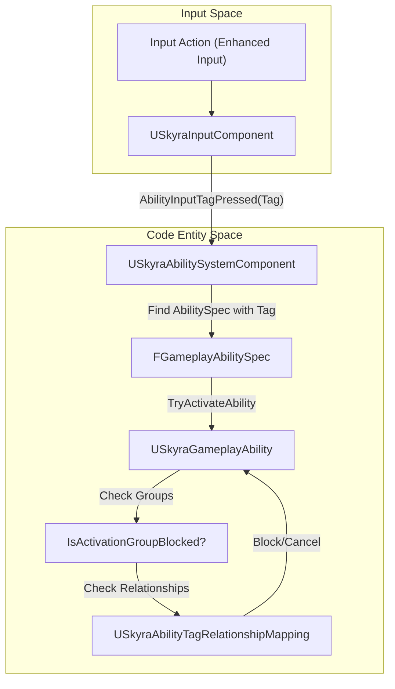
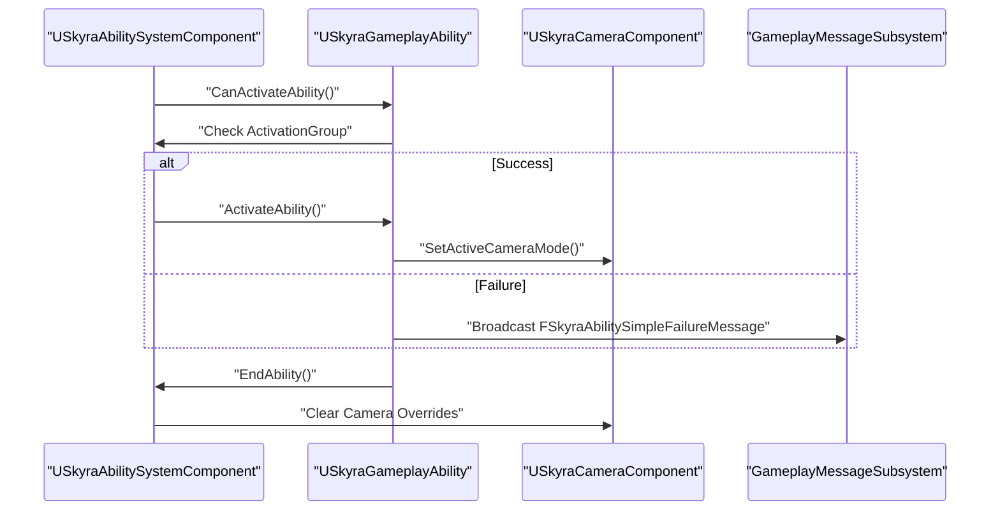

# 能力系统组件与能力类

Relevant source files

以下文件被用作生成此维基页面的上下文：

- [.gitattributes](.gitattributes)

本页面详细介绍了SkyraFramework游戏技能系统（GAS）实现的核心类。它涵盖了该框架如何扩展基础Unreal Engine GAS以支持输入标签路由、激活组、数据驱动的技能集以及专门的死亡处理。

## USkyraAbilitySystemComponent

`USkyraAbilitySystemComponent`（ASC）是Skyra中游戏机制的中心枢纽。它扩展了`UAbilitySystemComponent`，提供了用于输入处理、技能激活分组和基于标签的关系映射的专用逻辑。

### 输入路由和标签映射
与通常依赖于基于整数的输入ID的标准GAS不同，Skyra使用`FGameplayTag`进行输入绑定。
*   **输入队列**：ASC跟踪按下、释放和保持输入的句柄[Source/SkyraGame/Private/AbilitySystem/SkyraAbilitySystemComponent.cpp:22-24]().
*   **标签到技能映射**：输入标签通过`AbilityInputTagPressed`和`AbilityInputTagReleased`从`USkyraInputComponent`传递到ASC [Source/SkyraGame/Private/AbilitySystem/SkyraAbilitySystemComponent.cpp:194]().
*   **激活策略**：技能可以配置为触发`OnInputTriggered`（即时）或`WhileInputActive`（持续）[Source/SkyraGame/Private/AbilitySystem/Abilities/SkyraGameplayAbility.cpp:44]().

### 激活组
Skyra 引入 `ESkyraAbilityActivationGroup` 来管理能力的并发性和互斥性：
*   **独立**：可以与任何其他能力同时运行。
*   **排他_可替换**：可被其他排他性能力取消。
*   **排他_阻止**：激活时阻止其他排他性能力启动。

ASC 维护每个组中活跃能力的计数，以确定是否可以激活新的能力 [Source/SkyraGame/Private/AbilitySystem/SkyraAbilitySystemComponent.cpp:26]()。

### 标签关系映射
ASC 利用 `USkyraAbilityTagRelationshipMapping` 来定义标签如何全局交互。此数据资产允许设计者指定：
*   **要阻止的能力标签**：阻止能力启动的标签。
*   **要取消的能力标签**：强制活跃能力结束的标签。
*   **激活所需标签**：启动能力时，Actor 上必须存在的标签。
*   **激活阻止标签**：如果存在于 Actor 上，则阻止激活的标签。

**数据流程：从输入到能力激活**

源文件：[Source/SkyraGame/Private/AbilitySystem/SkyraAbilitySystemComponent.cpp:194]()、[Source/SkyraGame/Private/AbilitySystem/SkyraAbilityTagRelationshipMapping.cpp:8-46]()、[Source/SkyraGame/Private/AbilitySystem/Abilities/SkyraGameplayAbility.cpp:148-156]()

---

## USkyraGameplayAbility

`USkyraGameplayAbility` 是所有游戏逻辑的基类。它集成了框架的摄像机系统、UI消息传递以及消耗结构。

### 主要特性
*   **摄像机模式覆盖**：技能可以指定一个 `USkyraCameraMode`，当技能激活时，该 `USkyraCameraMode` 被推入摄像机栈 [Source/SkyraGame/Private/AbilitySystem/Abilities/SkyraGameplayAbility.cpp:49]()。
*   **失败通信**：当技能激活失败时，它可以根据失败标签广播 `FSkyraAbilitySimpleFailureMessage` 或播放失败蒙太奇 [Source/SkyraGame/Private/AbilitySystem/Abilities/SkyraGameplayAbility.cpp:102-132]()。
*   **激活策略**：
    *   `OnInputTriggered`：按下按钮时激活一次。
    *   `WhileInputActive`：按下时激活，保持激活状态直到释放。
    *   `OnSpawn`：当被授予给 ASC 时自动尝试激活 [Source/SkyraGame/Private/AbilitySystem/Abilities/SkyraGameplayAbility.cpp:179-180]()。

### 技能消耗
消耗以 `USkyraAbilityCost` 对象数组的形式实现。这使得单个技能可以拥有多种不同的消耗（例如，同时消耗体力和背包物品）[Source/SkyraGame/Private/AbilitySystem/Abilities/SkyraGameplayAbility.cpp:10]()。

**技能生命周期**

来源：[Source/SkyraGame/Private/AbilitySystem/Abilities/SkyraGameplayAbility.cpp:135-159]()，[Source/SkyraGame/Private/AbilitySystem/Abilities/SkyraGameplayAbility.cpp:102-118]()

---

## USkyraGameplayAbility_Death

一个专门处理角色过渡到死亡状态的能力。

*   **触发**：由`GameplayEvent.Death`标签自动触发 [Source/SkyraGame/Private/AbilitySystem/Abilities/SkyraGameplayAbility_Death.cpp:26]()。
*   **优先级**：它会取消所有其他能力，除了那些标记为`Ability.Behavior.SurvivesDeath`的能力 [Source/SkyraGame/Private/AbilitySystem/Abilities/SkyraGameplayAbility_Death.cpp:38-42]()。
*   **执行**：
    1.  将激活组设置为`Exclusive_Blocking`以防止新能力激活。
    2.  在`USkyraHealthComponent`上调用`StartDeath()` [Source/SkyraGame/Private/AbilitySystem/Abilities/SkyraGameplayAbility_Death.cpp:70-79]()。
    3.  当能力结束时，确保调用`FinishDeath()`来清理角色 [Source/SkyraGame/Private/AbilitySystem/Abilities/SkyraGameplayAbility_Death.cpp:81-90]()。

来源：[Source/SkyraGame/Private/AbilitySystem/Abilities/SkyraGameplayAbility_Death.cpp:14-57]()

---

## USkyraAbilitySet

`USkyraAbilitySet`是一种数据资产，用于在一次操作中向Actor授予一组GAS逻辑。它主要由Experience系统和Pawn初始化使用。

### 授予的内容
技能集可以包含：
1.  **游戏技能**：`FSkyraAbilitySet_GameplayAbility`数组（包含技能类、等级和输入标签）[Source/SkyraGame/Private/AbilitySystem/SkyraAbilitySet.cpp:84-106]()
2.  **游戏效果**：`FSkyraAbilitySet_GameplayEffect`数组（包含效果类和等级）[Source/SkyraGame/Private/AbilitySystem/SkyraAbilitySet.cpp:109-126]()
3.  **属性集**：`FSkyraAbilitySet_AttributeSet`数组（包含属性集类）[Source/SkyraGame/Private/AbilitySystem/SkyraAbilitySet.cpp:129-146]()

### 管理
*   **GiveToAbilitySystem**：实例化并向提供的ASC授予该集合中的所有项。它返回一个`FSkyraAbilitySet_GrantedHandles`结构体 [Source/SkyraGame/Private/AbilitySystem/SkyraAbilitySet.cpp:73-81]()
*   **TakeFromAbilitySystem**：使用存储的句柄干净地移除仅由该特定集合授予的技能和效果，而不影响其他集合 [Source/SkyraGame/Private/AbilitySystem/SkyraAbilitySet.cpp:32-66]()

源文件：[Source/SkyraGame/Private/AbilitySystem/SkyraAbilitySet.cpp:11-30]()、[Source/SkyraGame/Private/AbilitySystem/SkyraAbilitySet.cpp:73-147]()