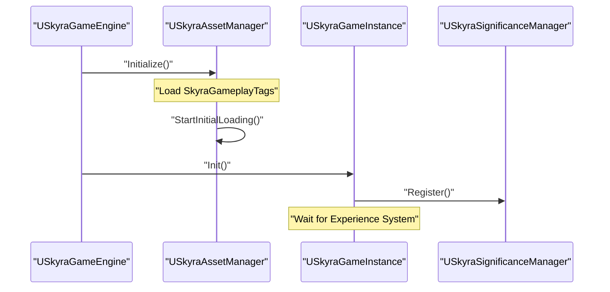

# SkyraFramework Overview

SkyraFramework 是一个基于 Unreal Engine 的**模块化游戏玩法框架**，用于支持**可扩展、数据驱动**的游戏开发。

该框架大量依赖以下系统：

- Gameplay Ability System (GAS)
- Modular Gameplay
- Game Features

整体设计目标是构建一个**解耦架构（Decoupled Architecture）**，使功能可以在**不修改核心类的情况下动态添加或移除**。

框架以一个插件形式提供，包含两个核心模块：

- `SkyraGame`（运行时核心）
- `SkyraEditor`（编辑器工具）

### 模块架构（Module Architecture）

框架在 [SkyraFramework.uplugin:17-28]() 中定义为两个模块：

*   **SkyraGame**
    - 类型：运行时模块
    - 加载阶段：`Default`
    - 职责：
        - Ability System 实现
        - Pawn 架构
        - Experience 系统
        - UI 框架
*   **SkyraEditor**:
    - 类型：编辑器模块
    - 加载阶段：`PreLoadingScreen`
    - 职责：
        - 自定义工具（UX）
        - 资源校验（Validator）
        - 工具栏扩展

详细内容参考：**[Plugin Architecture and Module Structure](#1.1)**.

### Plugin Dependency Graph

SkyraFramework acts as an orchestrator for several advanced Unreal Engine plugins. It establishes a robust dependency graph that includes industry-standard systems for abilities, UI, and networking.

**Framework Dependency Mapping**

```mermaid
graph TD
    subgraph "SkyraFramework Plugin"
        [SkyraGame] --> [SkyraEditor]
    end

    subgraph "External Dependencies"
        [SkyraGame] --> ["GameplayAbilities"]
        [SkyraGame] --> ["ModularGameplay"]
        [SkyraGame] --> ["CommonUI"]
        [SkyraGame] --> ["GameFeatures"]
        [SkyraGame] --> ["EnhancedInput"]
        [SkyraGame] --> ["GameplayMessageRouter"]
    end

    ["ModularGameplay"] --> ["ModularGameplayActors"]
    ["CommonUI"] --> ["CommonGame"]
    ["CommonGame"] --> ["CommonUser"]
```
Sources: [SkyraFramework.uplugin:29-138]()

### Core System Utilities

At the foundation of `SkyraGame` are several "Global" systems that manage the lifecycle of the application and its data. These utilities ensure that assets are loaded correctly before gameplay begins and provide centralized access to global gameplay tags and data.

*   **Asset Management**: `USkyraAssetManager` handles the discovery and synchronous/asynchronous loading of primary assets, including the execution of startup jobs.
*   **Global Data**: `USkyraGameData` acts as a singleton for global Gameplay Effect references, while `SkyraGameplayTags` provides a centralized C++ interface for the framework's tag dictionary.
*   **Engine & Instance**: Custom overrides like `USkyraGameEngine` and `USkyraGameInstance` provide hooks for initialization and global error handling.

For more information on these foundational classes, see **[Core System Utilities](#1.2)**.

### System Integration Overview

The following diagram illustrates how the core code entities within SkyraFramework interact to initialize a gameplay session.

**Code Entity Interaction: Session Startup**


Sources: [SkyraFramework.uplugin:55-57]()

### High-Level Components

Beyond the utilities, the framework is organized into several major functional areas:

| System | Primary Code Entities | Role |
| :--- | :--- | :--- |
| **Experiences** | `ASkyraGameMode`, `USkyraExperienceDefinition` | Defines *what* is being played (rules, maps, actions). |
| **GAS** | `USkyraAbilitySystemComponent`, `USkyraGameplayAbility` | Handles all logic for actions, attributes, and status effects. |
| **Pawn/Hero** | `ASkyraPawn`, `USkyraPawnExtensionComponent` | Modular actor logic that binds GAS, Input, and Visuals together. |
| **Inventory** | `USkyraInventoryManagerComponent`, `USkyraEquipmentInstance` | Manages items, weapons, and their associated gameplay logic. |
| **UI** | `ASkyraHUD`, `USkyraActivatableWidget` | Layered UI system built on top of CommonUI. |

### Repository Structure and Infrastructure

The repository includes standard Unreal Engine project infrastructure for source control and compilation.

*   **Source Control**: The project uses Git LFS for binary assets like `.uasset` files [.gitattributes:3-3]().
*   **Build Artifacts**: The environment is configured to ignore standard build directories such as `Binaries/`, `Intermediate/`, and `Saved/` [.gitignore:49-71]().
*   **Editor Cache**: The `DerivedDataCache/` is excluded from version control to prevent bloat [.gitignore:74-74]().

### Navigation

*   **[Plugin Architecture and Module Structure](#1.1)**: Deep dive into the `.uplugin` and `Build.cs` files.
*   **[Core System Utilities](#1.2)**: Details on Asset Manager, Game Data, and Tag systems.
*   **[Experience and Game Mode System](#2)**: How the framework handles data-driven game rules.
*   **[Gameplay Ability System (GAS)](#3)**: Implementation details of the framework's combat and ability logic.
*   **[SkyraEditor Module](#11)**: Overview of editor-only tooling and validation.

Sources: [.gitattributes:1-4](), [.gitignore:1-75]()